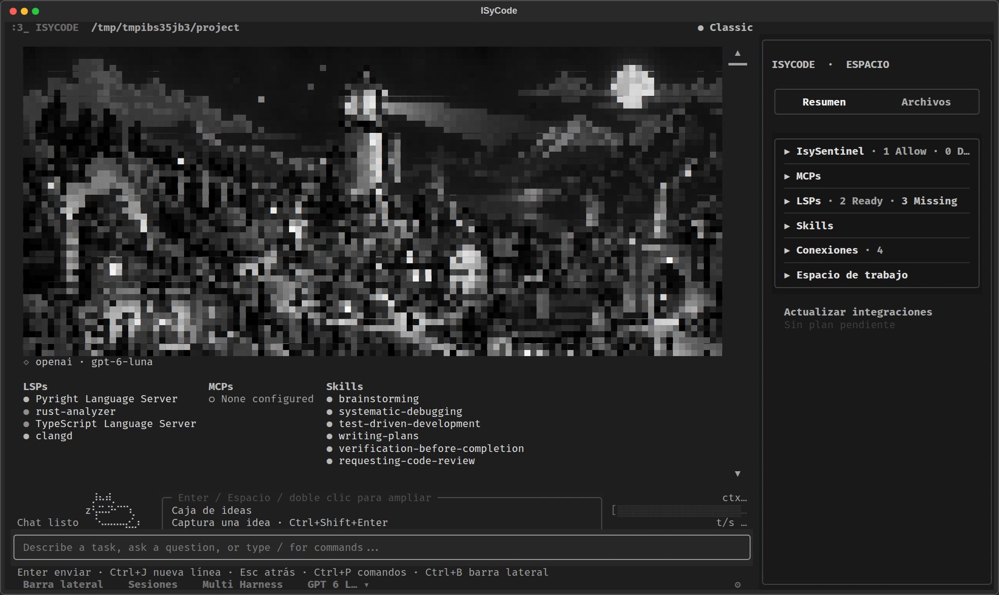
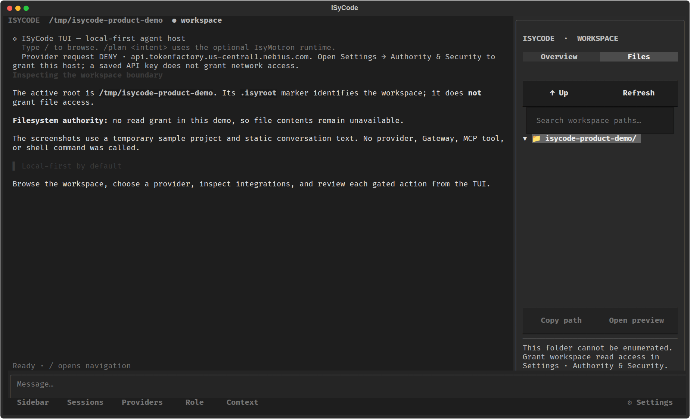

# ISyCode

**Un agente de programación para la terminal, local-first, donde cada acción pasa por permisos explícitos.** ISyCode reúne chat, archivos, git, comandos, MCP y providers en una TUI de teclado. Separa la identidad del proyecto (`.isyroot`) de la autoridad para tocarlo, y todo lo que el agente hace queda decidido por IsySentinel y registrado en un journal.

> **Estado:** en desarrollo. Esta página separa lo que ya se ejecutó de verdad de lo que está implementado y probado solo con dobles de prueba. Mira [Qué está probado](#qué-está-probado).


**Novedades (2026-10-07):** si se corta el stream o el provider devuelve un 5xx, un timeout o un 429, el paso se reenvía solo, con un retraso fijo por tipo de fallo y pocos intentos; nunca se repite una herramienta ya ejecutada ([ADR 0008](docs/decisions/0008-automatic-continuity-recovery.md)). La **cápsula de continuidad** cubre cada pérdida de contexto sin gastar tokens: conversación larga, rechazo por "demasiado largo", cambio a un modelo con menos ventana, sesión retomada y subagentes ([ADR 0009](docs/decisions/0009-continuity-capsule.md)). Elegir modelo es un solo flujo, provider → modelo → razonamiento, con una ficha que muestra solo datos conocidos y su fuente. Multi Harness lee también Command Code y Kilo CLI (15 herramientas). Una conversación abierta en dos ventanas ya no se pisa en silencio. En M15, `secure_closed` quedó cerrado por evidencia. Las puertas M0 a M8 están APROBADAS.

**Antes (2026-10-04):** el modelo guardado sobrevive al reinicio, también como clave de visión; `.netrc`, `.npmrc` y `.pypirc` no se leen ni se copian al log de comandos; Ctrl+S abre ShellBox; la cola puede hacer steer y devolver el texto si falla; Sessions borra con confirmación; cada conversación conserva su transcript, cola y turno en curso, y al cambiar de chat ese turno se aparca (no se cancela); las aprobaciones de cambios, comandos, commits o borrados son fail-closed —`n`/`Esc` rechazan, el botón por defecto es Reject— con el diff o comando exacto y su receipt; en Chat, `Esc` detiene el turno y `/retry` ofrece recuperarlo. Lo anterior (2026-10-01): agente sin límite de pasos, borrar y mover archivos, *Turn on all coding tools…* en un paso, Settings en ventana grande con `?` por opción, aprobar con `y`/`n`, copiar el texto seleccionado, panel de tareas plegable, panel lateral con interruptores verde/rojo y modelos destacados (GLM 5.3, Kimi K3, DeepSeek V4.1 Flash). Lo que falta está en [Lo que nos falta](#lo-que-nos-falta).

**Uso diario (2026-09-30):** recuperación manual con `/retry`, borradores y sesiones versionadas, `/context` para AGENTS.md, diagnóstico local `isycode doctor` y `/doctor`, y verificación explícita del proveedor con `/check`. Consulta [la guía y sus límites de verificación](docs/daily-use-readiness.md).

## Índice

- [La TUI](#la-tui)
- [Instalar y arrancar](#instalar-y-arrancar)
- [Estructura del repositorio](#estructura-del-repositorio)
- [Contribuir](#contribuir)
- [Modos: Classic y Security](#modos-classic-y-security)
- [Qué puede hacer el agente](#qué-puede-hacer-el-agente)
- [Comandos `/`](#comandos-)
- [Providers](#providers)
- [Configuración personal](#configuración-personal)
- [Seguridad y límites](#seguridad-y-límites)
- [Qué está probado](#qué-está-probado)
- [Integraciones](#integraciones)
- [Atajos](#atajos)
- [Lo que nos falta](#lo-que-nos-falta)
- [Roadmap y documentación](#roadmap-y-documentación)

## La TUI

Las capturas son evidencia histórica de la TUI real de Textual con un workspace temporal de demostración; no validan compatibilidad con otras versiones. El texto del chat es estático: no se llamó a ningún provider, Gateway, MCP ni comando. El árbol de archivos aparece bloqueado porque la captura no tiene permiso de lectura.

| Overview | Archivos |
| --- | --- |
|  |  |

Lo que verás al usarla:

- **Chat y transcript limpio:** las lecturas salen en una sola línea gris (`✓ read src/app.py · rcpt_…`). Un cambio que revisas muestra tu decisión (`✓ You approved · ruta` o `✗ You rejected · ruta · nothing was written`) y el modelo la recibe en `approved_by_user`. En una carpeta Classic ya confiable, el cambio ordinario sale como `✓ Quiet Classic · ruta` y el modelo recibe `approved_by_user: false` con `approval_mode: quiet-profile`. Un rechazo no se presenta como un éxito, y una edición quieta no se presenta como si la hubieras aprobado una a una.
- **Aprobaciones:** mientras la carpeta no está confiada, cada cambio, comando o commit abre una ventana con el diff o el comando exacto. `y` aprueba, `n` o `Esc` rechazan y `Enter` sobre el botón por defecto rechaza. Si una escritura reemplaza un archivo existente completo, la ventana lo dice: *Replace whole file*. Tras confiar la carpeta, las ediciones recuperables y los comandos con sandbox dejan de abrir esa ventana. El commit, los secretos, la autoridad, deshacer y MCP siguen abriéndola.
- **Settings y la paleta `/`:** se abren como una ventana grande y centrada. La opción resaltada se explica debajo de la lista; las que llevan `?` abren un cuadrito de ayuda al pulsar `?`. En el campo de filtro, `?` se escribe normal.
- **Panel Tasks:** el plan del agente con su progreso. Clic en el panel o `Ctrl+T` lo pliegan a una línea (`▸ Tasks · 3/7 done · now: …`) y lo vuelven a abrir.
- **IsySentinel en el panel lateral:** es la primera sección del panel y se actualiza en vivo. Muestra el modo del workspace y los permisos que Sentinel aceptaría ahora mismo. Si una etiqueta agrupa varias acciones y una de ellas está denegada, sale como *partial*. Debajo van las últimas decisiones ALLOW/DENY, con los checks que fallaron o quién aprobó, y el estado de la cadena del journal. El título lleva la cuenta de la sesión (`IsySentinel · 12 allow · 1 deny`). Solo muestra los campos que guarda el journal: nunca prompts, rutas, parámetros ni contenido. Es solo lectura y no decide nada.
- **Panel lateral:** MCPs, LSPs y Skills se leen por un punto de color (verde listo, ámbar comprobando, rojo no listo, gris apagado), sin pastilla de fondo. El título resume, por ejemplo `LSPs · 1 ready · 5 missing`. *Install commands* escribe el comando exacto en la sección y no descarga ni arranca nada. Cada sección se pliega con un clic en su título; Gateway, Mobile Host, Bridge y Workspace empiezan plegadas.
- **Copiar:** con el permiso *Copy selected text to the clipboard*, seleccionar texto con el ratón lo copia al portapapeles del sistema (wl-copy, xclip, xsel, pbcopy o clip, y además OSC 52). El botón *Copy path* del árbol de archivos usa el mismo camino. El campo de API key nunca se copia y el journal guarda solo tamaño y digest, nunca el texto.

## Instalar y arrancar

Desde el código fuente (Python 3.10 o posterior):

La instalación fija **Textual 8.2.8**, que habilita seleccionar texto en el chat y copiarlo mediante el permiso del workspace. CI ejecuta la suite con Python 3.10 y 3.12.

```bash
git clone https://github.com/DannyBaanks/ISyCode.git
cd ISyCode
python3 -m venv .venv
. .venv/bin/activate
python -m pip install -e .            # añade '.[anthropic]' para usar Claude de forma nativa
isycode
```

Para lanzarlo desde cualquier proyecto con este checkout:

```bash
./scripts/install-path
cd /ruta/a/tu/proyecto
isycode
```

Otras formas de ejecutarlo:

| Comando | Qué hace |
| --- | --- |
| `isycode` | Abre la TUI en la carpeta actual |
| `isycode -p "pregunta"` | Responde una vez y sale ([modo no interactivo](#modo-no-interactivo)) |
| `isycode cli` | Navegador de acciones por intención; no ejecuta shell |
| `isycode --help` / `--version` | Ayuda y versión |

La primera vez que abres una carpeta, ISyCode pregunta si será un workspace **recurrente** (crea un `.isyroot` vacío y puede guardar conversaciones) o **temporal**, y qué **modo** usará. Las conversaciones recurrentes se guardan en `~/.local/state/isycode/` (o bajo `$XDG_STATE_HOME`), nunca dentro del proyecto.

Actualización desde la terminal:

| Comando | Qué hace |
| --- | --- |
| **isycode actualizar** | Avanza un checkout limpio o prepara la instalación de usuario |
| **isycode actualizar --check** | Consulta cambios sin instalar ni avanzar la rama |
| **isycode actualizar --yes** | Acepta de antemano el stash o el merge que normalmente se te pregunta |

El comando detecta el checkout desde el propio programa, así que puedes
ejecutarlo desde cualquier carpeta. En una instalación de usuario sin checkout,
descarga el código oficial en `$XDG_DATA_HOME/isycode/source` (o
`~/.local/share/isycode/source`), prepara un entorno virtual y ofrece el comando
`isycode`. No usa `sudo`. Si el comando ya pertenece a otra aplicación, lo
conserva e indica la ruta del launcher de ISyCode.

Solo acepta el repositorio oficial `github.com/DannyBaanks/ISyCode`; un fork u
otro repositorio con el mismo nombre se rechaza antes del fetch.

Un avance rápido limpio se aplica directamente. Cualquier otra cosa te pregunta
antes (`[s/N]`): si tienes archivos modificados o nuevos, guardarlos en un
`git stash`, actualizar y volver a aplicarlos; si la rama local y la remota
divergieron, crear un merge commit. Sin terminal (por ejemplo en un script) la
respuesta es siempre no, salvo que pases `--yes`. `--check` previsualiza si Git
puede integrar ambas historias sin conflictos. Si el único
conflicto es `docs/security/m15-authority-coverage.json`, lo regenera desde el
código integrado. Cualquier otro conflicto detiene la operación e informa las
rutas sin dejar un merge pendiente. `--check` puede actualizar metadata de Git
al hacer fetch, pero no cambia archivos, rama, índice, entorno virtual ni
launcher.

### Paquetes precompilados

Al publicar un tag `vX.Y.Z`, CI ejecuta la suite hermética en Linux y, si pasa y coincide con la versión de `pyproject.toml`, construye paquetes nativos. Cada binario pasa un smoke check en su runner antes de adjuntarse a un GitHub Release en borrador con `SHA256SUMS`.

- **Windows x64:** ejecutable de consola `.exe` (ábrelo desde PowerShell o Terminal).
- **Linux x64:** AppImage (`chmod +x`) y `.deb` (`sudo apt install ./archivo.deb`), construidos sobre Ubuntu 22.04 (glibc 2.35 o posterior).
- **macOS ARM64:** `.pkg` y `.tar.gz`, sin firma ni notarización de Apple (Gatekeeper puede avisar). Intel Mac aún no está incluido.

Los paquetes instalan el comando `isycode`; no son una aplicación gráfica.

## Estructura del repositorio

```text
src/isycode/       Paquete de ISyCode
tests/             Pruebas automatizadas
docs/              Guías, diseño, seguridad y roadmap
examples/          Prototipos de investigación opcionales
scripts/           Launcher e instalación del comando
packaging/         Entrada y recursos de los paquetes nativos
.github/workflows/ CI y empaquetado
```

La guía rápida está en [docs/GUIA.md](docs/GUIA.md). El roadmap está en
[docs/ROADMAP.md](docs/ROADMAP.md). Las instrucciones para preparar cambios
están en [CONTRIBUTING.md](CONTRIBUTING.md).

### Pruebas

```bash
python -m pytest -q -m "not integration"
```

Las pruebas contra un ISyCo Gateway vivo son opt-in porque hablan con un servicio real (`test_gateway_write_file` escribe y borra un archivo en él):

```bash
ISYCODE_LIVE_GATEWAY=1 python -m pytest -q tests/test_gateway.py
```

## Modos: Classic y Security

Cada workspace tiene su modo. Lo eliges la primera vez que abres la carpeta (`Esc` = Security) y puedes cambiarlo en **Settings → Authority**. En **Settings → My defaults** puedes fijar el modo inicial de las carpetas nuevas; es solo una preferencia.

| | Classic | Security |
| --- | --- | --- |
| Leer y buscar archivos del workspace | incluido | lo activas tú |
| Proponer ediciones (diff + *Apply* en cada cambio) | incluido; tras confiar la carpeta, las ediciones ordinarias se aplican sin preguntar cada una; antes de eso, diff + *Apply* | lo activas tú |
| Chat con el provider elegido (solo hosts conocidos o el endpoint configurado) | incluido | lo activas tú |
| Guardar y reanudar conversaciones | incluido | lo activas tú |
| Guardar, usar y quitar API keys (guardar y quitar piden confirmación) | incluido | lo activas tú por servicio |
| Git status/diff y commits revisados | incluido; cada commit pide aprobación | permiso explícito; cada commit pide aprobación |
| Comandos de desarrollo en sandbox Bubblewrap/seccomp (si está disponible) | incluido; tras confiar la carpeta no pregunta cada comando; antes de eso, revisas y apruebas cada uno. Sin sandbox se quedan apagados | permiso explícito; revisas y apruebas cada comando |
| MCP local, diagnósticos Pyright | permiso explícito | permiso explícito |
| Gateway, broker, Tailscale, Mobile Host | permiso explícito | permiso explícito |
| Borrar y mover archivos | implícito; tras confiar la carpeta no pregunta cada vez; antes de eso, aprobación por acción | permiso explícito |
| Shell libre, archivos sensibles, editar `.isyroot` | no disponible | no disponible |

Classic es un preset de permisos implícitos de Workspace Authority, **no un bypass**: los comandos pasan solo por el sandbox verificado. En una carpeta que todavía no confiaste, cada edición y cada comando conservan su aprobación exacta. Cuando confías la carpeta, las lecturas, las ediciones recuperables dentro del presupuesto y los comandos aislados dejan de preguntar uno a uno. El commit, los secretos, los cambios de autoridad, deshacer, MCP y un comando sin sandbox siguen pidiendo confirmación o se quedan apagados. IsySentinel revisa cada acción y todo queda en el journal. Si no hay sandbox, no existe fallback inseguro. El preset nunca se escribe en la política explícita. Los workspaces creados antes de los modos siguen en Security. Una carpeta movida, copiada o recreada no hereda la confianza.

## Qué puede hacer el agente

Con un provider que soporta tool calls, el chat es un bucle de agente: el modelo pide herramientas, ISyCode las ejecuta a través de su execution owner y le devuelve el resultado. Cada herramienta aparece solo si su permiso está activo, y ninguna saltea IsySentinel ni el journal.

| Capacidad | Herramienta / comando | Permiso en Settings → Authority | ¿Pide aprobación cada vez? |
| --- | --- | --- | --- |
| Listar, leer y buscar por nombre | `workspace_list`, `workspace_read`, `workspace_search` | Read and search workspace files | no |
| Buscar texto dentro de archivos | `workspace_grep` | Read and search workspace files | no |
| Preparar contexto con archivos elegidos | `workspace_pack` | Read and search workspace files | sí, con lista exacta y estimación de tokens |
| Editar un fragmento exacto | `workspace_edit` | Edit workspace files | sí, con el diff exacto, salvo carpeta Classic ya confiable |
| Crear o reescribir un archivo (y sus carpetas) | `workspace_write` | Edit workspace files | sí, con el diff exacto, salvo carpeta Classic ya confiable |
| Borrar un archivo de texto | `workspace_delete` | Edit workspace files (incluido en Classic) | sí, mostrando todo lo que se borra, salvo carpeta Classic ya confiable |
| Mover o renombrar un archivo | `workspace_move` | Edit workspace files (incluido en Classic) | sí; nunca sobrescribe el destino. En carpeta Classic ya confiable no pregunta cada vez |
| Deshacer el último cambio de ISyCode | `/undo` | Edit workspace files | sí, con el diff inverso |
| Ejecutar un programa (tests, build, linter) | `workspace_run`, `/run` | Run commands in a sandbox | sí, con el comando exacto, salvo carpeta Classic ya confiable y con sandbox |
| Ver rama, cambios y diffs | `git_status`, `git_diff`, `/git`, `/diff` | See git status and diffs | no |
| Crear un commit | `git_commit`, `/commit` | Create git commits | sí, con archivos, mensaje y diff |
| Herramientas de servidores MCP locales | `mcp__<servidor>__<herramienta>`, `/mcp` | se concede al arrancar el servidor | sí: al arrancar y en cada llamada |
| Revisar errores tras editar un `.py` | automático tras aplicar un cambio | Check Python files after edits | no (solo lectura) |
| Mostrar su plan de trabajo | `update_tasks` (panel **Tasks**) | ninguno: no es una acción | no |
| Copiar texto que **tú** seleccionas | selección con el ratón, *Copy path* | Copy selected text to the clipboard | no (es un gesto tuyo; el modelo no tiene esta herramienta) |

**Todo de una vez:** en **Settings → Authority**, *Turn on all coding tools…* concede en un paso lectura, edición, mover, borrar, deshacer, comandos en sandbox, git, diagnósticos y copiar al portapapeles (lo que tu equipo soporte). Eso no apaga las preguntas. Cada commit sigue pidiendo aprobación. Los cambios y comandos ordinarios dejan de preguntar uno a uno solo después de confiar la carpeta. Sin esa confianza, cada uno sigue pidiendo aprobación. Sin sandbox los comandos se quedan apagados.

Si una herramienta está apagada, el agente te dice dónde activarla en vez de solo decir que no puede.

`workspace_pack` prepara, bajo petición, contexto de una lista de archivos o directorios del workspace activo. Antes de leer contenidos muestra los archivos exactos, tamaños y estimación, y exige aprobación para esa llamada; cancela sin leer el contenido. El límite se aplica a una estimación local aproximada basada en bytes UTF-8 (2 bytes por token), no a un tokenizer del provider. Acepta hasta 32 rutas, 200 archivos y 1 MiB total; cada archivo conserva el límite normal de lectura de 128 KiB y los paquetes omiten rutas sensibles, entradas ocultas al recorrer directorios y directorios comunes de dependencias/build/caché. La estimación no garantiza el conteo del provider. El texto empaquetado se marca como datos no confiables. No lee ni inyecta automáticamente el workspace, no escribe un archivo de salida y no incluye compresión Tree-sitter ni historial/diffs Git.

### Bucle y contexto

- **Sin límite local de pasos:** el agente trabaja hasta responder. Lo que decide qué puede hacer es IsySentinel, no un contador. `Esc` lo detiene cuando quieras. Las opciones heredadas de número de pasos se conservan por compatibilidad, pero no limitan el turno.
- **`Esc` detiene todo el turno**: la petición al modelo, una herramienta o un comando en marcha.
- El chat muestra cada explicación y el razonamiento que entregue el provider, luego sus herramientas y después el siguiente paso. El scroll sigue la salida mientras estás abajo; si subes a leer o buscas un mensaje antiguo, conserva tu posición. Pulsa `End` dentro del chat o vuelve al final para seguir la salida otra vez.
- Las sesiones guardan las notas de herramientas completas y su resumen de contexto. Si esas notas ya no caben en la ventana del modelo, el request lleva su versión condensada dentro de la cápsula de continuidad; lo guardado no se recorta. Los resultados se muestran como datos no confiables y pueden estar desactualizados; nunca se reejecutan. Si cancelas durante una operación, queda una nota de resultado no verificado para comprobar archivos y journal antes de reintentar. Las sesiones antiguas no pueden recuperar resultados que nunca guardaron.
- **Dos ventanas, una conversación.** Puedes abrir la misma conversación guardada en dos ventanas o procesos de ISyCode; cada una es una continuidad válida. Lo que no pasa nunca es que se mezclen o se pisen en silencio: cada ventana recuerda la huella (sha256) de lo que cargó o guardó, y solo escribe si el archivo sigue siendo exactamente ese, bajo un lock entre procesos. Si otra ventana la cambió (mensajes, resumen, borrador o notas), esta deja de guardar y te pregunta: guardar la tuya como conversación nueva (*Fork: …*, la otra queda intacta), abrir la versión guardada (descarta lo que solo está en esta ventana, con confirmación) o seguir sin guardar. Con la última, cerrar ISyCode descarta lo que solo está en esta ventana; `/sessions diverged` vuelve a mostrar la elección. El journal registra cada paso solo con ids y huellas. El lock usa `flock` en Linux y macOS; en Windows usa `msvcrt.locking`, todavía sin probar en Windows.
- La línea de consumo y `/usage` muestran tokens reportados de entrada/salida, incluyendo caché de Anthropic, y solicitudes. Las opciones heredadas `chat_token_budget`, `answer_tokens` y `agent_steps` no limitan la conversación activa. No hay límite local de generación. Si el historial no cabe en la ventana del modelo, el request lleva los mensajes recientes y una cápsula de continuidad determinista en lugar de los viejos, sin coste de tokens; un rechazo por "demasiado largo" se reenvía una vez con la cápsula ([ADR 0009](docs/decisions/0009-continuity-capsule.md)). La conversación guardada conserva todo. `/compact` resume cuando lo pides. `/check` y la revisión externa son solicitudes aparte.
- **Recuperación automática ([ADR 0008](docs/decisions/0008-automatic-continuity-recovery.md)):** si un paso falla por el stream, la red, un timeout, un 5xx o un 429, ISyCode descarta lo que alcanzó a llegar y reenvía ese mismo paso. Ese paso todavía no ejecutó herramientas, así que ningún efecto se repite. Los retrasos son fijos por tipo de fallo: stream 0.75 s ×4, red 1.5 s ×3, timeout 2 s ×3, 5xx 3 s ×3 y 429 7 s ×3. Si el provider pide `Retry-After`, se respeta hasta 15 s; si pide más, se te avisa. La barra de estado muestra `↻ … retrying in Xs (n/m)` y `Esc` cancela la espera. Credenciales, cuota, permisos, request inválido y errores desconocidos nunca se reintentan. Al agotar los intentos, el prompt queda guardado y `/retry` sigue disponible.
- **Cápsula de continuidad ([ADR 0009](docs/decisions/0009-continuity-capsule.md)):** un mensaje que ISyCode arma sin llamar a ningún modelo. Incluye tus pedidos anteriores, las tareas, el Idea box, cada cambio con el resultado que reportó la herramienta, los comandos con su código de salida, lo que se leyó y los últimos resultados recortados. Tiene un presupuesto que respeta, no lleva ids de llamadas, aprobaciones ni grants, y avisa al modelo de que debe verificar el estado actual antes de actuar. Se usa en cuatro casos:
  - **Conversación larga:** la conversación usa como máximo la mitad de la ventana del modelo (unos 3 caracteres por token; si no se conoce la ventana, se asume una de 128k). Si no cabe, el request lleva los mensajes recientes más la cápsula. Lo que cabe se manda igual que antes.
  - **"Demasiado largo":** si el provider rechaza el request por tamaño, ISyCode lo detecta (`context_length_exceeded`, los mensajes conocidos de OpenAI, vLLM/NIM y Anthropic, o un HTTP 413) y lo reenvía **una vez** con la cápsula.
  - **Modelo con menos ventana o sesión retomada:** se cubren solos, porque el presupuesto se recalcula en cada turno.
  - **Subagentes:** arrancan con una cápsula de hasta 6000 caracteres.

  Si el slot de modelo *small* usa el mismo provider que el chat, además escribe notas narrativas de lo antiguo. La conversación nunca se manda a otro provider para resumirla.
- `@ruta/archivo` en un mensaje adjunta ese archivo (hasta 5), leído con el permiso de lectura y marcado como datos, no instrucciones.

### Ediciones

`workspace_edit` reemplaza un fragmento de un archivo. Si el texto no aparece tal cual, lo busca por líneas completas ignorando, en este orden: los finales de línea (CRLF/LF), los espacios al final y la sangría. En el último caso re-sangra el texto nuevo según el archivo (tabs o N espacios). La coincidencia tiene que ser única, nunca se busca a medias dentro de una línea y un archivo con finales de línea mezclados solo acepta el texto exacto. La aprobación sigue mostrando el diff exacto. El chat avisa `matched ignoring indentation` y el modelo recibe `matched_ignoring`. `workspace_write` propone el contenido completo y puede crear hasta 8 carpetas nuevas, que aparecen en la aprobación. La escritura es atómica, no sigue symlinks, rechaza rutas sensibles y archivos de más de 128 KiB, y **no sobrescribe si el archivo cambió después de la revisión**. Cada cambio guarda un checkpoint fuera del proyecto para `/undo`.

En Linux y macOS se usan descriptores que nunca siguen enlaces. En Windows se usan rutas verificadas: se rechazan symlinks y junctions en toda la ruta y se comprueba con la ruta final del handle que lo abierto está dentro del workspace. En escrituras queda una ventana mínima entre la última comprobación y el `rename`, documentada en [`src/isycode/winfs.py`](src/isycode/winfs.py).

### Comandos en sandbox

Necesita **bubblewrap, libseccomp y python3 en Linux**; sin ellos, la opción aparece como no disponible.

- Sin shell: se ejecuta exactamente el programa y los argumentos aprobados (sin pipes, redirecciones ni variables).
- **Red bloqueada:** el namespace de red no se comparte y seccomp niega los sockets. Solo el workspace es escribible, `.isyroot` es de solo lectura y las rutas sensibles (`.git`, `.env`, claves…) quedan ocultas. No hay un permiso que vuelva a abrir esa red.
- Límite de tiempo (120 s por defecto, 600 s como máximo) y 64 KiB de salida.
- Si aparece un archivo sensible nuevo o cambia el programa después de revisarlo, no se ejecuta.
- Los cambios hechos por un comando no se deshacen con `/undo`.

### Git

Status, diffs y commits pasan por su propio owner. Los hooks nunca corren, un commit no hace push, se ignora la configuración del sistema y los archivos sensibles quedan fuera de status y diffs. Publicar un ref es otra acción, `git.push`: exige el remoto https, el ref y el digest exactos, y sin un transporte registrado no contacta a nadie. Un repositorio cuyo `.git/config` define programas que git ejecutaría (fsmonitor, filtros, pager, textconv, credential helpers, includes…) se rechaza. Solo se admite una carpeta `.git` en la raíz del workspace.

### MCP local

Los servidores stdio se declaran **solo** en tu `~/.config/isycode/mcp.json`, nunca desde el repositorio, porque arrancar uno ejecuta un programa con tus permisos:

```json
{"servers": {"docs": {"command": ["npx", "-y", "some-mcp-server"], "env": {"API_TOKEN": "…"}}}}
```

`/mcp` los lista; `/mcp start docs` pide permiso para ese ejecutable y aprobación del comando exacto. Mientras corre, sus herramientas aparecen para el modelo y **cada llamada** muestra los argumentos exactos y pide aprobación. Los servidores corren con tu usuario (red incluida), en la carpeta del workspace y con un entorno mínimo: solo unas variables de base y las que escribiste en `mcp.json`. Las claves de proveedor del host no se copian. Se detienen al salir. Sus descripciones y respuestas se tratan como datos no confiables.

### Skills, MCP, LSP y subagentes

`/skills` lista guía Superpowers incluida con licencia MIT; `/skills use brainstorming` alterna una guía solo para el chat actual y `/skills clear` la quita. Las guías se fijan a un commit upstream y se validan por digest. Leerlas no ejecuta scripts ni concede permisos. También aparecen en Settings → Skills.

`/mcp add playwright` o `/mcp add context7` escribe un preset oficial, con versión npm fijada, en la configuración privada. El primer `/mcp start ...` solicita revisión y ejecuta npm con el usuario actual; cada herramienta mantiene su propia aprobación.

Settings → LSP ofrece búsqueda LSP de símbolos para los servidores con un adapter de solo lectura y red denegada disponibles en este equipo. Actualmente Pyright y TypeScript reales pasaron handshake y búsqueda sandboxed; rust-analyzer, gopls y clangd se muestran solo cuando sus runtimes y sandbox están instalados. TypeScript necesita IPC anónimo AF_UNIX para su proceso tsserver; no puede crear sockets ni conectar a la red. Diagnósticos automáticos tras editar siguen disponibles para Pyright/Python.

`/models` enseña hasta doce pares provider/model recientes. `/subagent <tarea>` abre un selector antes de enviar; `delegate_task` permite que el modelo principal proponga uno, que requiere tu selección. Cada subagente usa el proveedor y endpoint elegidos, trabaja de uno en uno y, para editar, comparte los permisos y revisiones diff del workspace. No reciben la conversación completa: arrancan con una cápsula de continuidad acotada (tus pedidos, tareas y actividad de herramientas, hasta 6000 caracteres), y no pueden lanzar subagentes anidados.

En Files, `Copy path` funciona para archivos y carpetas; `Open preview` abre un modal de texto de solo lectura seleccionable con botón de copia. La copia sigue pasando por IsySentinel y ClipboardOwner.

### Modo no interactivo

```bash
isycode -p "¿Dónde se valida el token?"
echo "Resume qué hace este proyecto" | isycode -p - --json
```

Responde una vez y sale. Usa los mismos owners, IsySentinel y journal que la TUI. Como nadie puede aprobar nada, **solo ofrece las herramientas sin aprobación** que el workspace ya tenga permitidas (lectura, búsqueda, `git_status`, `git_diff`). Códigos de salida: `0` bien, `1` error, `2` uso incorrecto, `3` petición denegada.

## Comandos `/`

`/` o `Ctrl+P` abren la navegación; `/help` lista todo.

| Comando | Qué hace |
| --- | --- |
| `/undo` | Deshace el último cambio de ISyCode, mostrando antes el diff |
| `/run <programa> [args]` | Ejecuta un comando en el sandbox. Pide aprobación salvo que la carpeta esté confiada y haya sandbox |
| `/git`, `/diff [ruta] [--staged]` | Rama y cambios; diff |
| `/commit <mensaje>` | Commit de los archivos cambiados tras revisar el diff |
| `/mcp add playwright`, `/mcp add context7`, `/mcp`, `/mcp start <nombre>`, `/mcp stop <nombre>` | MCP fijados; al añadir se configura, al iniciar se revisa npm y cada llamada pide aprobación |
| `/compact` | Resume ahora los mensajes antiguos con el slot *small*. La cápsula automática actúa sola cuando el contexto no cabe |
| `/retry` | Prepara el prompt interrumpido para que lo revises y lo reenvíes; nunca relanza herramientas |
| `/harness` | Multi Harness: ajustes de las otras CLIs de agentes, en solo lectura |
| `/providers`, `/provider`, `/models` | Providers, catálogo y modelos recientes |
| `/session` | Workspace, provider y rol actuales |
| `/readme`, `/plan`, `/review` | Vista previa de README, plan vía IsyMotron (opcional), revisión externa |

**Comandos propios:** `~/.config/isycode/commands/<nombre>.md` (tuyo) tiene prioridad. Después se busca `.isycode/commands/<nombre>.md` y, por compatibilidad, `.isycode-commands/<nombre>.md`. Las lecturas del workspace requieren el permiso de lectura. `$ARGUMENTS` se sustituye por lo que escribas después. Un comando es solo un prompt: no concede permisos.

## Providers

Selecciónalo desde **Providers** o con `ISYCODE_PROVIDER` / `ISYCODE_MODEL`. Si el provider elegido no tiene clave, ISyCode abre un campo enmascarado para pegarla (también en **Settings → API keys**). La clave se guarda en el keyring del sistema, nunca en el proyecto, el journal ni el historial; sin keyring seguro no se guarda nada y ISyCode indica la variable de entorno. Una clave no concede permiso de red: el host del provider se autoriza aparte (Classic lo incluye).

| Provider | Variable | Nota |
| --- | --- | --- |
| Anthropic (Claude) | `ANTHROPIC_API_KEY` | Nativo con el SDK oficial: `pip install 'isycode[anthropic]'` |
| OpenAI | `OPENAI_API_KEY` | |
| NVIDIA NIM | `NVIDIA_NIM_API_KEY` | Probado con una clave real |
| Nebius | `NEBIUS_API_KEY` | Probado por el equipo |
| Groq | `GROQ_API_KEY` | |
| OpenRouter | `OPENROUTER_API_KEY` | Herramientas solo con `ISYCODE_TOOL_CALLS=1` |
| Ollama, llama.cpp | opcional | Endpoints locales |

Los presets que no anuncian llamadas a herramientas (OpenRouter, Fireworks, Cerebras y otros) solo conversan, porque un modelo sin ese soporte rechaza la petición entera. Si tu modelo sí las soporta, exporta `ISYCODE_TOOL_CALLS=1`.

**Claude nativo:** el provider `anthropic` usa la API Messages con el modelo `claude-opus-5-5` por defecto, thinking adaptativo (su resumen aparece en el bloque de razonamiento) y effort `medium`. Los bloques de thinking se devuelven intactos dentro de un turno de herramientas; si ISyCode recorta contexto, la API descarta los bloques afectados en vez de fallar (`prefix_mismatch_behavior: drop_block`). Si Claude rechaza una petición, el servidor puede reintentarla en otro modelo (`fallbacks: "default"`). Una negativa o una llamada a herramienta cortada por longitud nunca se ejecuta.

**Elegir modelo:** en **Providers**, al elegir un provider se abre su lista de modelos y, si el modelo tiene niveles de razonamiento, el selector de razonamiento. El cambio se guarda al confirmar. La lista busca por nombre, id y familia. Al mover el foco, una ficha muestra solo datos conocidos, cada uno con su fuente:
- contexto, de la cuenta o de la configuración;
- familia, herramientas y precios, del snapshot de models.dev;
- disponibilidad, medida por ISyCode.

Lo que no se sabe aparece como *Not reported*. Si el modelo activo desaparece del catálogo, sigue elegido y se avisa.

**Modelos destacados:** si el provider los lista, el selector de modelos pone arriba, con ★, GLM 5.3 Flash, GLM 5.3, Kimi K3 y DeepSeek V4.1 Flash (`deepseek-ai/deepseek-v4.1-flash` en NVIDIA). El resto del catálogo sigue debajo.

Los demás providers comparten el transporte compatible con OpenAI. Que exista el preset no implica que se haya validado una clave real de cada servicio. ChatGPT cuenta con inicio de sesión oficial por navegador o código de dispositivo mediante Codex app-server, separado de las API keys y con su propia cuenta privada. Los demás providers conservan sus métodos declarados; no se infiere OAuth por preset.

## Configuración personal

| Dónde | Qué |
| --- | --- |
| Settings → My defaults | Modo y tipo de las carpetas nuevas, rol por defecto, pasos del agente (sin límite, 10, 25, 50 o 100), longitud de respuesta |
| Settings → Authority | Permisos y modo de este workspace |
| Settings → API keys | Guardar o quitar claves |
| `~/.config/isycode/commands/*.md` | Tus comandos `/` |
| `~/.config/isycode/mcp.json` | Tus servidores MCP locales |

**Preferencias por workspace:** en **Settings → Initialize this workspace's
.isycode/**, ISyCode propone con diff `.isycode/config.json` y, dentro de un
repositorio Git, un bloque administrado en `.gitignore`. La inicialización solo
está disponible cuando el workspace tiene su propio `.isyroot`; la identidad
no concede permisos. Requiere grants existentes de lectura/escritura y, en un
repo Git, `git.status`. Cada archivo se aprueba por separado. Si `.isycode/` ya
está versionado o Git no puede comprobarlo, se detiene sin cambiar el índice.

**Workspace preferences** permite guardar `default_role` para ese proyecto.
Las opciones heredadas `agent_steps`, `answer_tokens` y `chat_token_budget` se
ignoran. Las llamadas al modelo no tienen límites locales de salida; si el historial
no cabe en la ventana del modelo se manda con la cápsula de continuidad (ADR 0009).
Workspace Authority, IsySentinel y las aprobaciones de herramientas siguen
activos. **Copy legacy workspace commands…** copia un comando antiguo tras
revisar el diff y conserva el original. `.gitignore` evita commits accidentales;
no es un límite de seguridad.

## Seguridad y límites

ISyCode separa tres conceptos:

1. **`launch_dir`:** la carpeta desde la que se invocó el programa.
2. **`workspace_root`:** el límite lógico que marca `.isyroot`, o `launch_dir` si no hay marker.
3. **Autoridad:** los permisos efectivos para acciones concretas. El marker **nunca** concede acceso.

Cada acción sigue el mismo camino: **intención → execution owner → Workspace Authority → IsySentinel → efecto → receipt**. IsySentinel es deny-by-default: agrega comprobaciones puras (Systembilities) y no ejecuta nada. Las acciones sin owner quedan denegadas. Las aprobaciones son de un solo uso y están ligadas al digest exacto de la petición. Decisiones y receipts van a un journal privado, encadenado por hash y rotado en segmentos de 4 MB (un segmento alterado, faltante o reordenado se detecta). El Gateway mantiene además su propia autenticación y sus scopes.

Desde 2026-10-07, `secure_closed: true` es un resultado verificado, no una etiqueta: cada callsite de efecto pasa por su owner. Un escáner (`action_coverage.primitive_caller_violations`) lo vuelve a poner en `false` si aparece cualquier otro llamador de esas primitivas. M15 sigue abierto solo por los testigos remotos del Gateway. El inventario de owners y acciones se regenera en [`docs/security/m15-authority-coverage.json`](docs/security/m15-authority-coverage.json). Diseño y límites: [fronteras de seguridad](docs/design/isysentinel-security-boundaries.md), [contrato Mobile Host](docs/mobile-host-v1.md) y [decisión de runtime](docs/decisions/0001-runtime-boundary.md).

## Qué está probado

**Ejecutado de verdad:**

- **TUI:** arranque, paneles Overview/Files, árbol bloqueado sin permiso y paleta (las capturas de arriba).
- **Pyright LSP:** `initialize` y `workspace/symbol` reales en un workspace temporal; las pruebas negativas bloquearon sockets y escritura.
- **Broker semántico local:** build y arranque Docker con health check mediante el owner de ISyCode, en red interna, montaje read-only y sin credenciales.
- **Chat con NVIDIA NIM** tras autorizar el host; cancelación de chat y streaming.
- **Agente con herramientas en la máquina de Danny (Linux):** leer, buscar, escribir, editar y borrar de principio a fin pasando por las aprobaciones. Un modelo de NVIDIA (Nemotron) ejecutó además una autoprueba guiada de lectura, edición, mover, borrar, ataques que deben fallar, comandos y git; sus hallazgos de UX se corrigieron (decisión visible, *Replace whole file*, cómo activar herramientas).
- **Recuperación y cápsula contra NVIDIA NIM (2026-10-08).** Se probaron cuatro casos:
  - La cápsula sola, y también con notas narrativas: el modelo real recordó una palabra clave que solo estaba en un mensaje viejo que el request ya no llevaba.
  - Un rechazo real por tamaño en `gpt-oss-20b` (896k caracteres), recuperado con un único reenvío de 3,4k tokens.
  - Un stream real cortado a mitad, recuperado con un reintento idéntico.
  - El canario encontró que NIM responde un desborde como `max_tokens must be at least 1, got -N`, sin la palabra "context", y eso quedó corregido.

  Los cortes del lado del servidor, los 429 y los 5xx reales siguen NOT_DEMONSTRATED. Evidencia: [`docs/evidence/continuity-canary-2026-10-08/`](docs/evidence/continuity-canary-2026-10-08/README.md).
- **MCP local real (2026-10-08):** el preset fijado `context7` se descargó con npm y arrancó tras sus dos aprobaciones, en 16,1 s y con 2 herramientas. Una llamada rechazada no llegó al servidor; la aprobada devolvió una respuesta real del servicio context7 con su recibo. Tras `stop`, la herramienta dejó de ofrecerse. El journal verifica PASS. El modelo era simulado. Evidencia: [`docs/evidence/mcp-local-live-2026-10-08/`](docs/evidence/mcp-local-live-2026-10-08/README.md).
- **Capturas históricas con Textual 8.2.8:** documentaron la ventana de Settings, la ayuda `?`, el hover de la barra inferior y los interruptores del panel lateral. Se conservan como evidencia de esa revisión de la interfaz.

**Implementado y probado solo con dobles de prueba** (la suite hermética lo cubre, pero no se ha ejecutado contra el sistema real):

- Comandos en sandbox: los tests unitarios simulan Bubblewrap; un witness local adicional ejecutó lectura, edición aprobada, unittest y Git diff con Bubblewrap real y provider simulado.
- Diagnósticos tras editar: servidor LSP simulado, no Pyright.
- Provider Anthropic: el SDK real contra respuestas HTTP simuladas; sin llamadas a la API real.
- MCP local: la suite usa un servidor simulado; el preset real `context7` se probó aparte (ver arriba).
- Portapapeles: las pruebas unitarias siguen usando una herramienta simulada. El 2026-10-04, en este escritorio X11, `ClipboardOwner.copy` pasó por el grant y por `xclip`: decisión ALLOW, la lectura de vuelta coincidió y el portapapeles anterior se restauró. Evidencia: `docs/evidence/clipboard-witness-2026-10-04.json`. El journal guarda tamaño y digest, no el texto.
- Archivos en Windows: la lógica se prueba en Linux simulando la ruta final del handle; aún no se ha ejecutado en Windows.

**Parcial o pendiente:**

- **Gateway en vivo:** el cliente semántico y Gateway MCP están conectados, pero falta demostrar una operación contra el Gateway real con permiso local, scope remoto e IDs de workspace coincidentes. Estado en la [auditoría Gateway](docs/security/m15-gateway-audit-2026-09-28.md).
- **LSP:** solo Pyright (`workspace/symbol` y diagnósticos); sin autocompletado ni navegación completa.
- **Mobile Host:** faltan sesiones remotas, streaming, cancelación y approvals remotos.
- **Tailscale:** flujo de owners y UI probado offline; la conectividad real de tailnet sigue **NOT_DEMONSTRATED**.
- **Pickers nativos** (`desktop.file_picker`): bloqueados hasta que tengan owner.
- **No disponible todavía:** borrar o mover carpetas enteras, borrar archivos binarios o de más de 128 KiB, OAuth, OpenISy L0/L1.

La [matriz de features](docs/product/tui-feature-matrix.md) detalla la evidencia por superficie.

## Integraciones

- **ISyCo Gateway:** define `GATEWAY_URL` y una clave con scope `isyco.semantic` (HTTPS fuera de loopback). También requiere un ID opaco coincidente entre Gateway e ISyCode; ese ID es un binding operativo, no prueba identidad del filesystem. Hay once operaciones semánticas read-only con payload tipado y revisión explícita, y un flujo manual para invocar una herramienta Gateway MCP con aprobación individual.
- **Acceso privado por Tailscale (opcional):** Settings descubre el cliente local. El wizard ofrece la guía oficial o una instalación automatizada en Ubuntu/Debian en tres pasos aprobados, login de navegador sin guardar credenciales y una ruta Tailscale Serve privada `/isycode` hacia Mobile Host en `127.0.0.1:8765`. Nunca usa Funnel ni `serve reset`. Ver [diseño y evidencia](docs/superpowers/specs/2026-09-29-private-tailnet-setup-design.md).
- **Mobile Host:** escucha en `127.0.0.1:8765`; arranque y pairing con PIN de un solo uso pasan por su owner. Un bind remoto exige certificado y llave TLS.
- **Catálogo externo OpenISy:** con `OPENISY_API_URL` lee estados y metadatos de MCP, Skills y providers; descubrir no activa ni invoca.
- **IsyMotron:** planner/runtime opcional para `/plan`. No es la autoridad de seguridad de ISyCode; sus grants nunca autorizan acciones del producto.
- **Multi Harness:** `/harness`, la barra inferior o Settings abren una tarjeta por cada agente de terminal instalado en tu equipo: Crush, Qwen Code, OpenCode, Claude Code, Codex, Grok, Hermes, fx, OpenClaw, Pi, Kimi, Cursor, Copilot, Command Code y Kilo CLI. Cada tarjeta muestra su versión y sus ajustes, con un mapa de diferencias frente a ISyCode. La vista es de solo lectura: las credenciales se saltan, y el historial crudo de prompts de Command Code (`history.jsonl`) no se lee. Copiar el modelo por defecto o importar un transcript anterior pide confirmación. La sonda de versión de Command Code pasa `COMMANDCODE_SKIP_UPDATES` para no instalar actualizaciones.
- **Roles:** agentes de ISyCode y los ocho motores de ISyCo en catálogos separados. Elegir un rol no ejecuta comandos ni concede permisos.

## Atajos

| Atajo | Acción |
| --- | --- |
| `Enter` | Enviar. `Shift+Enter`, `Ctrl+J` y `Alt+Enter` insertan una nueva línea. `Ctrl+Enter` no envía |
| `Enter` durante un turno | Encola el mensaje (máximo 8). Envío vacío sobre la cola: steer |
| `Esc` | Detener el turno; si no hay operación, volver o cerrar. En la cola, devuelve el texto sin pisar el borrador |
| `Ctrl+S` | Idea Box / ShellBox de procesos ya aprobados en sandbox |
| `/` o `Ctrl+P` | Navegación semántica |
| `Ctrl+F` | Buscar en la consola |
| `Ctrl+B` | Mostrar u ocultar el panel lateral |
| `F6` / `Shift+F6` | Files / Overview |
| `F7` / `Shift+F7` | Ancho del panel lateral |
| `Ctrl+L` | Volver al composer conservando el borrador |
| `Ctrl+T` | Plegar o desplegar el panel Tasks |
| `y` / `n` | Aprobar / rechazar en cualquier ventana de aprobación |
| `?` | En Settings o `/`, explicar la opción resaltada |
| Selección con el ratón | Copiar al portapapeles (con el permiso activo) |

El engranaje **Settings** incluye el mapa completo.

## Lo que nos falta

Lo poquito que queda, en orden:

1. **Catálogo NVIDIA:** medido de nuevo el 2026-10-08 en la cuenta y el endpoint de chat probados: 80 modelos, 18 disponibles y los mismos 55 con HTTP 404. El selector oculta esos 404 sin borrarlos. Un 404 no es un campo oficial de deprecación y no se transfiere a otros endpoints. Siete quedaron NOT_DEMONSTRATED (timeout, 500, 400 o stream cortado). Evidencia: `docs/evidence/continuity-canary-2026-10-08/`.
2. **Identidad visual propia:** terminar de diferenciar la TUI (marca, colores, encabezado) de otras CLIs.
3. **Validar en real** lo que sigue en doble de prueba: Claude nativo y Windows. El MCP local ya se vio en real el 2026-10-08 (`docs/evidence/mcp-local-live-2026-10-08/`); falta el preset `playwright` y un arranque en frío con red lenta, porque el timeout de 30 s incluye la descarga npm. El portapapeles de este escritorio X11 quedó visto el 2026-10-04 (`docs/evidence/clipboard-witness-2026-10-04.json`). El sandbox Linux con bubblewrap sí se vio en vivo el 2026-10-03 (un proceso ShellBox real y su cancelación, `docs/evidence/tools-catalog-2026-10-03/shellbox-live.json`).
4. **Recuperación y cápsula fuera de NVIDIA:** con NIM ya están probadas (2026-10-08). Faltan Anthropic, OpenAI y otros providers, que pueden redactar el rechazo por tamaño de otra forma, además de 429/5xx reales y el ahorro por caché de prompts (NOT_DEMONSTRATED).
5. **Remotos de M15 y Mobile Host:** una operación real contra el Gateway con permiso y scope, y sesiones/approvals remotos en Mobile Host.

## Roadmap y documentación

**Dirección de producto Classic/Security:** [roadmap ejecutable de autonomía segura y UX](docs/roadmap-classic-security-ux.md), con hitos, pruebas y puertas obligatorias. Las puertas M0 a M8 están APROBADAS por Danny Baanks: M0–M3 con evidencia `33b218df`, M4–M5 con `8a280c17`, M6 con `31bee476` (re-aprobada tras reabrir G6-05 por la ADR 0008), M6A con `ae616fbe`, M7 con `0eaa4eb2` y M8 con `32aa6ccb`. Siguen pendientes M9 (matriz adversarial, dogfood y rendimiento) y M10 (release gradual). En una carpeta Classic que todavía no confiaste, cada edición y cada comando siguen pidiendo confirmación. Tras confiarla, las ediciones recuperables y los comandos con sandbox dejan de preguntar uno a uno; el commit, los secretos y la autoridad siguen preguntando. Un comando escribe en una copia y el árbol cambia al promover ese diff. Esa promoción, igual que escribir, borrar o mover, cuenta en un ledger fuera del checkout. Si pasa el tope, el comando puede terminar y el árbol no cambia. El objetivo sigue siendo autonomía acotada, con confirmación al cruzar una frontera real.

La estrategia histórica describía dos etapas (la evolución Classic/Security se concreta ahora en el roadmap anterior): primero **ISyCode Secure**, con acciones tipadas y permisos mínimos; después **ISyCode Full**, sumando capacidades con permisos explícitos. Full no desactiva IsySentinel: cada capacidad nueva necesita su owner, sus límites y su receipt.

Prioridades abiertas:

1. M9: matriz adversarial, dogfood y rendimiento.
2. Cerrar los pendientes remotos de M15: checker estructural del Gateway, HTTPS/proxy de despliegue y una operación semántica real con permiso y scope.
3. Cerrar M16: sesiones recuperables, diagnósticos, cobertura UX y matriz con testigos reproducibles.
4. Validar en entornos reales lo que hoy solo tiene dobles de prueba (sandbox de comandos, Pyright, Claude, MCP, Windows).
5. Completar Mobile Host con adapters, sesiones y approvals.
6. Evaluar L0/L1 cuando la base de seguridad esté cerrada.

El release no se declara "daily-driver-ready" mientras M15 siga abierto.

- [Guía rápida en español](docs/GUIA.md)
- [Roadmap por milestones](docs/ROADMAP.md)
- [Matriz de features y evidencia](docs/product/tui-feature-matrix.md)
- [Comparativa con otras CLIs](docs/product/cli-competitive-audit.md)
- [Decisiones de arquitectura (ADR)](docs/decisions/)
- [Fronteras de IsySentinel](docs/design/isysentinel-security-boundaries.md)
- [Contrato Mobile Host v1](docs/mobile-host-v1.md)

## Contribuir

ISyCode está en desarrollo y agradece reportes y cambios revisables. Lee
[CONTRIBUTING.md](CONTRIBUTING.md) antes de abrir un pull request.
