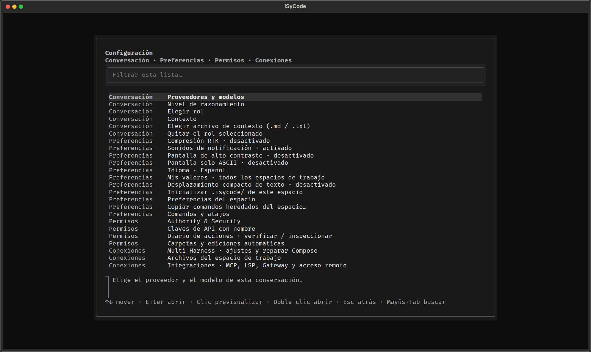

# ISyCode

**Un agente de programación para la terminal.** Local, con teclado, y con un permiso
explícito detrás de cada efecto. Chat, archivos, git, comandos, MCP y providers
viven en una sola TUI. El proyecto se identifica con `.isyroot`; eso **no**
autoriza a tocarlo. IsySentinel decide, un owner ejecuta, el journal guarda el recibo.

Español por defecto. Inglés y chino simplificado en un ciclo. Los nombres de
producto se quedan: ISyCode, Classic, Security, Authority & Security, MCP, LSP,
Skills, Gateway, RTK, Multi Harness.

> **Estado (2026-10-10):** versión `0.1.0`, en desarrollo activo sobre
> [`main`](https://github.com/DannyBaanks/ISyCode). Esta página describe el
> producto que hay en el código. Lo ejecutado de verdad y lo que solo tiene
> tests está en [Qué está probado](#qué-está-probado).

```bash
git clone https://github.com/DannyBaanks/ISyCode.git
cd ISyCode
python3 -m venv .venv
. .venv/bin/activate
python -m pip install -e .
isycode
```

Python 3.10 o posterior. La TUI usa **Textual 8.2.8**. La primera carpeta
pregunta si será un workspace recurrente o temporal, y si arranca en Classic o
en Security. `Esc` en esa pantalla es Security.


Captura real de la TUI (Textual 8.2.8) en un workspace de demostración, idioma
español, modo Classic. No se llamó a ningún provider, Gateway ni MCP. El paisaje
es el tablero de reposo; desaparece hacia arriba con el primer mensaje.

## Índice

- [Qué es](#qué-es)
- [La interfaz](#la-interfaz)
- [Instalar, arrancar y actualizar](#instalar-arrancar-y-actualizar)
- [Classic y Security](#classic-y-security)
- [Qué puede hacer el agente](#qué-puede-hacer-el-agente)
- [Idioma](#idioma)
- [Providers y modelos](#providers-y-modelos)
- [Comandos `/`](#comandos-)
- [Seguridad](#seguridad)
- [Integraciones](#integraciones)
- [Atajos](#atajos)
- [Qué está probado](#qué-está-probado)
- [Lo que falta](#lo-que-falta)
- [Documentación](#documentación)
- [Contribuir](#contribuir)

## Qué es

ISyCode es el agente de terminal de ISyCo. Lo abres en la carpeta del proyecto
y trabajas ahí: lees, editas, corres tests, haces commit, hablas con el modelo.
No es un shell libre y no es un wrapper de otra CLI.

Tres reglas de producto:

1. **Identidad ≠ autoridad.** `.isyroot` marca el borde del workspace. Los
   permisos viven en Workspace Authority, por acción.
2. **Deny by default.** IsySentinel no ejecuta nada. Si no hay owner, grant y
   (cuando toca) aprobación de un solo uso, la acción no ocurre.
3. **Todo deja rastro.** Decisiones y recibos van a un journal privado,
   encadenado por hash. El modelo no ve secretos ni el texto copiado al
   portapapeles.

La TUI está pensada para usarla todo el día: streaming, cola de mensajes,
varias conversaciones a la vez, compactación automática cuando el historial no
cabe, y recuperación si el stream se corta.

## La interfaz

| Overview | Archivos |
| --- | --- |
|  |  |



Lo que ves al abrirla hoy:

- **Paisaje de arranque.** El faro y la luna ocupan el chat mientras no hay
  mensajes. En ventanas anchas se recorta abajo, no se estira. Encima: `ISYCODE`,
  la ruta y `● Classic` o `● Security`. Debajo: el modelo, y las columnas LSP /
  MCP / Skills.
- **Chat.** Las lecturas salen en una línea gris con recibo. Un cambio que
  revisas muestra tu decisión (`aprobaste` / `rechazaste`). En una carpeta
  Classic ya confiable, la edición ordinaria sale como Quiet Classic: el modelo
  recibe `approved_by_user: false`. Un rechazo no se pinta como éxito.
- **Compositor.** Gato a la izquierda (duerme en reposo, camina durante el
  turno), Caja de ideas, ShellBox con `Ctrl+S`, barra de contexto. `Enter` envía.
  `Shift+Enter`, `Ctrl+J` y `Alt+Enter` son nueva línea.
- **Panel lateral (`Ctrl+B`).** Una tarjeta: IsySentinel en vivo, MCPs, LSPs,
  Skills, Conexiones y Espacio de trabajo. Overview / Archivos arriba.
  Conexiones empieza plegado (Gateway, MCP, Mobile Host, Bridge).
- **Archivos.** Árbol, búsqueda, Copiar ruta y Abrir vista. Listar y leer
  pasan por Authority e IsySentinel; el panel enseña el recibo. Files no borra
  ni renombra.
- **Sesiones.** El botón Sesiones abre la lista de trabajo, no un tercer
  chat. Cada conversación guarda su transcript, cola y turno. Cambiar de chat
  aparca el turno; no lo cancela. `Esc` cancela solo el de la pantalla.
- **Aprobaciones.** `y` aprueba, `n` o `Esc` rechazan. El botón por defecto
  es rechazar. El diff o el comando exacto van en la tarjeta. Si una escritura
  reemplaza el archivo entero, la ventana lo dice.
- **Settings (`⚙`).** Ventana grande y centrada. Filtro, grupos
  Conversación / Preferencias / Permisos / Conexiones, y `?` en las opciones
  que lo llevan.

Las capturas son de un workspace temporal de demostración. El placeholder del
prompt puede seguir en inglés; el resto de menús, botones y Settings está en el
idioma activo.

## Instalar, arrancar y actualizar

### Desde el código

```bash
git clone https://github.com/DannyBaanks/ISyCode.git
cd ISyCode
python3 -m venv .venv
. .venv/bin/activate
python -m pip install -e .            # '.[anthropic]' para Claude nativo
isycode
```

Para lanzarlo desde cualquier proyecto con este checkout:

```bash
./scripts/install-path
cd /ruta/a/tu/proyecto
isycode
```

| Comando | Qué hace |
| --- | --- |
| `isycode` | Abre la TUI en la carpeta actual |
| `isycode -p "pregunta"` | Responde una vez y sale |
| `isycode cli` | Navegador de acciones por intención; no ejecuta shell |
| `isycode --help` / `--version` | Ayuda y versión |
| `isycode update` / `isycode actualizar` | Actualiza un checkout limpio o una instalación de usuario |
| `isycode update --check` | Consulta cambios sin instalar |
| `isycode update --yes` | Acepta de antemano stash o merge |

CI corre la suite en Python 3.10 y 3.12. Las conversaciones recurrentes se
guardan en `~/.local/state/isycode/` (o `$XDG_STATE_HOME`), nunca dentro del
proyecto.

`isycode update` detecta el checkout desde el propio programa. Solo acepta
`github.com/DannyBaanks/ISyCode`. Un fork se rechaza antes del fetch. Sin
terminal la respuesta es no, salvo `--yes`. Si el único conflicto es
`docs/security/m15-authority-coverage.json`, lo regenera; cualquier otro
detiene la operación.

### Paquetes precompilados

Al publicar un tag `vX.Y.Z`, CI construye paquetes nativos si la suite hermética
pasa y la versión coincide con `pyproject.toml`. Hoy **no hay release publicado**.

- **Windows x64:** `.exe` de consola.
- **Linux x64:** AppImage y `.deb` (Ubuntu 22.04, glibc 2.35+).
- **macOS ARM64:** `.pkg` y `.tar.gz`, sin notarización de Apple.

Los paquetes instalan el comando `isycode`; no son una app gráfica.

### Primera vez en una carpeta

ISyCode pregunta si el workspace será **recurrente** (crea `.isyroot` y puede
guardar conversaciones) o **temporal**, y el **modo**. Quick Start deja
recurrente + Classic + coding tools en una pantalla; Custom setup va paso a
paso. `Esc` es Security.

## Classic y Security

Lo eliges al abrir la carpeta y lo cambias en **Settings → Authority & Security**.
**Settings → Mis valores** fija el modo de las carpetas nuevas; es una
preferencia, no un grant.

| | Classic | Security |
| --- | --- | --- |
| Leer y buscar archivos | incluido | lo activas tú |
| Proponer ediciones | incluido; tras confiar la carpeta, las ordinarias no preguntan cada una | lo activas tú |
| Chat con el provider elegido | incluido | lo activas tú |
| Guardar conversaciones | incluido | lo activas tú |
| API keys (guardar y quitar piden confirmación) | incluido | por servicio |
| Git status/diff y commits | incluido; cada commit pide aprobación | permiso explícito; cada commit pide aprobación |
| Comandos en sandbox (bubblewrap/seccomp) | incluido; tras confiar, no pregunta cada comando | permiso explícito |
| MCP, diagnósticos Pyright | permiso explícito | permiso explícito |
| Gateway, Tailscale, Mobile Host, Bridge | permiso explícito | permiso explícito |
| Borrar y mover archivos | implícito; tras confiar no pregunta cada vez | permiso explícito |
| Shell libre, editar `.isyroot`, archivos sensibles | no disponible | no disponible |

Classic es un preset de grants implícitos, **no un bypass**. Sin confiar la
carpeta, cada edición y cada comando conservan su aprobación exacta. Al
confiarla, lecturas, ediciones recuperables y comandos aislados dejan de
preguntar uno a uno. Commit, secretos, autoridad, deshacer, MCP y un comando
sin sandbox siguen preguntando o se quedan apagados. Si no hay sandbox, no hay
fallback inseguro. Una carpeta movida o copiada no hereda la confianza.

**Turn on all coding tools…** en Authority concede lectura, edición, mover,
borrar, deshacer, comandos en sandbox, git, diagnósticos y copiar al
portapapeles. No apaga las preguntas. Sin sandbox los comandos siguen apagados.

## Qué puede hacer el agente

Con un provider que soporta tool calls, el modelo pide herramientas, ISyCode
las corre por su owner y le devuelve el resultado. Cada herramienta aparece
solo con su permiso. Ninguna saltea IsySentinel ni el journal.

| Capacidad | Herramienta | Permiso | ¿Pide aprobación? |
| --- | --- | --- | --- |
| Listar, leer, buscar por nombre | `workspace_list`, `workspace_read`, `workspace_search` | Read and search workspace files | no |
| Buscar texto | `workspace_grep` | Read and search workspace files | no |
| Empaquetar contexto | `workspace_pack` | Read and search workspace files | sí, con lista y estimación |
| Memoria privada y grafos | `memory_*`, `memoir_*` | herramientas de workspace | sí, una vez por operación |
| Editar un fragmento | `workspace_edit` | Edit workspace files | sí, salvo Classic ya confiable |
| Crear o reescribir un archivo | `workspace_write` | Edit workspace files | sí, salvo Classic ya confiable |
| Borrar / mover | `workspace_delete`, `workspace_move` | Edit workspace files | sí, salvo Classic ya confiable |
| Deshacer el último cambio de ISyCode | `/undo` | Edit workspace files | sí, con el diff inverso |
| Comando en sandbox | `workspace_run`, `/run` | Run commands in a sandbox | sí, salvo Classic ya confiable con sandbox |
| Git status/diff | `git_status`, `git_diff` | See git status and diffs | no |
| Commit | `git_commit`, `/commit` | Create git commits | sí, con archivos, mensaje y diff |
| Página HTTPS pública | `webfetch` | host de esa página | sí, en cada host nuevo |
| MCP local | `mcp__<servidor>__<herramienta>` | al arrancar el servidor | sí: al arrancar y en cada llamada |
| Diagnósticos Pyright tras editar `.py` | automático | Check Python files after edits | no |
| Plan de trabajo | `update_tasks` | ninguno | no |
| Copiar lo que **tú** seleccionas | ratón, Copy path | Copy selected text to the clipboard | no (el modelo no tiene esta herramienta) |

Si una herramienta está apagada, el agente te dice dónde activarla.

**`workspace_pack`:** hasta 32 rutas, 200 archivos, 1 MiB. Cada archivo sigue
el tope de lectura de 128 KiB. Omite secretos, ocultos al recorrer directorios
y carpetas típicas de build/caché. La estimación es local (~2 bytes/token), no
el tokenizer del provider. El paquete se marca como datos no confiables.

**Memoria:** SQLite privada fuera del checkout, una por workspace. El agente
solo la toca si se lo pides. Olvidar borra; consolidar archiva. Las lecturas
aprobadas pueden ir al modelo: trátulas como contexto no confiable.

### Bucle, contexto y varias ventanas

- No hay límite local de pasos. `Esc` detiene el turno entero.
- El scroll sigue la salida si estás abajo; si subes, conserva tu sitio. `End`
  vuelve a seguirla.
- **Recuperación automática** ([ADR 0008](docs/decisions/0008-automatic-continuity-recovery.md)):
  stream cortado, red, timeout, 5xx o 429 reenvían ese paso. No se repite una
  herramienta ya ejecutada. Retrasos fijos; `Retry-After` hasta 15 s. `Esc`
  cancela la espera. Al agotar intentos, el prompt queda y `/retry` sigue.
- **Cápsula de continuidad** ([ADR 0009](docs/decisions/0009-continuity-capsule.md)):
  un resumen que ISyCode arma sin gastar tokens (pedidos, tareas, idea box,
  cambios, comandos, lecturas). Si el historial no cabe, si el provider rechaza
  por tamaño, si cambias a un modelo más pequeño, o al lanzar un subagente.
  La conversación guardada no se recorta. `/compact` resume cuando lo pides.
- **Dos ventanas, una conversación.** Cada proceso recuerda la huella de lo
  que cargó. Si otra ventana escribió, esta no pisa: puedes hacer fork, recargar
  o seguir sin guardar. El lock usa `flock` en Linux y macOS; Windows no se ha
  ejecutado.
- **Varias conversaciones en el mismo proceso.** Cada chat es un lane. Cambiar
  de conversación no cancela la que dejas. `/msg <nombre> <texto>` entrega ese
  texto a otro chat como si lo hubieras escrito tú.
- `@ruta/archivo` adjunta hasta 5 archivos, leídos con el permiso de lectura y
  marcados como datos.

### Ediciones, sandbox y git

`workspace_edit` busca el fragmento exacto y, si hace falta, ignora finales de
línea, espacios finales y sangría (siempre coincidencia única). La aprobación
enseña el diff exacto. Escritura atómica, sin seguir symlinks, tope 128 KiB.
Si el archivo cambió después de revisarlo, no se sobrescribe. Cada cambio deja
checkpoint para `/undo`.

Los comandos necesitan **bubblewrap, libseccomp y python3 en Linux**. Sin ellos
la opción aparece apagada. Sin shell, sin red, solo el workspace escribible,
`.isyroot` de solo lectura. 120 s por defecto, 600 s máximo, 64 KiB de salida.
Los cambios de un comando no se deshacen con `/undo`.

Git: hooks apagados, sin push implícito, sin config del sistema. `git.push` es
otra acción (remoto https, ref y digest exactos). Un `.git/config` con
programas que git ejecutaría se rechaza. Solo se admite `.git` en la raíz del
workspace.

Un aviso opt-in de [grit](https://github.com/rtk-ai/grit) puede mostrar símbolos
reclamados por otros agentes al editar. Es informativo: no bloquea ni autoriza.

## Idioma

El idioma de la interfaz es una preferencia de usuario, no un grant del
workspace. Ciclo: **es → en → zh → es** (Settings, o la entrada de idioma).

- Los catálogos van en `src/isycode/locales/<código>/LC_MESSAGES/isycode.po`.
- Los nombres de producto no se traducen.
- Comandos `/`, flags y payloads del protocolo se quedan en inglés.
- El chat, el código y la salida del provider no se autotraducen.

## Providers y modelos

Elígelo en **Proveedores y modelos** o con `ISYCODE_PROVIDER` / `ISYCODE_MODEL`.
Si no hay clave, un campo enmascarado la pide (también en **Settings → Claves
de API**). La clave va al keyring del sistema. Una clave no concede red: el
host se autoriza aparte (Classic lo incluye).

| Provider | Variable | Nota |
| --- | --- | --- |
| Anthropic (Claude) | `ANTHROPIC_API_KEY` | SDK oficial: `pip install 'isycode[anthropic]'` |
| OpenAI | `OPENAI_API_KEY` | default de catálogo `gpt-6-luna` si no hay modelo guardado |
| NVIDIA NIM | `NVIDIA_NIM_API_KEY` | probado con clave real |
| Nebius | `NEBIUS_API_KEY` | probado por el equipo |
| Groq | `GROQ_API_KEY` | |
| OpenRouter | `OPENROUTER_API_KEY` | herramientas solo con `ISYCODE_TOOL_CALLS=1` |
| Ollama, llama.cpp | opcional | endpoints locales |
| ChatGPT / Codex | inicio de sesión oficial | navegador o código de dispositivo; no es una API key |

Flujo al elegir modelo: provider → modelo → razonamiento. La ficha enseña solo
datos conocidos (contexto, familia, herramientas, precio, disponibilidad) y su
fuente. Lo desconocido sale como *Not reported*. El modelo guardado sobrevive
al reinicio y gana al default del catálogo.

Si el provider los lista, salen arriba con ★: GLM 5.3 Flash, GLM 5.3, Kimi K3 y
DeepSeek V4.1 Flash.

Los presets que no anuncian tool calls solo conversan, salvo
`ISYCODE_TOOL_CALLS=1`. Que exista el preset no implica una clave real validada
de cada servicio.

## Comandos `/`

`/` o `Ctrl+P` abren la navegación. `/help` lista todo. Los nombres se quedan
en inglés.

| Comando | Qué hace |
| --- | --- |
| `/undo` | Deshace el último cambio de ISyCode |
| `/run <programa> [args]` | Comando en sandbox |
| `/git`, `/diff`, `/commit` | Rama, diff, commit revisado |
| `/mcp add playwright`, `/mcp add context7`, `/mcp start <nombre>` | MCP fijados; cada llamada pide aprobación |
| `/compact` | Resume ahora con el slot *small* |
| `/retry` | Revisa y reenvía el prompt interrumpido; nunca relanza herramientas |
| `/rtk` | Compresión nativa de salida (opt-in). `/rtk recall <sha256>` muestra el original |
| `/harness` | Multi Harness, solo lectura |
| `/providers`, `/models` | Providers y catálogo |
| `/session`, `/sessions` | Estado y lista de conversaciones |
| `/msg <nombre> <texto>` | Escribe en otra conversación |
| `/skills`, `/subagent`, `/iteration` | Guías, un subagente, o tres modelos en secuencia |
| `/doctor`, `/check`, `/usage`, `/context` | Diagnóstico local, sondeo del provider, tokens, AGENTS.md |
| `/readme`, `/plan`, `/review` | Preview de README, plan IsyMotron, revisión externa |

Comandos propios: `~/.config/isycode/commands/<nombre>.md` primero, luego
`.isycode/commands/`. Un comando es un prompt: no concede permisos.

## Seguridad

Cada acción sigue el mismo camino:

**intención → execution owner → Workspace Authority → IsySentinel → efecto → receipt**

1. `launch_dir` es desde dónde invocaste el programa.
2. `workspace_root` es el borde que marca `.isyroot` (o `launch_dir`).
3. La **autoridad** son los permisos efectivos. El marker nunca concede acceso.

IsySentinel es deny-by-default. Las aprobaciones son de un solo uso y van
ligadas al digest exacto de la petición. El journal es privado, encadenado por
hash, en segmentos de 4 MB. Un segmento alterado, faltante o reordenado se
detecta.

`secure_closed: true` en
[`docs/security/m15-authority-coverage.json`](docs/security/m15-authority-coverage.json)
quiere decir que cada callsite de efecto pasa por su owner. Un escáner lo
vuelve a `false` si aparece otro llamador. M15 sigue abierto por los testigos
remotos del Gateway.

Diseño: [fronteras de IsySentinel](docs/design/isysentinel-security-boundaries.md),
[Mobile Host](docs/mobile-host-v1.md),
[runtime](docs/decisions/0001-runtime-boundary.md).

## Integraciones

- **MCP local.** Solo `~/.config/isycode/mcp.json`. Arrancar uno ejecuta un
  programa con tu usuario. `/mcp start` pide el comando exacto; cada herramienta
  pide los argumentos. Descripciones y respuestas son datos no confiables.
  Playwright queda reducido a `browser_snapshot`: tú navegas, ISyCode filtra el
  árbol de accesibilidad, te enseña el texto y solo entonces puedes compartirlo
  con el modelo. Tope 24 000 caracteres, marcado no confiable, fidelidad no
  evaluada. No usa tu Chrome personal.
- **RTK** ([rtk-ai/rtk](https://github.com/rtk-ai/rtk), Apache-2.0). Opt-in,
  apagado por defecto. Comprime la salida de un comando **ya aprobado** para el
  modelo; no concede permisos. ISyCode pregunta `rtk rewrite`, ejecuta el argv
  original una vez, y entrega el compactado. El original queda archivado (hash
  en el recibo). `/rtk` y Settings → Compresión RTK. Guía: [`docs/rtk/GUIA.md`](docs/rtk/GUIA.md).
- **Skills.** Guía Superpowers empaquetada, fijada por digest. Leerla no
  ejecuta scripts ni concede permisos.
- **LSP.** Pyright y TypeScript reales pasaron handshake y búsqueda
  sandboxed. rust-analyzer, gopls y clangd se muestran si el runtime está.
  Diagnósticos automáticos tras editar: Pyright.
- **Multi Harness.** Crush, Qwen Code, OpenCode, Claude Code, Codex, Grok,
  Hermes, fx, OpenClaw, Pi, Kimi, Cursor, Copilot, Command Code y Kilo CLI.
  Solo lectura: versión, ajustes, diferencias. Copiar el modelo por defecto o
  importar un transcript pide confirmación.
- **ISyCo Gateway.** `GATEWAY_URL` + clave con scope `isyco.semantic` (HTTPS
  fuera de loopback) e ID opaco coincidente. Once operaciones semánticas de
  solo lectura. Una operación real con permiso local, scope remoto e IDs
  coincidentes sigue **NOT_DEMONSTRATED**.
- **Tailscale y Mobile Host.** Settings puede proponer una ruta Serve privada
  `/isycode` hacia `127.0.0.1:8765`. Nunca Funnel. Pairing con PIN de un solo
  uso. Sesiones remotas, streaming y approvals remotos: **NOT_DEMONSTRATED**.
- **IsyMotron.** Planner opcional para `/plan`. No es la autoridad de
  seguridad.
- **OpenISy.** Catálogo externo de MCP/Skills/providers si hay
  `OPENISY_API_URL`. Descubrir no activa ni invoca.
- **Bridge.** Coordinación opt-in entre agentes. Un lease es un semáforo, no
  un permiso. ISyCode no arranca el daemon.

## Atajos

| Atajo | Acción |
| --- | --- |
| `Enter` | Enviar. `Shift+Enter` / `Ctrl+J` / `Alt+Enter` = nueva línea |
| `Enter` durante un turno | Encola (máximo 8). Envío vacío sobre la cola: steer |
| `Esc` | Detener el turno; si no hay, volver o cerrar |
| `Ctrl+S` | Idea Box / ShellBox |
| `/` o `Ctrl+P` | Navegación |
| `Ctrl+F` | Buscar en el chat. `Ctrl+Shift+F` busca en todas las conversaciones |
| `Ctrl+B` | Panel lateral |
| `F6` / `Shift+F6` | Archivos / Overview |
| `F7` / `Shift+F7` | Ancho del panel |
| `Ctrl+L` | Volver al compositor |
| `Ctrl+T` | Plegar Tasks |
| `y` / `n` | Aprobar / rechazar |
| `?` | En Settings, explicar la opción |
| Selección con el ratón | Copiar (con el permiso activo) |

## Qué está probado

**Ejecutado de verdad**

- TUI de producto (estas capturas): paisaje, Classic, panel IsySentinel,
  archivos con recibo, Settings en español.
- Agente con herramientas en Linux (NVIDIA): leer, buscar, escribir, editar,
  borrar, mover, comandos y git, con aprobaciones.
- Chat NVIDIA NIM, cancelación y streaming.
- Cápsula y recuperación contra NIM (2026-10-08): el modelo recordó una
  palabra que ya no iba en el request; un overflow real de 896k caracteres se
  recuperó en un reenvío; un stream cortado se reintentó. 429/5xx reales siguen
  **NOT_DEMONSTRATED**. Evidencia:
  [`docs/evidence/continuity-canary-2026-10-08/`](docs/evidence/continuity-canary-2026-10-08/).
- MCP local `context7` (2026-10-08): npm, handshake, llamada rechazada que no
  llegó al servidor, llamada aprobada con respuesta real y recibo. Modelo
  simulado. [`docs/evidence/mcp-local-live-2026-10-08/`](docs/evidence/mcp-local-live-2026-10-08/).
- Pyright `initialize` y `workspace/symbol` reales en un workspace temporal.
- Portapapeles X11 con `xclip` (2026-10-04): ALLOW, lectura de vuelta
  coincidió. Journal: tamaño y digest, no el texto.
- Sandbox Linux con bubblewrap en vivo (2026-10-03), un proceso ShellBox y su
  cancelación.
- RTK 0.51.0 opt-in: comando original una vez, salida compactada al modelo,
  original recuperable por hash. Probe local, sin provider externo.
  [`docs/rtk/GUIA.md`](docs/rtk/GUIA.md).
- Broker semántico local en Docker, red interna, montaje read-only.

**Suite hermética (tests, sin sistema real):** comandos, MCP simulado, Claude
con HTTP simulado, archivos Windows simulados en Linux, Tailscale offline.

**Parcial o pendiente**

- Gateway semántico en vivo con permiso, scope e IDs coincidentes.
- LSP más allá de Pyright/TypeScript handshake.
- Mobile Host remoto (sesiones, streaming, approvals).
- Tailscale: UI y owners sí; tailnet real **NOT_DEMONSTRATED**.
- Claude nativo contra la API real; Windows nativo.
- Playwright `browser_snapshot` en una página real, con revisión humana.
- Borrar/mover carpetas enteras, binarios o archivos de más de 128 KiB.

La [matriz de 2026-09-28](docs/product/tui-feature-matrix.md) es histórica. El
[roadmap](docs/ROADMAP.md) se auditó contra `main` el 2026-10-09.

## Lo que falta

1. Testigos remotos de M15: una operación Gateway real, HTTPS de despliegue.
2. Mobile Host con adapters, sesiones y approvals remotos.
3. Validar Claude nativo y Windows en máquina real.
4. Recuperación (ADR 0008/0009) fuera de NVIDIA: Anthropic, OpenAI, 429/5xx
   reales, ahorro de prompt cache.
5. M9 (matriz adversarial, dogfood, rendimiento) y M10 (release gradual).
   M0–M8 del roadmap Classic/Security están APROBADOS.

El producto no se declara daily-driver-ready mientras M15 remoto y M10 sigan
abiertos.

## Documentación

- [Guía rápida](docs/GUIA.md)
- [Roadmap](docs/ROADMAP.md) y [Classic/Security](docs/roadmap-classic-security-ux.md)
- [Uso diario y límites de verificación](docs/daily-use-readiness.md)
- [RTK](docs/rtk/GUIA.md)
- [Decisiones (ADR)](docs/decisions/)
- [Fronteras de IsySentinel](docs/design/isysentinel-security-boundaries.md)
- [Mobile Host v1](docs/mobile-host-v1.md)

```text
src/isycode/       Producto
tests/             Suite hermética
docs/              Guías, diseño, seguridad, evidencia
scripts/           Launcher y update
packaging/         Paquetes nativos
```

```bash
python -m pytest -q -m "not integration"
ISYCODE_LIVE_GATEWAY=1 python -m pytest -q tests/test_gateway.py   # opt-in, escribe en un Gateway real
```

## Contribuir

ISyCode está en desarrollo. Lee [CONTRIBUTING.md](CONTRIBUTING.md) antes de
abrir un pull request.
