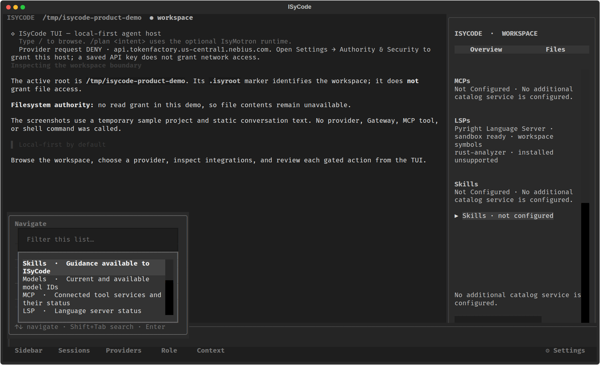

# ISyCode

**Un agente de terminal local-first para trabajar desde una TUI enfocada en el workspace.** ISyCode reúne chat, sesiones, archivos, providers y herramientas en una interfaz de teclado, y mantiene separadas la identidad del proyecto y la autoridad para leerlo.

> Estado: producto en desarrollo. Algunas rutas ya tienen evidencia de ejecución real; otras son parciales o todavía no están conectadas. Esta página distingue ambas cosas.

## La TUI

Las capturas muestran la TUI real de Textual con un workspace temporal de demostración. El texto del chat es estático: no se llamó a un provider, Gateway, herramienta MCP ni comando de shell. El árbol de archivos queda bloqueado porque la captura no tiene un grant de lectura.

| Overview | Archivos | Navegación semántica |
| --- | --- | --- |
|  |  |  |

## Qué ofrece

- **Chat en terminal:** conversación con streaming y cancelación con `Esc`; OpenAI, NVIDIA NIM, Nebius, Ollama y llama.cpp usan la interfaz de provider disponible en esta versión.
- **Workspace con límite explícito:** encuentra el `.isyroot` más cercano o usa el directorio de inicio como fallback. Guarda `launch_dir` y `workspace_root` por separado.
- **Explorador integrado:** árbol, búsqueda acotada, selección, copiar ruta y preview. La identidad `.isyroot` no es un permiso: la lectura exige grants aplicables y el host de archivos disponible.
- **Sesiones:** crear, buscar, reanudar, renombrar y bifurcar conversaciones; las sesiones recurrentes viven fuera del repositorio. El primer mensaje genera un nombre.
- **Integraciones visibles:** estados de MCP, Skills, LSP, Gateway, Mobile Host y Bridge; los elementos descubiertos se distinguen de los que se pueden invocar.
- **Roles:** agentes conversacionales de ISyCode y los ocho motores operativos de ISyCo aparecen en catálogos separados. Se transfiere el flujo, propósito y guardrails del motor; elegir un rol no ejecuta sus comandos ni le concede permisos.
- **CLI por intención:** `isycode cli` abre ramas semánticas para explorar las acciones disponibles sin ejecutar shell arbitrario. En la instalación integrada de ISyCo, `isyco cli` deriva al mismo navegador.
- **Búsqueda y ayuda:** `Ctrl+F` busca en la consola actual; `/` y `Ctrl+P` abren el navegador de Skills, Models, MCP, LSP, Files, Roles, Providers, Sessions, Workspace y Commands.
- **Providers y claves:** selector de provider/modelo y claves con nombre guardadas en el vault del sistema cuando está disponible. Una clave no concede permiso de red.

## Estado comprobable

### Demostrado en ejecución

- **TUI real:** arranque, paneles Overview/Files, árbol bloqueado sin grant y paleta semántica. Las capturas de arriba son del renderer de la aplicación.
- **Pyright LSP:** handshake `initialize` y búsqueda `workspace/symbol` reales en un workspace temporal; pruebas negativas bloquearon sockets y escritura. Es una integración acotada a búsqueda de símbolos, no un LSP completo.
- **Broker semántico local:** build y arranque Docker con health check mediante el owner de ISyCode. El contenedor usa red interna sin puerto publicado, montaje read-only, capabilities eliminadas, `no-new-privileges`, límites de recursos y sin credenciales. `definition` respondió con Jedi; `symbols/search` reportó honestamente fallback. Una ruta no permitida devolvió 404.
- **Cancelación de chat/review y streaming:** el transporte cancela la tarea activa y conserva las respuestas parciales como parciales, fuera del historial utilizable.

Los testigos de Pyright y Docker se ejecutaron sobre datos temporales. No prueban acceso autorizado al workspace de cada usuario ni una operación en el Gateway de producción.

### Implementado con configuración y grants

- Provider chat/model requests pasan por los controles locales de red; requieren credencial y host autorizado.
- `.isyroot`, directorio de lanzamiento, sesiones externas, paleta, selector de providers/roles, búsqueda de consola y Settings.
- Preview local de archivos mediante el host existente de IsyMotron en Linux, con grants de filesystem explícitos. El alcance efectivo está limitado por esos grants; el marker no los crea ni amplía.
- Once operaciones semánticas read-only del Gateway con payloads tipados, revisión explícita y gates locales/remotos independientes.
- Gateway MCP: listar herramientas y flujo manual para revisar payload y aprobar una llamada individual.
- Contexto `AGENTS.md`/`AGENT.md`, selector nativo de README y consultas de símbolos Pyright pasan por owners y permisos específicos cuando se configuran.
- Primer corte de Mobile Host: health local, pairing PIN de un uso, credencial temporal hasheada, inventario de runtimes y heartbeat de clientes.

“Implementado” significa que hay un flujo en el código; cada integración puede seguir necesitando instalación, credencial, grants y configuración externa. Mira las columnas de evidencia de la [matriz de features](docs/product/tui-feature-matrix.md).

### Parcial o pendiente

- **ISySentinel / M15:** `security.py` agrega decisiones de forma pura y Workspace Authority conserva grants por root. Los flujos conectados atan el digest de solicitud a un owner y acción registrados; las acciones sin owner quedan denegadas aunque tengan grant. M15 sigue abierto: faltan auditoría durable, auditoría universal de callsites y owners para Mobile Host, Bridge, L1 y mutaciones generales.
- **Ejecución de herramientas del modelo:** una respuesta de texto como `{"tool":"bash",...}` es texto y no se ejecuta. No hay ejecución arbitraria de shell ni escritura general del workspace desde el chat.
- **Gateway en vivo:** el cliente/owner semántico está conectado en ISyCode, pero falta demostrar una operación contra el Gateway real con grant local, scope remoto e IDs de workspace coincidentes.
- **MCP general:** solo Gateway MCP tiene el flujo manual de invocación. Los otros catálogos son descubrimiento; no activan Skills ni llaman herramientas por sí solos. No hay bucle de tools del modelo.
- **LSP:** Pyright ofrece `workspace/symbol`; Rust Analyzer se detecta como no soportado. No hay todavía diagnósticos, autocompletado ni navegación completa.
- **Mobile Host:** aún faltan sesiones remotas, streaming, cancelación, approvals, adapters operativos y administración completa de credenciales.
- **Providers:** OAuth todavía no está implementado. Los métodos OAuth leídos de un catálogo externo son metadatos.
- **OpenISy L0/L1:** sus contratos se documentan como integración futura; el ciclo de staging, activación, worker aislado, receipts y rollback no está integrado en ISyCode.
- **Auditoría duradera y release:** receipts durables, diagnósticos unificados, settings completos, accesibilidad/rendimiento y reconciliación final de owners siguen en el roadmap.

## Seguridad y límites

ISyCode separa tres conceptos:

1. **`launch_dir`:** la carpeta desde la que se invocó el programa.
2. **`workspace_root`:** el límite lógico detectado por `.isyroot`, o `launch_dir` si no hay marker.
3. **Autoridad:** los permisos efectivos concedidos para acciones concretas. El marker nunca concede acceso.

Las acciones con efectos deben pasar por Workspace Authority, IsySentinel, approval cuando corresponda y un execution owner compatible. La política aún no está conectada de forma completa; por eso varias capacidades permanecen bloqueadas o parciales. El Gateway mantiene además su Sentinel remoto. Los receipts de algunas rutas siguen siendo locales/en memoria, no una auditoría durable.

El diseño y límites están en [fronteras de seguridad](docs/design/isysentinel-security-boundaries.md), [contrato Mobile Host](docs/mobile-host-v1.md) y [decisión de runtime](docs/decisions/0001-runtime-boundary.md).

## Instalar y arrancar

Requiere Python 3.10 o posterior. El TUI usa Textual y Rich; Pyright LSP y el broker Docker son integraciones opcionales.

```bash
git clone https://github.com/DannyBaanks/ISyCode.git
cd ISyCode
python3 -m venv .venv
. .venv/bin/activate
python -m pip install -e .
isycode
```

Para iniciar desde cualquier proyecto con el launcher de este checkout:

```bash
./scripts/install-path
cd /ruta/a/tu/proyecto
isycode
```

`isycode cli` abre el navegador semántico. El wrapper `isyco cli` existe en la instalación integrada con el CLI de ISyCo; el paquete standalone instala `isycode` y no reemplaza ese comando del sistema.

En el primer arranque, se puede marcar el directorio como workspace recurrente. Aceptar crea un `.isyroot` vacío; rechazar mantiene la ejecución temporal. Las conversaciones recurrentes se guardan en `~/.local/state/isycode/isyrcodesessions/` o bajo `$XDG_STATE_HOME`.

## Providers

Selecciona un provider desde **Providers** o configura `ISYCODE_PROVIDER` y `ISYCODE_MODEL`. Variables de credencial aceptadas:

| Provider | Variable |
| --- | --- |
| OpenAI | `OPENAI_API_KEY` |
| NVIDIA NIM | `NVIDIA_NIM_API_KEY` |
| Nebius | `NEBIUS_API_KEY` |
| Ollama | `OLLAMA_API_KEY` |
| llama.cpp | `LLAMACPP_API_KEY` |

También se pueden guardar claves nombradas en el vault del sistema. Sin una clave, ISyCode arranca en estado no configurado. Antes de hacer una solicitud se debe autorizar el host del provider en **Settings → Authority & Security**. OAuth no está disponible todavía.

## Integraciones

- **ISyCo Gateway:** define `GATEWAY_URL` y una clave con scope `isyco.semantic`. Para rutas no locales usa HTTPS. La configuración también requiere un ID opaco coincidente entre Gateway e ISyCode; ese ID es un binding operativo, no prueba identidad física del filesystem.
- **Catálogo externo OpenISy:** define `OPENISY_API_URL`; puede leer estados/metadatos de MCP, Skills y providers, sujeto a autorización de host. Descubrir no activa ni invoca.
- **IsyMotron:** es un adapter opcional y fuente del host Linux read-only de archivos. Configura `ISYMOTRON_ROOT` si no se descubre automáticamente.
- **Mobile Host:** por defecto escucha en `127.0.0.1:8765`. El bind remoto exige certificado y llave TLS; pairing y health no significan que haya runtime remoto operativo.

## Atajos principales

| Atajo | Acción |
| --- | --- |
| `Enter` / `Shift+Enter` | Enviar / nueva línea |
| `Esc` | Cancelar stream activo; si no hay operación, volver/cerrar menú |
| `/` o `Ctrl+P` | Abrir navegación semántica |
| `Ctrl+F` | Buscar en la consola actual |
| `Ctrl+B` | Mostrar u ocultar panel lateral |
| `F6` / `Shift+F6` | Abrir Files / Overview |
| `F7` / `Shift+F7` | Ajustar ancho del panel lateral |
| `Ctrl+L` | Volver al composer conservando el borrador |

El engranaje **Settings** incluye el mapa completo de atajos.

## Roadmap

El orden de trabajo y los criterios de salida están en [`ROADMAP.md`](ROADMAP.md). Las brechas por superficie, evidencia y estado demostrado están en [`docs/product/tui-feature-matrix.md`](docs/product/tui-feature-matrix.md).

La estrategia tiene dos etapas: primero publicar **ISyCode Secure**, con el conjunto actual de acciones tipadas y permisos mínimos; después ampliar hacia **ISyCode Full** agregando capacidades y grants explícitos. Full no desactiva Sentinel ni convierte grants en ejecución arbitraria: cada capacidad nueva requiere su propio owner, límites y registro de resultado.

Prioridades abiertas:

1. Terminar M15: auditar cobertura de Workspace Authority + IsySentinel + approvals + execution owners en todas las acciones y añadir auditoría durable.
2. Cerrar M16: sesiones recuperables, configuración/diagnósticos, cobertura UX y matriz con testigos reproducibles.
3. Demostrar el Gateway semántico real con identidad, scopes y grants correctos.
4. Completar Mobile Host con adapters, sesiones/stream, cancelación y approvals.
5. Añadir las acciones de archivos y capacidades runtime únicamente detrás de owners tipados y permisos verificables.
6. Evaluar L0/L1 después de cerrar la base de seguridad; no se incluye como capacidad activa de esta versión.

El release no se declara “daily-driver-ready” mientras M15 siga abierto.

## Documentación

- [Guía rápida en español](GUIA.md)
- [Roadmap por milestones](ROADMAP.md)
- [Matriz de features y evidencia](docs/product/tui-feature-matrix.md)
- [Comparativa con otras CLIs](docs/product/cli-competitive-audit.md)
- [Fronteras de ISySentinel](docs/design/isysentinel-security-boundaries.md)
- [Contrato Mobile Host v1](docs/mobile-host-v1.md)
