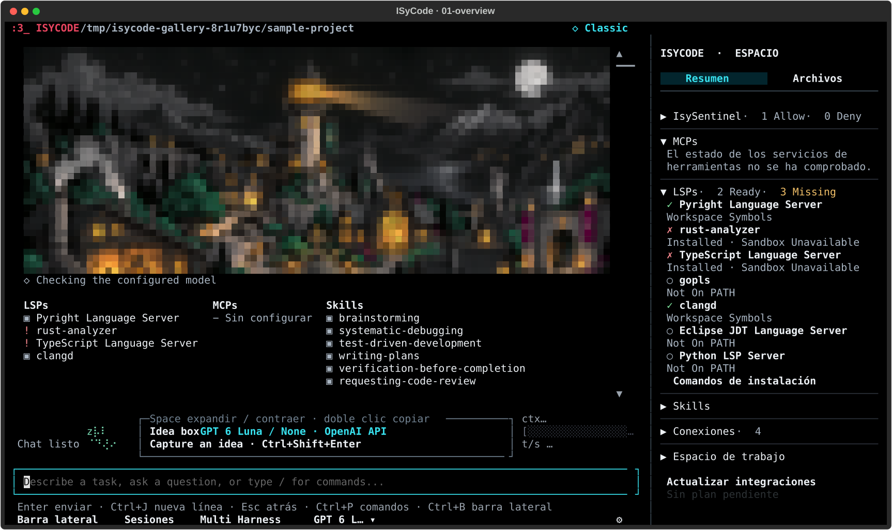
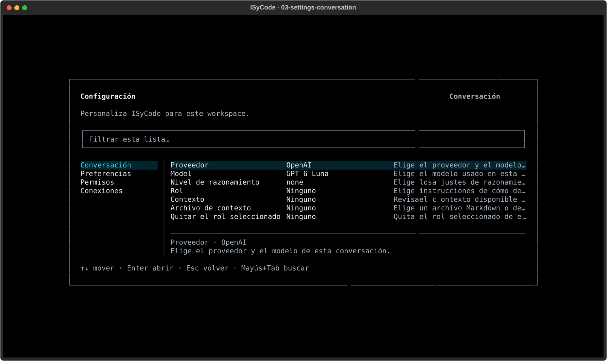
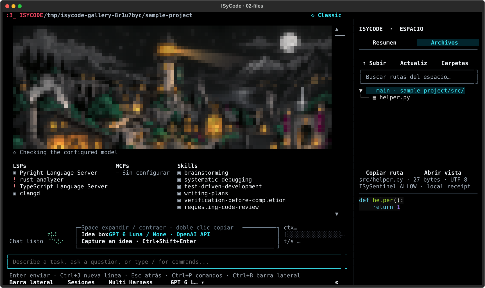

# ISyCode

**Tu proyecto, tu terminal, tus decisiones.**

Un agente de programación para leer código, proponer cambios, ejecutar pruebas
y revisar Git desde una sola terminal. Conversa con el modelo que elijas,
conserva tus sesiones localmente y controla qué puede hacer en cada proyecto.

[Empezar](#empieza-en-tu-proyecto) · [Guía de uso](docs/GUIA.md) ·
[Documentación](docs/reference/README.md) ·
[Reportar un problema](https://github.com/DannyBaanks/ISyCode/issues)



*TUI real en un proyecto de ejemplo. [Menús, gestos y capturas](docs/design/2026-10-12-mockup-e2e/GUIA.md).*

## Trabaja sin salir de la terminal

- **Del código al cambio.** Busca archivos y símbolos, lee contexto, revisa
  propuestas de edición y ejecuta comandos cuando los permisos lo permiten.
- **Un modelo a tu elección.** Providers como OpenAI, Anthropic, NVIDIA NIM y
  OpenRouter, además de endpoints locales con Ollama o llama.cpp.
- **Conversaciones que continúan.** Sesiones guardadas, cola de mensajes,
  búsqueda y recuperación de turnos interrumpidos.
- **Control por proyecto.** Modos Classic y Security, revisión de cambios,
  permisos por capacidad y registro de las acciones.
- **Una interfaz coherente.** Panel lateral plano, Settings por categorías,
  selección de texto precisa y opciones de alto contraste, ASCII y movimiento reducido.
- **Extensiones opcionales.** MCP local, ayuda LSP, Skills y Multi Harness
  para consultar otros entornos de agentes.

La interfaz está disponible en español, inglés y chino simplificado. Las
sesiones y preferencias se guardan en tu equipo; al usar un provider remoto,
el contexto enviado se procesa en ese servicio.

## Empieza en tu proyecto

Necesitas **Python 3.10 o posterior** y Git. Instala ISyCode con un solo comando:

### Linux / macOS
```bash
curl -fsSL https://raw.githubusercontent.com/DannyBaanks/ISyCode/main/install.sh | bash
```

### Windows (PowerShell)
```powershell
irm https://raw.githubusercontent.com/DannyBaanks/ISyCode/main/install.ps1 | iex
```

Una vez instalado, abre cualquier terminal y ejecuta:
```bash
isycode
```

Para mantenerlo siempre al día con los últimos cambios y mejoras:
```bash
isycode actualizar
```

<details>
<summary><b>Instalación manual desde el código (desarrolladores)</b></summary>

```bash
git clone https://github.com/DannyBaanks/ISyCode.git
cd ISyCode
./install.sh
```

O con venv manual:
```bash
python3 -m venv .venv
. .venv/bin/activate
python -m pip install -e .
isycode
```
</details>

En Windows, desde el checkout puedes usar `& .\scripts\install-windows.ps1`
y arrancar `.venv\Scripts\isycode.exe`. La primera etapa de paridad incluye
almacenamiento nativo y Git; el sandbox de comandos Windows sigue pendiente.
Consulta [la guía de paridad](docs/platform-parity/GUIA.md) para pruebas y alcance.

Para Claude nativo, instala también el extra con
`python -m pip install -e '.[anthropic]'`.

1. Elige un workspace **recurrente** para guardar conversaciones o **temporal**
   para una sesión puntual, y selecciona Classic o Security.
2. Abre **Configuración → Conversación → Proveedor** y configura
   el provider que usarás.
3. Pide una tarea concreta: «Explícame este módulo» o «Añade esta prueba».
   Revisa las propuestas y habilita las capacidades que necesites.

La ejecución aislada de comandos requiere **bubblewrap y libseccomp en Linux**.
Consulta [instalación y actualización](docs/reference/installation.md) para
configuración, diagnóstico y plataformas.

**v1.0.0-rc.1 · candidato a release (pre-release).** La instalación desde el código es la vía disponible;
consulta [compatibilidad y verificación](docs/reference/verification.md) antes
de depender de una integración o plataforma específica.

## Todo en su lugar

**Configuración** reúne Conversación, Preferencias, Permisos y Conexiones.
Busca una opción y consulta su explicación sin recorrer una lista interminable.



**Archivos** combina navegación, búsqueda y vista previa del proyecto con el
estado de la lectura.



## Elige cómo trabaja el agente

**Classic** prepara las capacidades habituales de programación. Al confiar
explícitamente en una carpeta, las ediciones ordinarias y los comandos aislados
pueden continuar sin preguntar en cada paso. Los commits y otras operaciones
que requieren revisión conservan sus confirmaciones.

**Security** empieza con las capacidades apagadas y permite habilitarlas una
por una. Puedes cambiar de modo y revisar permisos en
**Configuración → Permisos → Authority & Security**.

Ambos modos conservan IsySentinel y el registro de acciones.
[Permisos, aprobaciones e integraciones](docs/reference/authority-and-integrations.md).

## Atajos para el día a día

| Acción | Atajo |
| --- | --- |
| Enviar / nueva línea | `Enter` / `Ctrl+J` |
| Detener un turno o volver | `Esc` |
| Abrir comandos | `/` o `Ctrl+P` |
| Mostrar el panel lateral | `Ctrl+B` |
| Expandir o contraer una caja enfocada | `Space` |
| Abrir las opciones de copia de una caja | Doble clic |
| Copiar exactamente el texto marcado | Selección con el ratón + `Ctrl+C` |

[Flujos, providers y todos los atajos](docs/reference/workflows.md).

## Aprende, participa y mejora ISyCode

- [Guía de uso en español](docs/GUIA.md): primeros pasos y trabajo diario.
- [Referencia del producto](docs/reference/README.md): instalación, comandos,
  permisos e integraciones.
- [Estándar visual y Design Skills](.agents/skills/isycode-design/SKILL.md):
  criterios compartidos para ampliar la TUI.
- [Contribuir](CONTRIBUTING.md): preparar el entorno y presentar cambios.
- [Seguridad e investigación](SECURITY.md): pruebas en entornos propios y
  cómo reportar vulnerabilidades de forma privada.
- [Issues](https://github.com/DannyBaanks/ISyCode/issues): errores y propuestas.
- [Roadmap](docs/ROADMAP.md): evolución del producto.

## Estado de versión y Release Readiness (v1.0.0-rc.1)

ISyCode se encuentra en **v1.0.0-rc.1** (Release Candidate 1).

El núcleo de seguridad, los contratos de ISySentinel, los Execution Owners y la interfaz TUI están completamente demostrados y verificados mediante más de 1,900 pruebas automáticas.

El cierre formal hacia la versión **v1.0.0 final** permanece explícitamente supeditado a la ejecución de la prueba de usabilidad con 5 usuarios reales (Gate **G9-05** del roadmap, según el protocolo en [docs/usability-g9/GUIA.md](docs/usability-g9/GUIA.md)), manteniendo el principio *fail-closed* del proyecto hasta contar con los participantes.

## Archivos añadidos al repositorio (2026-10-31)

El commit `cf0063e` versiona la auditoría que estaba sin control de versiones:

- `AUDITORIA_RESUMEN.md` — resumen.
- `AUDITORIA_CODIGO.md` — detalle de código.
- `AUDITORIA_HALLAZGOS.txt` — hallazgos en crudo.
- `LICENSE`.


## Licencia

El código original de ISyCode se distribuye bajo la [licencia MIT](LICENSE).
Los componentes, recursos y dependencias de terceros conservan sus licencias
y avisos de autoría respectivos, incluidos los de las
[skills incluidas](src/isycode/bundled_skills/LICENSE) y los
[recursos de iconografía y tipografía](docs/design/2026-10-11-icons-typography/licenses/).
