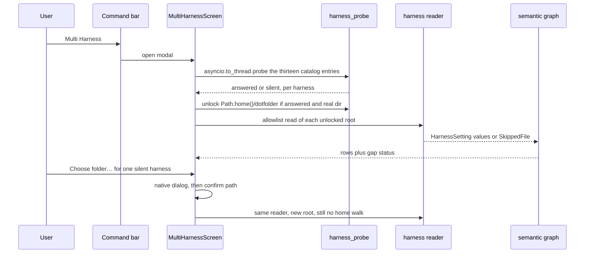

# Multi Harness: a semantic options graph for ISyCode Classic

| Field | Value |
| --- | --- |
| Author | ISyCode design (placeholder) |
| Date | 2026-10-02 |
| Status | Draft |
| Product | ISyCode Classic, local Textual TUI |
| Checkout | `/home/danny/Development/ISyCo Git/ISyCode` (GitHub DannyBaanks/ISyCode) |
| Scope | Architecture only. This document does not implement the feature, does not authorize a milestone, and does not mark gates G0–G6. |

## Overview

Multi Harness is a read-only map from thirteen fixed CLI homes into ISyCode settings that mean the same thing, plus an explicit record of what those CLIs have and ISyCode does not. A shared key string is not a shared meaning. Each semantic node is a meaning ("default model", "approval before a shell command", "project instructions file", "user-facing color theme"). A harness contributes an edge only when one allowlisted field inside one unlocked folder implements that meaning. If two fields differ, they stay two nodes or an explicit `NON_EQUIVALENT` edge. Nothing is aliased because the names look alike. Gemini is not a harness. Danny did not add it.

The user opens **Multi Harness** from the command bar (the control stays available when the right rail is hidden). ISyCode probes the catalog with the argv `[executable, "--version"]`, no shell, short timeout. A process that answers unlocks only that harness's one automatic folder, and only when that path is a real directory. A process that does not answer, or a missing directory, contributes nothing until that person picks one folder with the native OS folder window. Readers then list option names from a per-harness allowlist. Secret files are skipped. The screen shows, per semantic option, the source value (redacted), ISyCode's current value, and the edge kind. Copy is a later, per-option confirm. It never means "import everything", and it never copies a credential, a host, a trust bit, or a sandbox bypass.

On the machine inspected for this draft (2026-10-02), ten CLIs answered `--version`: opencode 1.18.32, Claude Code 2.1.287, codex-cli 0.155.1, grok 1.0.46, Hermes Agent v0.21.5, fx 0.0.11, OpenClaw 2026.9.7, pi 0.87.1, kimi 2.0.2, and cursor-agent 2026.10.01-e373342. `crush` and `qwen` were not on `PATH`, so their dot folders stay locked even though the directories exist. `cursor` is still absent; `cursor-agent` is the name that answers, so `~/.cursor` unlocks. `~/.local/bin/agent` is a symlink to that same binary and is not another harness. `copilot` was absent, so `~/.copilot` stays locked even though the directory exists. `gh copilot` is not an installed extension and is not the probe. Several real configs live outside a dot folder (`~/.config/opencode`, `~/.config/crush`, `~/.local/share/crush`, `~/.local/share/opencode`). Those are not folder aliases. They stay unread until a native pick. The gap threshold stays 4. Growing the catalog to 13 does not raise it. With only the automatic roots, `user_skills` is still the one preference-shaped option at N=4 whose ISyCode target is absent, so its status is `ADD` and the row says `Missing in ISyCode`. Cursor added no skill list, so N did not rise. That row does not implement a skill directory. `provider_endpoint` is also at N=4 (codex, hermes, openclaw, kimi) and is `DO_NOT_MERGE`, not `ADD`, because a foreign base URL is `non_transferable`. Cursor has no base-URL key. `ui_theme` is on Claude, Pi, and Kimi only (N=3), so it stays `WATCH`. Cursor `display.mode` is the layout value `zen`, not a color theme, and does not join. `web_fetch` and `web_search` are two nodes, both absent in ISyCode, and both `WATCH` at N=0: no allowlisted file showed the tool enabled. This document does not invent the missing options inside ISyCode to make the table look aligned.

## Background & Motivation

ISyCode already has its own settings, scattered across real stores. There is no single settings tree to pour another TUI's JSON into:

- Provider and model selection is `PRESETS`, `save_provider_selection`, `selected_provider_name`, and `selected_model_name` in `src/isycode/providers.py`. The file is `state_root() / "preferences" / "provider.json"` (`_preferences_path`).
- xAI sign-in is only `src/isycode/grok_session.py`. `auth_file()` is `~/.grok/auth.json`. `run_login` is the precedent for a shell-free `asyncio.create_subprocess_exec` that does not live in `tui.py`. `set_xai_auth_mode` writes `preferences/xai-auth.json` with mode `api_key` or `session`. That path exists so the user can talk to Grok. It is not a multi-provider OAuth layer.
- Approval is per action. `WorkspaceAuthority.evaluate` still asks when `spec.approval_required` is set, except `workspace_trust.quiet_classic` for `QUIET_CLASSIC_ACTIONS` (`src/isycode/workspace_trust.py`). Quiet Classic does not cover commits, secrets, credentials, provider calls, config, or authority (`docs/decisions/0005-quiet-classic-profile.md`). `command_runner.sandbox_executable` must resolve or `workspace.command.run` is not quiet. There is no unsandboxed fallback.
- Roles are the in-code catalogs `ISYCODE_AGENTS`, `ISYCODE_SUBAGENTS`, and `ISYCO_MOTORS` in `src/isycode/catalog.py`, plus the session field `role` and `UserDefaultsStore.default_role`.
- Project instructions are the workspace file `AGENTS.md`, loaded by `TUIApp._load_context_file` / `_open_context_menu`. `ChatSessionStore.validate_state` accepts `context_path` only when it is exactly `"AGENTS.md"`.
- Chat transcripts are `ChatSessionStore` and `ChatSessionOwner` (`session.create` / `session.resume`). The Sessions control (`#sessions-button` → `_show_chat_sessions`) hides `#chat` and shows `WorkList`. The list path is `ChatSessionOwner.list_conversations` inside `_refresh_work_list`. `ChatSessionsScreen` is a `ModalScreen` in `tui.py`, and nothing in `src/` constructs it.
- LSP is `discover_servers` and `language_server_catalog` in `src/isycode/lsp.py`: PATH presence only, display-only for anything not installed. A configured command from another CLI is not this function.
- Local MCP is `mcp_local.config_path()` and `load_config`. `config_path()` is `$XDG_CONFIG_HOME/isycode/mcp.json`, or `~/.config/isycode/mcp.json` when that variable is unset. Pinned packages are `mcp_presets.PRESETS`. Starting one is `mcp.local.start` plus an approval. Descriptions and results are untrusted. The row shows server names and argv. Env values stay out of that text. The digest hash still includes env values, so the row must not print the digest.
- Skills are the hash-pinned bundle in `skill_catalog.py` (`MANIFEST_SHA256`, `read_skill`). Discovery does not activate a skill. The rail copy says so.
- User-wide preferences are `UserDefaultsStore` (`user-defaults.json`): `new_workspace`, `new_workspace_mode`, `default_role`, `agent_steps`, `answer_tokens`, `chat_token_budget`. Workspace overrides are `WORKSPACE_PREFERENCE_KEYS` in `workspace_config.py`, written by `WorkspaceConfigOwner` under an approval. Neither store has a theme, a vim flag, or a foreign plugin map.
- ISyCode has no web-fetch tool and no web-search tool. `CHAT_WORKSPACE_TOOLS` in `src/isycode/action_runtime.py` is `workspace_list`, `workspace_read`, `workspace_grep`, and `workspace_search`. The chat loop can also offer `request_context_access`, `ask_user`, and, when workspace tools are on, `update_tasks` and `delegate_subagent`, plus edit and write. None of those fetch a URL. `src/isycode/codex_connector.py` sets `web_search` to `"disabled"` on the Codex app-server client. That turns the connector feature off. It is not an ISyCode tool. HTTP in `providers.py` and `streaming.py` is the call to the model API.
- The TUI paints a fixed theme. `TUIApp.CSS` in `src/isycode/tui.py` hardcodes colors. Code blocks use `theme="monokai"`. There is no user theme file.

The pain is the opposite of a missing importer. A naive copy would treat `model`, `theme`, `yolo`, `trust_level`, `api_key`, and `mcp.env` as if they were ISyCode fields. Some of those grant network hosts, skip approvals, or are secrets. Some are not ISyCode features at all. Multi Harness has to show the difference instead of papering over it.

What was actually on disk, names and types only (no message bodies, tokens, emails, or client ids were copied into this document):

| CLI | `--version` on 2026-10-02 | Automatic folder | What that folder actually is |
| --- | --- | --- | --- |
| crush | executable absent | `~/.crush` not unlocked | Directory exists: `crush.db`, `logs/`, `init`, `.gitignore`. Not read automatically. |
| qwen | executable absent | `~/.qwen` not unlocked | Directory exists: `settings.json`, `installation_id`, empty `sessions/`, empty `skills/`, `projects/*/chats/*`, `output-language.md`. Not read automatically. |
| opencode | 1.18.32, rc=0 | `~/.opencode` unlocks | Install tree: `bin/opencode`, `node_modules/`, `package.json`. No product config in this folder. |
| claude | 2.1.287 (Claude Code), rc=0 | `~/.claude` unlocks | `settings.json`, `.claude.json`, `history.jsonl`, `projects/*/*.jsonl`, `skills/`, `plugins/`. `.credentials.json` is SECRET. |
| codex | codex-cli 0.155.1, rc=0 | `~/.codex` unlocks | `config.toml`, empty `AGENTS.md`, `session_index.jsonl`, `sessions/`. `auth.json` and `installation_id` are SECRET. |
| grok | grok 1.0.46, rc=0 | `~/.grok` unlocks | `config.toml`, `trusted_folders.toml`, `sessions/<urlencoded-project>/<id>/`. `auth.json` and `agent_id` are SECRET. The graph does not open `auth.json`. |
| hermes | Hermes Agent v0.21.5, rc=0 | `~/.hermes` unlocks | Real directory, not a symlink. `config.yaml`, `SOUL.md`, `memories/USER.md`, `skills/`, `sessions/request_dump_*.json`. Skip whole: `auth`, `updates`, `.env`, `auth.json`, `auth.lock`, `nous_auth.json` (not present on this machine; still skipped if it appears), `install_id`. |
| fx | 0.0.11, rc=0 | `~/.fx` unlocks | Real directory. `settings.json`. Sessions hold `events.jsonl`, `permissions.json`, `session.json`, `usage-v2.json`. Skip whole: `auth.json`, `auth.lock`, `chatgpt-auth.json`, `chatgpt-auth.lock`. |
| openclaw | OpenClaw 2026.9.7, rc=0 | `~/.openclaw` unlocks | Real directory. `openclaw.json`. `workspace/` holds `AGENTS.md`, `SOUL.md`, `IDENTITY.md`, `USER.md`. `state/openclaw.sqlite` is not queried for live rows. |
| pi | 0.87.1, rc=0 | `~/.pi` unlocks | Real directory. Probe `PATH` name `pi` only. `~/.pi/agent/bin/pi` is not a second root. `agent/settings.json`. `agent/auth.json` is SECRET. |
| kimi | 2.0.2, rc=0 | `~/.kimi-code` unlocks | Real directory. Binary name is `kimi` (also at `~/.kimi-code/bin/kimi`). There is no `~/.kimi`. This is the one folder-name exception: the automatic folder is `.kimi-code` only. Not a second walk and not an alias of another harness. |
| cursor | `cursor-agent` 2026.10.01-e373342, rc=0. `cursor` is still absent | `~/.cursor` unlocks | Real directory, not a symlink. `cli-config.json`, `projects/` (one project directory, no files), `statsig-cache.json` (telemetry, skip the whole file). Probe order stays `cursor-agent`, then `cursor`. The first name answers. |
| copilot | executable absent. `gh copilot` is not installed | `~/.copilot` not unlocked | Directory exists and stays locked until `copilot --version` answers. Layout recorded below for the later allowlist. Logs were not read. |

Known roots that the probe must not walk, confirmed present, and not aliases of the dot folder:

- OpenCode product config: `~/.config/opencode/opencode.jsonc` (keys observed: `$schema`, `provider`, `lsp`, `mcp`, `plugin`). `model`, `permission`, and `theme` were not keys of this file. Symlinks `agent`, `command`, and `tui.json` resolve outside that directory into a source checkout. Do not follow them.
- OpenCode state: `~/.local/share/opencode/opencode.db` (about 2.3 GiB) plus `auth.json` and `mcp-auth.json`. Tables include `session`, `message`, `part`, `session_message`, `permission`, `project`, and also `credential`, `account`, `account_state`, `control_account`. The last four are SECRET tables. `session_share` has a `secret` column and is not queried.
- Crush config: `~/.config/crush/crush.json` (keys include `providers`, `lsp`, `mcp`; `providers.*.api_key` is a secret key). `~/.local/share/crush/` holds another `crush.json` (`models.large.model`, `models.large.provider`, `recent_models`), `projects.json`, and `providers.json`. `providers.json` is skipped whole. It is not parsed for key material.
- `crushrc` was not opened. Its schema is NOT_DEMONSTRATED.
- Qwen `settings.json` and `installation_id` were not opened. Their schemas are NOT_DEMONSTRATED. The file names are recorded so a reader can skip them.

Grok session files under an unlocked `~/.grok/sessions/<urlencoded-project>/<session-id>/` include `chat_history.jsonl`, `system_prompt.txt`, `updates.jsonl`, `events.jsonl`, `summary.json`, `prompt_context.json`. `summary.json` key names include `current_model_id`, `sandbox_profile`, `reasoning_effort`, `num_messages`, and also `session_summary` and `agent_id`. The reader allowlist below keeps only the first four. `prompt_context.json` and `system_prompt.txt` are prompt material and are not allowlisted, even though a one-off key listing saw `agents_md_files` inside `prompt_context.json`. That key is not a reader output until a fixture isolates it. It does not count toward a gap.

`--version` is the probe, not `--v`. The first wording was `--v`. `--v` is not portable: some CLIs use it for verbose, some reject it, and the ten binaries above all answered `--version` with rc=0. The probe is a fixed argv list. It is not a shell string and it is not `--v` with a fallback that would run a second, looser command. Cursor is the only entry with two candidate executable names, and it still runs one `--version` against the first name `shutil.which` finds. On this machine that name is `cursor-agent`. `~/.local/bin/agent` resolves to the same `cursor-agent` binary and the same version string. It is not a fourteenth harness and it is not Copilot. The catalog does not gain an `agent` id.

## Goals & Non-Goals

### Goals

- A checked-in semantic graph, plus optional user overrides, that joins harness settings only by meaning.
- Discovery of the thirteen catalog CLIs by `[executable, "--version"]` and of exactly one automatic folder each.
- A native folder pick, per harness, when the probe or the dot folder fails. The pick returns one real directory and grants nothing.
- A Multi Harness screen reachable with `#side-panel` hidden.
- Rows that can say `same`, `missing here`, `not the same`, or `secret, skipped`, and a count `N` for the gap rule.
- An explicit `ADD` / `WATCH` / `DO_NOT_MERGE` backlog. `ADD` does not implement the missing feature.
- A later, separate, bounded copy of transcript text into the current chat, labeled as a copy.
- Tests on fixtures and fake binaries. No real home directory, transcript, or secret in tests.

### Non-goals

- **The idea box.** Danny asked for a small rounded rectangle, always in the upper-right of the chat column, including when the sidebar is hidden. That is a separate UX request. This document does not specify it, place it, or share a widget with it. Do not merge the two.
- A general multi-provider OAuth or API-key framework. xAI API key and Grok OAuth already exist only so ISyCode can talk to Grok (`grok_session.py`). This graph must not read, copy, or reimplement `~/.grok/auth.json`.
- Widening the catalog past these thirteen: `crush`, `qwen`, `opencode`, `claude`, `codex`, `grok`, `hermes`, `fx`, `openclaw`, `pi`, `kimi`, `cursor`, `copilot`. Gemini is not one of them. `agent` is not one of them: `~/.local/bin/agent` is a symlink to `cursor-agent`, not a second product and not Copilot. `~/.config/opencode` is not an alias of `~/.opencode`. `~/.config/crush` and `~/.local/share/crush` are not aliases of `~/.crush`. `~/.kimi` is not a second Kimi root (it does not exist). `~/.pi/agent/bin/pi` is not a second Pi root. A new name needs a documented reason that it is only a folder alias of one of these thirteen. The Kimi exception below is a folder name, not an alias of another harness. None of the outside OpenCode or Crush paths qualify.
- Import-everything, recursive `$HOME` walks, and "copy each JSON file into ISyCode state".
- Turning another CLI's auto-approve, `yolo`, `skipDangerousModePermissionPrompt`, `skipAutoPermissionPrompt`, or "dangerously skip permissions" into ISyCode grants, Quiet Classic, or a skipped approval.
- Copying credentials, API keys, OAuth tokens, refresh tokens, cookies, account records, installation ids, or agent ids.
- A parallel agent fleet. One conversation generates at a time (`TUIApp._loop_task`). Codex `features.multi_agent` is not a fleet switch for ISyCode.
- Bridge. `_bridge_enabled` stays false. No bridge daemon, no tokens in the TUI or `chat.jsonl`, no reads of `agents.json`, `leases.json`, or `identity_tokens.json`.
- Network autonomy, `--share-net`, unsandboxed command fallback, opening M6A, or the agent loop. Evidence under `docs/evidence/` does not certify a gate. This design is not a milestone.
- Following symlinks out of the unlocked root, including OpenCode's `tui.json` link into a checkout.
- Treating an imported transcript as the same process or the same agent identity.
- Implementing gap features (`theme`, vim mode, hooks, and anything else ISyCode lacks) inside the import click or inside the graph PR.

## Proposed Design

### Catalog and unlock

Fixed catalog. Probe argv is exactly `[executable, "--version"]`.

| harness id | executable name | automatic folder after a successful probe |
| --- | --- | --- |
| `crush` | `crush` | `~/.crush` |
| `qwen` | `qwen` | `~/.qwen` |
| `opencode` | `opencode` | `~/.opencode` |
| `claude` | `claude` | `~/.claude` |
| `codex` | `codex` | `~/.codex` |
| `grok` | `grok` | `~/.grok` |
| `hermes` | `hermes` | `~/.hermes` |
| `fx` | `fx` | `~/.fx` |
| `openclaw` | `openclaw` | `~/.openclaw` |
| `pi` | `pi` | `~/.pi` |
| `kimi` | `kimi` | `~/.kimi-code` |
| `cursor` | `cursor-agent`, then `cursor` | `~/.cursor` |
| `copilot` | `copilot` | `~/.copilot` |

`executable` comes from `shutil.which` on the process `PATH`, then `Path.resolve(strict=True)`. It must be a regular file with the execute bit. No user string is interpolated. Cursor tries `cursor-agent` first and `cursor` only if the first name is not on `PATH`. It does not probe both, and it still unlocks only `~/.cursor`. Timeout is 3.0 seconds. `stdin` is `DEVNULL`. Combined stdout and stderr are capped at 4 KiB; the process is killed on timeout or overflow. The displayed version line is the first line, truncated to 120 characters, and dropped if it contains `@` or has no space and is longer than 80 characters (same spirit as `grok_session.public_login_line`). rc=0 and a non-empty version line count as "answered". Anything else, including timeout, is "no response". No response means no automatic folder, even if the directory exists. That is crush, qwen, and copilot on this machine. Cursor answers through `cursor-agent`, and `~/.cursor` is a real directory, so that harness unlocks. `cursor` itself is still absent and is not probed once `cursor-agent` is found.

Kimi is the one folder-name exception. The probed executable is `kimi`. The automatic folder is `Path.home() / ".kimi-code"`, not `Path.home() / ".kimi"`. There is no `~/.kimi` on this machine. The reader does not also look for `~/.kimi`. A pick of some other directory is still the normal native-folder path, not a second automatic root.

Unlock check for an automatic root:

1. `candidate = Path.home() / dotname` using the literal dot name, not a user string.
2. `lstat` the candidate. If it is missing, or not a directory, or is a symlink, it is not unlocked. A symlink is not followed, even if the target looks like the same path.
3. The reader never calls `os.walk` on `$HOME` and never follows a symlink inside the root. v1 skips every symlink, including a relative link whose target would still resolve inside the root (`~/.grok/bin/grok` points at `../downloads/...` inside `~/.grok` and is still skipped). Fail closed. A swapped link after a check is a time-of-check race; not following is the mitigation.
4. Every opened path is built as `root.joinpath(*relative_parts)` from the allowlist. After `lstat`, the path must be a regular file, not a symlink. `relative_to(root)` must not escape. Resolved parents that leave `root` are a hard error for that file, not a reason to read it.

A user-picked folder is a second root for one named harness. It does not replace the rule for the other twelve. It is not scanned for sibling CLIs. Validation is in the component list below. Picking `~/.config/opencode` for harness `opencode` is allowed. That pick does not also unlock `~/.local` or `~/.opencode`.



### Where the code lives

Probes, dialogs, and sqlite opens must not be called from the `TUIApp` AST with `create_subprocess_exec`, `Popen`, `run`, `call`, `check_call`, or `check_output`. `secure_tui_direct_api_bypasses` in `src/isycode/action_coverage.py` flags those on `TUIApp` and on screens defined in `tui.py` that the app can construct. Precedent is `grok_session.run_login`.

| Module | Responsibility |
| --- | --- |
| `src/isycode/harness_graph.py` | Dataclasses, checked-in seed, `gap_status`, redaction policy for display. Pure. No I/O of `$HOME`. |
| `src/isycode/harness_probe.py` | `probe_catalog()`, `unlock_dotfolder()`, `validate_picked_root()`. `asyncio.to_thread` from the UI. |
| `src/isycode/harness_readers/<harness>.py` | One module per catalog id: `grok`, `claude`, `codex`, `opencode`, `crush`, `qwen`, `hermes`, `fx`, `openclaw`, `pi`, `kimi`, `cursor`, `copilot`. One allowlist each. Return settings and skips. No network. Cursor's allowlist is the live `cli-config.json` keys below. Copilot ships against fixtures until `copilot` answers. Tests for both use fixtures, not this home directory. |
| `src/isycode/harness_store.py` | Load/save picked roots and graph overrides under `state_root() / "multi-harness"`. Mode `0700` directory, `0600` files, `O_NOFOLLOW` temp replace, the same shape as `save_provider_selection` and `UserDefaultsStore.update`. No secret values. |
| `src/isycode/file_picker.py` | New `choose_harness_folder(initial_directory, *, title)`. Reuses `build_linux_directory_picker_command` and a Windows `askdirectory` helper whose title argument defaults so `choose_sibling_workspace_folder` still says "Choose sibling project folder". Catches `FilePickerUnavailable` from `_run_picker` and replaces the "Context-file" / "context-file" wording with "Folder selection for {Harness}". Does not call `choose_workspace_directory`, `choose_workspace_file`, or `choose_sibling_workspace_folder`. |
| `src/isycode/tui.py` | Command-bar button, settings-menu entry, slash command, modal screen. The screen awaits helpers. It does not spawn processes itself. |

`choose_workspace_directory` and `choose_workspace_file` stay fail-closed (`BLOCKED_BY_DESIGN` in `action_coverage.py` for `desktop.file_picker`). A CLI folder under `~` is not a sibling project, so `SiblingFolderPickerOwner` does not apply. The new chooser is not an Authority action and is not wired to `desktop.file_picker`. It grants no workspace root, no path prefix, and no preset.

No new `ActionRequest` is required for discovery, for a user-opened read of one known directory, or for `save_provider_selection`. If a later PR inserts lines in `tui.py` above an existing `ActionRequest`, regenerate `docs/security/m15-authority-coverage.json` from `authority_coverage_snapshot()` with `json.dumps(..., ensure_ascii=False, indent=2) + "\n"` and no `sort_keys`, which is the generator in `updater.py` (`GENERATED_COVERAGE_SNAPSHOT`). Do not hand-edit classifications.

### Data model

```python
Transfer = Literal[
    "copyable",          # may be written to the named ISyCode preference after confirm
    "display_only",      # show, no copy button
    "non_transferable",  # meaning must not become a grant, host, trust bit, or hook
    "secret_skip",       # do not read a value; row exists only as "secret, skipped"
    "gap",               # ISyCode has no target; never an import write
]

ValueKind = Literal["bool", "enum", "path", "text", "model-id", "secret-excluded"]

@dataclass(frozen=True)
class SemanticOption:
    id: str
    title: str                 # English
    meaning: str               # one sentence
    value_kind: ValueKind
    transfer: Transfer
    isycode_target: str        # "src/isycode/...:symbol" or "absent"
    copy_requires: tuple[str, ...] = ()

@dataclass(frozen=True)
class HarnessSetting:
    harness_id: str            # one of the thirteen
    relative_path: str         # inside the unlocked root, POSIX
    pointer: str               # JSON pointer, toml dotted key, or "sqlite:table.column"
    value_type: str            # json type or sqlite decl
    semantic_id: str | None    # None means unmapped
    edge: Literal["same", "non_equivalent", "unmapped"]

@dataclass(frozen=True)
class SkippedFile:
    harness_id: str
    relative_path: str
    reason: Literal["secret", "symlink", "unknown", "identity", "oversize", "denied_table"]

@dataclass(frozen=True)
class Gap:
    semantic_id: str
    harnesses: tuple[str, ...] # readers that returned a real setting
    isycode_target: str
    status: Literal["ADD", "WATCH", "DO_NOT_MERGE", "ALIGNED"]
```

User overrides live in `state_root() / "multi-harness" / "graph-overrides.json"` (mode `0600`). The only document shape is `{"version": 1, "tighten": [{"harness_id", "semantic_id", "edge": "non_equivalent"}], "ignored": ["semantic_id"]}`. `edge` may only be `non_equivalent`. An id in `ignored` is omitted from the gap screen and from `N`. An override may not add a harness id, may not store a secret value, and may not flip `non_transferable` or `secret_skip` to `copyable` or to `same`. Unknown harness ids and unknown semantic ids are rejected. Picked roots live in `roots.json` as `{"version": 1, "roots": {"harness_id": "/absolute/path"}}`. One absolute path per known catalog id. A list of `{harness_id, path}` objects is not this file. Unknown harness ids are rejected. `state_root()` is `src/isycode/workspace_setup.py`: `$ISYCODE_STATE_HOME`, else `%LOCALAPPDATA%/ISyCode` on Windows, else `$XDG_STATE_HOME/isycode` or `~/.local/state/isycode`.

`ChatSessionStore.validate_state` allowlist today is exactly `provider`, `model`, `role`, `context_path`, `draft`, `tool_history`, `conversation_summary`, `usage`. This design adds **no** session-state fields. Provenance of a later transcript copy is a visible chat line, not a new key. Unknown keys must keep failing closed.

### Seed nodes that were actually demonstrated

Edges below are only for fields observed on 2026-10-02, or for ISyCode symbols that exist in this checkout. A harness with no edge is not "missing the feature" in the product sense until its reader has run against an unlocked root. `NOT_DEMONSTRATED` means this draft did not see the field. Implementers use the fixture shape in tests. They do not treat the fixture as this machine's file.

| Semantic id | Meaning | Value kind | Transfer | ISyCode target |
| --- | --- | --- | --- | --- |
| `default_model` | The model id the user wants new turns to use, together with a provider id when the file has one. | `model-id` | `copyable` only if `copy_requires` holds; otherwise the edge is display-only | `providers.save_provider_selection` / `selected_model_name`. File: `preferences/provider.json`. |
| `session_model` | The model id recorded on one past session. Not the user's default. | `model-id` | `display_only` | `absent` as a default. `NON_EQUIVALENT` to `default_model`. |
| `shell_approval` | ISyCode asks before a command unless Quiet Classic already covers that one sandboxed action. | `enum` | `display_only` on the ISyCode side. Foreign skip/yolo flags do **not** use this id. | `workspace_trust.quiet_classic`, `QUIET_CLASSIC_ACTIONS`, `approvals.ActionApproval`, `command_runner.sandbox_executable`. |
| `approval_bypass` | A setting whose job is to skip a permission prompt (`yolo`, skip-dangerous, skip-auto). | `bool` | `non_transferable` | ISyCode has the opposite behavior. Target string `absent` as a bypass switch. Status `DO_NOT_MERGE`. |
| `permission_mode` | Reserved id for Grok `ui.permission_mode` after a reviewed fixture. No reader returns it today. | `enum` | `display_only` | `absent`. The live edge is `unmapped` (`semantic_id` is `None`), so N stays 0 and the worked table omits the id. A deny-listed value becomes `approval_bypass` without printing the string. |
| `project_instructions` | A project instructions file the user maintains (`AGENTS.md` in ISyCode and in the Codex home). | `path` | `display_only` | `TUIApp._load_context_file("AGENTS.md")`; `validate_state` allows only that path. |
| `mcp_server_list` | Named MCP servers, command argv, and an enabled bit. Env values are not part of the node. | `text` | `display_only` | `src/isycode/mcp_local.py:config_path`. Copying argv is not this design. Env is `secret_skip` when the key name looks like a secret, and display-skipped otherwise in v1. |
| `lsp_on_path` | Language-server binaries found on `PATH`. Not a configured command. | `text` | `display_only` | `lsp.discover_servers` / `language_server_catalog`. |
| `lsp_configured_command` | A command line another CLI stores to start a language server. | `text` | `display_only` | `absent`. `NON_EQUIVALENT` to `lsp_on_path`. |
| `ui_theme` | A user-facing color theme, the key literally named `theme` in a UI settings file. | `text` | `gap` | `absent`. `TUIApp.CSS` and `theme="monokai"` are code, not a setting. Claude, Pi, and Kimi join this node. Grok `ui.auto_dark_theme`, Hermes `display.skin`, and Cursor `display.mode` do not. |
| `display_layout` | A layout or focus mode, not a color theme. Cursor `display.mode` was the short value `zen`. | `enum` | `gap` | `absent`. `NON_EQUIVALENT` to `ui_theme`. |
| `vim_mode` | The editor uses vim keybindings. | `bool` | `gap` | `absent`. ISyCode has no vim setting. |
| `ui_notifications` | Whether the UI shows notifications. | `bool` | `gap` | `absent`. |
| `ui_hints` | Whether the UI shows hints. | `bool` | `gap` | `absent`. |
| `explore_subagent_model` | A model id stored for an explore subagent. Not the user's default model unless `copy_requires` passes. | `model-id` | `display_only` | `absent` as a default. `NON_EQUIVALENT` to `default_model` on this machine: the string matches the model-id regex and there is no provider id, so it does not join `default_model`. The id is not printed. |
| `permission_rules` | Allow and deny lists in a foreign permissions object. | `text` | `non_transferable` | `absent`. Show counts only. Must not become a grant or Quiet Classic. `NON_EQUIVALENT` to `command_allowlist` until a fixture shows the entries are shell commands. |
| `approval_mode` | Cursor `approvalMode`, an enum for how that CLI approves actions. | `enum` | `non_transferable` | `absent`. `NON_EQUIVALENT` to `shell_approval` and to `approval_bypass`. The observed value is `allowlist`, which is not a bypass flag. |
| `sandbox_policy` | Another CLI's sandbox mode or network-access setting. | `enum` | `non_transferable` | `absent` as an import target. Must not enable a grant, Quiet Classic, or network. |
| `auto_accept_web_search` | A switch that accepts web search without a prompt. | `bool` | `non_transferable` | `absent`. Must not enable network. Not `web_search` and not `web_fetch`. |
| `web_fetch` | The agent can request one http(s) URL and read the text. | `text` | `gap` | `absent`. ISyCode has no page-fetch tool. |
| `web_search` | The agent can run a web query. | `text` | `gap` | `absent`. `NON_EQUIVALENT` to `web_fetch` and to `auto_accept_web_search`. |
| `run_everything_streak` | A counter nudging a "run everything" prompt. | `text` | `non_transferable` | `absent`. Not an approval bypass by itself, and not copied. |
| `ui_auto_dark_theme` | Grok's `ui.auto_dark_theme` string. Not shown to be a named color theme. | `text` | `gap` | `absent`. `NON_EQUIVALENT` to `ui_theme`. |
| `ui_skin` | Hermes `display.skin`, a display string. Not verified as a color theme. | `text` | `gap` | `absent`. `NON_EQUIVALENT` to `ui_theme` until a fixture shows the value domain. |
| `agent_persona` | A persona file such as `SOUL.md`. Not the project's instruction file. | `path` | `display_only` | `absent`. `NON_EQUIVALENT` to `project_instructions`. Body is not loaded. |
| `agent_identity` | `IDENTITY.md`. Not a project instructions file and not `SOUL.md`. | `path` | `display_only` | `absent`. `NON_EQUIVALENT` to `project_instructions` and to `agent_persona`. |
| `user_profile_file` | `USER.md` or `memories/USER.md`. A user-profile note, not project instructions. | `path` | `display_only` | `absent`. `NON_EQUIVALENT` to `project_instructions`. Body is not loaded. |
| `command_allowlist` | A list of shell command strings that may run without a prompt. | `text` | `non_transferable` | `absent`. Must not become an ISyCode command grant. The row shows a count, not the commands. |
| `toolset_list` | Named toolset lists that are not MCP server commands. | `text` | `display_only` | `absent`. `NON_EQUIVALENT` to `mcp_server_list`. |
| `enabled_plugins` | A map of plugin id to enabled. Not ISyCode's in-process `PluginRegistry`. | `bool` | `display_only` | `absent` for a user plugin marketplace. `plugins.PluginRegistry` is code. `NON_EQUIVALENT`. |
| `user_skills` | A directory or config list of user skills. | `path` | `display_only` | `absent` as a user directory. `skill_catalog.skills` is a hash-pinned bundle and is a different node, `bundled_skills`, `NON_EQUIVALENT`. |
| `prior_transcript` | A copy of past chat text. | `text` | `display_only` until the transcript PR, then a bounded copy | `ChatSessionStore` / `ChatSessionOwner.record`. |
| `folder_trust` | Another product's "this directory is trusted" bit. | `bool` | `non_transferable` | `WorkspaceTrust` exists and must not be written by this graph. `DO_NOT_MERGE`. |
| `hook_command` | A shell command stored to run on a CLI event. | `text` | `non_transferable` | `absent`. Not an `ADD` that pastes the command. |
| `provider_endpoint` | A base URL or host another CLI stored. | `text` | `non_transferable` | `providers.provider_base_url` reads ISyCode presets and env. Do not import a foreign URL. |
| `fork_secondary_model` | Grok `ui.fork_secondary_model`. A second model for a fork, not the default. | `model-id` | `display_only` | `absent`. `NON_EQUIVALENT` to `default_model`. |
| `reasoning_effort` | The user's default reasoning-effort string, not the effort stored on one past session. | `enum` | `display_only` | `src/isycode/providers.py:Provider.reasoning_effort`. Not a `UserDefaultsStore` field. Do not copy. |

`copy_requires` for `default_model`:

1. The same setting, or a sibling field in the same file, has a provider id that is **exactly** a key of `PRESETS` (`casefold`, no alias: `gemini` is not `google`, `openai` is not `chatgpt`).
2. The model id matches the `validate_state` rule: length 1–256, `^[A-Za-z0-9._:/-]+$`, and `ChatSessionStore._sanitize_text` leaves it unchanged.
3. The write sets `ISYCODE_PROVIDER` and `ISYCODE_MODEL` in this process, then calls `save_provider_selection(provider, model)`. It does not construct `Provider` and it does not call `load_provider_key`.
4. The open transcript's `state.model` is not rewritten. The confirm text says the open chat does not switch. `selected_provider_name()` and `selected_model_name()` prefer those env vars over `preferences/provider.json`, so the row shows the process selection and, when the file differs, the saved file as well.

`SemanticOption.isycode_target` is exactly `absent` or one symbol. Extra words in the table are notes and are not stored in the field. Symbols used by `gap_status`: `default_model` is `src/isycode/providers.py:save_provider_selection`; `shell_approval` is `src/isycode/workspace_trust.py:quiet_classic`; `project_instructions` is `src/isycode/tui.py:_load_context_file`; `mcp_server_list` is `src/isycode/mcp_local.py:config_path`; `lsp_on_path` is `src/isycode/lsp.py:discover_servers`; `prior_transcript` is `src/isycode/session_owner.py:ChatSessionOwner.record`; `provider_endpoint` is `src/isycode/providers.py:provider_base_url`; `reasoning_effort` is `src/isycode/providers.py:Provider.reasoning_effort`; `folder_trust` is `src/isycode/workspace_trust.py:WorkspaceTrust`. `user_skills`, `ui_theme`, `web_fetch`, and `web_search` are exactly `absent`. A prose cell is not a target.

On this machine the Codex `config.toml` key `model` has no sibling provider id in `PRESETS`. That edge cannot meet `copy_requires`. Hermes and FX also carry a provider string; this document does not record those strings, so the seed does not claim they match `PRESETS`. Kimi's provider table id is `managed:kimi-code`, which is not a `PRESETS` key. Crush `models.large.provider` can meet `copy_requires` only when the string is exactly a `PRESETS` key and the folder was user-picked. No alias table in v1. `gemini` is not `google` is an anti-alias example inside `PRESETS`. It is not a request to add a Gemini harness.

### Edges from observed files

Automatic roots (probe succeeded and the dot folder is a real directory on this machine):

| Harness | Relative path | Pointer | Edge |
| --- | --- | --- | --- |
| codex | `config.toml` | `model` | `same` → `default_model`, but copy blocked by `copy_requires` (no provider id). Display the model id redacted to 80 chars. |
| codex | `config.toml` | `model_reasoning_effort` | `same` → `reasoning_effort`, `display_only`. |
| codex | `config.toml` | `approvals_reviewer` | `unmapped`. Not `shell_approval`. The key is not `approval_policy`. |
| codex | `config.toml` | `projects.<abs-path>.trust_level` | `non_equivalent` → `folder_trust`. |
| codex | `config.toml` | `mcp_servers.<name>.command`, `.args`, `.startup_timeout_sec` | `same` → `mcp_server_list`. `.env` values are not read. Two server entries were present; names are not part of the seed. |
| codex | `config.toml` | `plugins.<id>.enabled` | `same` → `enabled_plugins`. |
| codex | `config.toml` | `skills.config[].path`, `.enabled` | `same` → `user_skills`. |
| codex | `config.toml` | `features.multi_agent`, `features.multi_agent_v2`, `agents.max_depth` | `unmapped`. Must not start a second `_loop_task`. |
| codex | `config.toml` | `hooks.Interrupt[].hooks[].command` | `non_equivalent` → `hook_command`. Show "hook present", not a copyable command. |
| codex | `config.toml` | `openai_base_url`, `experimental_realtime_webrtc_call_base_url` | `non_equivalent` → `provider_endpoint`. |
| codex | `AGENTS.md` | file presence and size (0 bytes here) | `same` → `project_instructions`. Do not slurp body into the graph. |
| codex | `session_index.jsonl` | keys `id`, `thread_name`, `updated_at` only | `same` → `prior_transcript` as a list, not a body. |
| claude | `settings.json` | `theme` | `same` → `ui_theme`. |
| claude | `settings.json` | `enabledPlugins.<id>` bool | `same` → `enabled_plugins`. Shape only; the personal id list is not the seed. |
| claude | `settings.json` | `skipDangerousModePermissionPrompt`, `skipAutoPermissionPrompt` | `non_equivalent` → `approval_bypass`. |
| claude | `settings.json` | `hooks.SessionEnd[].hooks[].command` | `non_equivalent` → `hook_command`. |
| claude | `history.jsonl` | keys `sessionId`, `timestamp`, `project` only | `same` → `prior_transcript` index. Do not load `display` or `pastedContents` into the row value. |
| claude | `projects/*/*.jsonl` | file names | `same` → `prior_transcript` as files, bodies deferred. |
| claude | `skills/*` directory names | names | `same` → `user_skills`. |
| grok | `config.toml` | `ui.yolo` | `non_equivalent` → `approval_bypass`. |
| grok | `config.toml` | `ui.permission_mode` | `unmapped`. `semantic_id` is `None`. It does not increment `permission_mode` or any other id. A fixture value in the deny-list (`yolo`, `bypass`, `danger`, `skip`, `auto`) becomes `approval_bypass`, and the raw string is not shown. |
| grok | `config.toml` | `ui.fork_secondary_model` | `non_equivalent` → `fork_secondary_model`. |
| grok | `config.toml` | `ui.auto_dark_theme` | `non_equivalent` → `ui_auto_dark_theme`. |
| grok | `config.toml` | `ui.vim_mode` | `same` → `vim_mode`. Same meaning as Cursor `editor.vimMode`: vim keybindings. Not `ui_theme`. The Grok value is not copied into this document. |
| grok | `config.toml` | `ui.compact_mode`, `ui.show_timeline`, `ui.screen_mode`, `ui.max_thoughts_width` | `unmapped` each, transfer `gap`. Not merged into `ui_theme` or into Cursor `display.mode`. |
| grok | `trusted_folders.toml` | `folders.<path>.trusted` | `non_equivalent` → `folder_trust`. |
| grok | `sessions/*/*/summary.json` | allowlist `current_model_id`, `sandbox_profile`, `reasoning_effort`, `num_messages` | `current_model_id` → `session_model`. `sandbox_profile` → `sandbox_policy`, `non_transferable` (do not write a sandbox). `reasoning_effort` here is the effort recorded on that session, the same class as FX `session.json` `effort`. It does not join the user-default `reasoning_effort` node and does not increment N. Never read `session_summary` or `agent_id`. |
| grok | `sessions/*/*/chat_history.jsonl` | file name | `same` → `prior_transcript`. Body deferred. |
| opencode | *(none in `~/.opencode`)* |  | Reader returns no semantic settings. `package.json` and `node_modules/` are not options. |
| hermes | `config.yaml` | `model.default`, `model.provider` | `same` → `default_model`. Copy still needs an exact `PRESETS` provider id. The value is not recorded in this document. |
| hermes | `config.yaml` | `model.base_url` | `non_equivalent` → `provider_endpoint`. Key exists. The URL is not printed and not copied. |
| hermes | `config.yaml` | `agent.reasoning_effort` | `same` → `reasoning_effort`, `display_only`. |
| hermes | `config.yaml` | `display.skin` | `non_equivalent` → `ui_skin`. Not merged into `ui_theme`. |
| hermes | `config.yaml` | `web.backend` | `unmapped`. The only key under `web`. It is not a fetch switch and not a search switch. `web_fetch` and `web_search` stay `NOT_DEMONSTRATED` for Hermes and do not increment N. The value is not copied. |
| hermes | `config.yaml` | `display.compact`, `display.streaming`, and the other `display.*` bools and strings besides `skin` | `unmapped`. One harness. Not a theme. |
| hermes | `config.yaml` | `command_allowlist` | `non_equivalent` → `command_allowlist`. List of strings. Show the count only. |
| hermes | `config.yaml` | `platform_toolsets`, `known_plugin_toolsets`, `known_builtin_toolsets` | `non_equivalent` → `toolset_list`. Not MCP server argv. |
| hermes | `config.yaml` | `plugins` | `unmapped`. The only demonstrated subkey is `clone_timeout_seconds`. `plugins/` is an empty directory. Not `enabled_plugins`. |
| hermes | `config.yaml` | `skills.creation_nudge_interval` | `unmapped`. Not the skill list. |
| hermes | `skills/*/` | one-level directory names | `same` → `user_skills`. Do not read skill bodies. Do not copy them into `skill_catalog`. |
| hermes | `SOUL.md` | presence and size only | `non_equivalent` → `agent_persona`. Not `project_instructions`. |
| hermes | `memories/USER.md` | presence and size only | `non_equivalent` → `user_profile_file`. |
| hermes | `sessions/request_dump_*.json` | file names | `same` → `prior_transcript` as a list. Bodies are request dumps and are not read in the graph PR. |
| hermes | `config.yaml` | whole keys `auth` and `updates` | skipped. Not semantic nodes. |
| fx | `settings.json` | `provider`, `models.gateway`, `models.codex` | `same` → `default_model`. Two model slots plus a provider string. Copy only if that provider string is exactly a `PRESETS` key. |
| fx | `settings.json` | `effort` | `same` → `reasoning_effort`, `display_only`. |
| fx | `settings.json` | `fast_mode` | `unmapped`. One harness. |
| fx | `settings.json` | `credential_source` | `secret_skip`. The value is not read. |
| fx | `sessions/*/session.json` | `id`, `title`, `provider`, `model`, `effort`, `created_at_ms`, `updated_at_ms`, `conversation_language`, `subagent_child` | `model` → `session_model` (`NON_EQUIVALENT` to `default_model`). `id` and `title` → `prior_transcript` list. `effort` here is per session, not a second user default. |
| fx | `sessions/*/permissions.json` | `schema_version`, `next_generation`, `rules` | `display_only` toward `shell_approval`: this file stores approval rules. `rules` was an empty list, so a rule object's schema is NOT_DEMONSTRATED. Never copy a rule into grants or Quiet Classic. A future rule whose meaning is skip, yolo, or allow-all is `approval_bypass`, not a copy. |
| fx | `sessions/*/events.jsonl`, `usage-v2.json`, `history.jsonl` key `text` | names or index keys only | `prior_transcript` does not load bodies. `history.jsonl` index keys that are safe are `schema_version` and `timestamp_ms`. Do not load `text`. |
| openclaw | `openclaw.json` | `agents.defaults.model.primary` | `same` → `default_model`. A string. Model-id keys under `agents.defaults.models` are a catalog, not extra defaults. Those ids are not listed in this document. |
| openclaw | `openclaw.json` | `models.providers.<id>.baseUrl` | `non_equivalent` → `provider_endpoint`. The URL is not printed and not copied. |
| openclaw | `openclaw.json` | `models.providers.<id>` other than `baseUrl` | `api` and `models` were present on one provider entry. `api` is `unmapped`. Do not descend into credential material. The whole `auth` key and `gateway.auth` are skipped. |
| openclaw | `openclaw.json` | `plugins.entries.<id>.enabled` | `same` → `enabled_plugins`. Skip each entry's `config` object. Ids are not part of the seed. |
| openclaw | `openclaw.json` | `skills.entries.<id>.enabled` | `same` → `user_skills`. 27 entries were present. Ids are not part of the seed. Do not copy skill text. |
| openclaw | `openclaw.json` | `telemetry.enabled` | `unmapped`. One harness. Do not copy `consentedAt`. |
| openclaw | `openclaw.json` | `gateway.mode` | `unmapped`. Not a grant and not Bridge. |
| openclaw | `workspace/AGENTS.md` | presence and size only | `same` → `project_instructions`. Body is not slurped into the row. |
| openclaw | `workspace/SOUL.md` | presence and size only | `non_equivalent` → `agent_persona`. |
| openclaw | `workspace/IDENTITY.md` | presence and size only | `non_equivalent` → `agent_identity`. |
| openclaw | `workspace/USER.md` | presence and size only | `non_equivalent` → `user_profile_file`. |
| openclaw | `state/openclaw.sqlite` |  | Not a graph-PR reader. The file exists and has many tables. Tables or columns whose names contain `token`, `secret`, `password`, `credential`, `private_key`, or `auth` are never opened. Session-list columns wait for a fixture. Danny's live rows are not a source. So OpenClaw does not increment `prior_transcript` until that fixture exists. |
| pi | `agent/settings.json` | `theme` | `same` → `ui_theme`. ISyCode stays `absent`. |
| pi | `agent/settings.json` | `tuiMode`, `lastChangelogVersion` | `unmapped`. Not a theme and not a model. |
| pi | `agent/sessions/<encoded-cwd>/*.jsonl` | file names | `same` → `prior_transcript` list. Bodies are not read. |
| pi | `agent/models-store.json` |  | Oversize relative to a config allowlist (about 549 KiB). Model keys inside it are NOT_DEMONSTRATED. Do not dump the file. |
| pi | `agent/auth.json` |  | SECRET. Not opened. |
| kimi | `config.toml` | `default_model` | `same` → `default_model`. |
| kimi | `config.toml` | `providers."managed:kimi-code".type` | `unmapped` provider record. `managed:kimi-code` is not a `PRESETS` key, so `copy_requires` fails. No alias. |
| kimi | `config.toml` | `providers."managed:kimi-code".base_url` | `non_equivalent` → `provider_endpoint`. The value is not read and the URL is not printed. |
| kimi | `config.toml` | `providers."managed:kimi-code".api_key`, `.oauth` | `secret_skip`. The oauth subtable is not opened. |
| kimi | `config.toml` | `models."<id>".default_effort` | `unmapped`. It sits on each catalog entry next to `capabilities`. Not shown to be the user's selected effort, so it does not increment `reasoning_effort`. |
| kimi | `config.toml` | `thinking.enabled` | `unmapped`. One bool. Not merged with `reasoning_effort`. |
| kimi | `config.toml` | `services.moonshot_search`, `services.moonshot_fetch` | Each service `base_url` is the same `provider_endpoint` edge on this harness, value not read. `api_key` and each `oauth` subtable are `secret_skip`. No service URL is printed. Not `mcp_server_list`. The service name alone does not show that a fetch or search tool is enabled, so these rows do not increment `web_fetch` or `web_search`. That capability is `NOT_DEMONSTRATED` for Kimi. |
| kimi | `tui.toml` | `theme` | `same` → `ui_theme`. |
| kimi | `tui.toml` | `notifications.enabled` | `same` → `ui_notifications`. |
| kimi | `tui.toml` | `render_latex`, `disable_paste_burst`, `cache_expiry_hint`, `disable_feedback_survey`, `editor.command`, `notifications.notification_condition`, `upgrade.auto_install` | `unmapped` each, except `editor.command` and `upgrade.auto_install`, which are `non_transferable` (a command string and an installer switch). Show "set" / "unset" or "present", not a copy. `notification_condition` is not the enabled bit. |
| kimi | `workspaces.json` | `version`, `workspaces.<id>.root`, `.name`, `.created_at`, `.last_opened_at` | `unmapped` workspace index. Not folder trust by itself. |
| kimi | `workspace-trust/` | directory of workspace ids | `non_equivalent` → `folder_trust`. Must not mark an ISyCode workspace trusted. |
| kimi | `session_index.jsonl` | `sessionId`, `sessionDir`, `workDir` | `same` → `prior_transcript` list. |
| kimi | `sessions/*/state.json` | file name | `prior_transcript` body is not read. |
| kimi | `credentials/`, `oauth/`, `device_id` |  | SECRET. Skip the directories and the file. |
| cursor | `cli-config.json` | `editor.vimMode` | `same` → `vim_mode`. |
| cursor | `cli-config.json` | `display.mode` | `non_equivalent` → `display_layout`. Observed value `zen`. Not `ui_theme`. |
| cursor | `cli-config.json` | `display.showLineNumbers`, `display.showThinkingBlocks`, `display.showStatusIndicators`, `display.showStatusLineRunningTime` | `unmapped` display bools. One harness. Not a color theme. |
| cursor | `cli-config.json` | `notifications` | `same` → `ui_notifications`. |
| cursor | `cli-config.json` | `hints` | `same` → `ui_hints`. |
| cursor | `cli-config.json` | `exploreSubagentModel` | `non_equivalent` → `explore_subagent_model`. No sibling provider id, so `copy_requires` fails and this is not `default_model`. The id is not printed. |
| cursor | `cli-config.json` | `hasChangedDefaultModel` | `unmapped` bool. It is not a model id and does not increment `default_model`. |
| cursor | `cli-config.json` | `permissions.allow`, `permissions.deny` | `non_equivalent` → `permission_rules`. Allow length was 1 and deny length was 0. Show the counts. Do not store the strings. |
| cursor | `cli-config.json` | `approvalMode` | `non_equivalent` → `approval_mode`. Observed value `allowlist`. Not `approval_bypass`. |
| cursor | `cli-config.json` | `sandbox.mode`, `sandbox.networkAccess` | `non_equivalent` → `sandbox_policy`. `sandbox.mode` was `disabled`. `networkAccess` is a short enum and is not printed. Must not enable network. |
| cursor | `cli-config.json` | `autoAcceptWebSearch` | `non_equivalent` → `auto_accept_web_search`. |
| cursor | `cli-config.json` | `runEverythingSettingsPromptStreak` | `non_equivalent` → `run_everything_streak`. An int. Not copied. |
| cursor | `cli-config.json` | `version`, `modelSlashCommands`, `steering`, `rewind`, `network.useHttp1ForAgent`, `attribution.attributeCommitsToAgent`, `attribution.attributePRsToAgent` | `unmapped`. One harness each. Do not copy attribution into git identity. Do not treat `version` as the CLI version probe. |
| cursor | `projects/<project>/` | directory present, no files at the depth checked | `prior_transcript` stays NOT_DEMONSTRATED. No session filename pattern was found. Do not read bodies. Do not publish the project directory name. |
| cursor | `statsig-cache.json` |  | Telemetry. Skip the whole file. It is also over the 256 KiB config cap. |

Copilot is observed and locked. The probe did not answer, so none of these rows increment `N`. The reader must not open `~/.copilot` until `copilot --version` answers. The names are the allowlist for that later reader. `config.json` is JSONC: it begins with comments and is not plain JSON. A comment in the file says user settings belong in `settings.json`. That file was not present. Do not invent its keys.

| Copilot path, locked | Pointer | Edge when the probe later answers |
| --- | --- | --- |
| `config.json` | `firstLaunchAt`, `appTipShown`, `reasoningSummariesCleanupDone` | `unmapped`. |
| `config.json` | `trustedFolders` | `non_equivalent` → `folder_trust`. A list. Do not copy it into `WorkspaceTrust`. Do not print the entries. |
| `session-state/<id>/workspace.yaml` | `id`, `cwd`, `client_name`, `user_named`, `summary_count`, `fork_count`, `created_at`, `updated_at` | Index only. `client_name` was `github/cli`. Do not publish session ids or `cwd`. Not `prior_transcript` until a body allowlist exists, and not while the folder is locked. |
| `session-state/<id>/events.jsonl` | object keys `type`, `id`, `parentId`, `timestamp`, `data` | Do not read `data`. Not a transcript body. |
| `session-state/<id>/checkpoints/`, `research/`, `files/` | names only | Not read. `research/` and `files/` were empty. |
| `installed-plugins/` | empty directory | `display_only` toward `enabled_plugins` only after the probe answers and a record exists. Empty, so it would not increment `N` even then. |
| `sidebar-sessions-state/*.json` | `schemaVersion`, `cwd`, `sessionIds` | `display_only` sidebar state until a meaning is proven. Do not publish ids or `cwd`. |
| `open-sessions-state.json` | a map whose keys are session ids | Index shape only. Do not publish the ids. |
| `servers/` | empty | Not MCP until a file exists. |
| `ide/` | empty | Not a setting. |
| `logs/` |  | Do not read. |
| `config.json.trusted-folders.lock`, `installed-plugins.lock`, `session-state/.session-operation-locks/` |  | Lock files. Not settings. |

Not automatic. Counted only after a native pick of that exact directory:

| Pick | File | Pointer | Edge |
| --- | --- | --- | --- |
| `~/.config/opencode` | `opencode.jsonc` | `lsp.<id>.command`, `.extensions` | `same` → `lsp_configured_command`. |
| `~/.config/opencode` | `opencode.jsonc` | `mcp.<id>.type`, `.command`, `.enabled` | `same` → `mcp_server_list`. `environment` values skipped; a key whose name contains `key`, `token`, or `secret` is `secret_skip`. |
| `~/.config/opencode` | `opencode.jsonc` | `plugin[]` | `non_equivalent` → `enabled_plugins`. A string list is not Claude's bool map, so a picked OpenCode folder does not increment `enabled_plugins`. |
| `~/.config/opencode` | `opencode.jsonc` | `provider.<id>.models.<id>.*` | `unmapped` catalog entry. Not `default_model`. Do not copy `cost` or any env. |
| `~/.local/share/opencode` | `opencode.db` | `session.id`, `session.title`, `session.directory`, `session.model`, `session.time_updated` with `LIMIT` | `model` column → `session_model`. Title/id → `prior_transcript` list. |
| `~/.config/crush` | `crush.json` | `lsp.<id>.command`, `.args`, `.enabled` | `lsp_configured_command`. |
| `~/.config/crush` | `crush.json` | `mcp.<id>.command`, `.args`, `.type` | `mcp_server_list`. `env` skipped. `providers.*.api_key` not descended. `providers.*.base_url` → `provider_endpoint`. |
| `~/.local/share/crush` | `crush.json` | `models.large.model`, `models.large.provider`, `recent_models` | `default_model` only when provider is exactly a `PRESETS` key. |
| `~/.local/share/crush` | `projects.json` | `projects[].path`, `.data_dir`, `.last_accessed` | `prior_transcript` index of projects, not bodies. |
| `~/.crush` | `crush.db` | `sessions.id`, `title`, `message_count`, `created_at`, `updated_at` | `prior_transcript` list. Do not read `files.content` or `messages.parts` in the graph PR. |
| `~/.qwen` | `projects/*/chats/*.{json,jsonl}` | names | `prior_transcript` list. `sessions/` was empty. |

SECRET skips, recorded by filename, never opened by a reader:

| Harness | Relative or known path | Reason |
| --- | --- | --- |
| grok | `auth.json`, `auth.json.lock`, `agent_id` | secret / identity. `grok_session.py` already owns `auth.json` for xAI. This graph does not open it. |
| grok | `models_cache.json` | top-level keys include `identity` and `auth_method`. Skip the file. |
| grok | `settings_cache.json` | signed `payload`. Not a settings source. |
| claude | `.credentials.json` | secret. |
| claude | `bridge_tokens/`, `bridge_sessions/*.token` | secret. Also out of scope because Bridge stays off. |
| claude | `mcp-needs-auth-cache.json` | auth cache. Skip whole file. |
| claude | `.claude.json` | contains `userID` and `machineID`. Not on the allowlist. Migration flags are not worth a second reader. |
| codex | `auth.json`, `installation_id` | secret. |
| codex | `*.sqlite`, `.codex-global-state.json` | not on the allowlist. Schema of the global-state file is NOT_DEMONSTRATED. Sqlite files can hold transcripts and memories. |
| opencode share | `auth.json`, `mcp-auth.json` | secret. |
| opencode db | tables `credential`, `account`, `account_state`, `control_account`; table `session_share` | denied. No `SELECT`. |
| crush share | `providers.json` | secret file. Do not parse. |
| qwen | `installation_id`, `settings.json` | not opened. `settings.json` schema is NOT_DEMONSTRATED. `installation_id` is secret-shaped. |
| hermes | `.env`, `auth.json`, `auth.lock`, `install_id`, config keys `auth` and `updates` | secret or skipped whole. `nous_auth.json` was absent and is still a skip if it appears. |
| fx | `auth.json`, `auth.lock`, `chatgpt-auth.json`, `chatgpt-auth.lock`, `settings.json` key `credential_source` | secret. |
| openclaw | `openclaw.json` keys `auth` and `gateway.auth` | secret. Sqlite tables and columns named with `token`, `secret`, `password`, `credential`, `private_key`, or `auth` are denied. |
| pi | `agent/auth.json` | secret. Not opened. |
| kimi | `credentials/`, `oauth/`, `device_id`, `api_key`, every `oauth` subtable | secret. |
| cursor | `statsig-cache.json` | telemetry. Skip the whole file. |
| copilot | `logs/` | not read. The folder is locked anyway. |

Also not read: `prompt_context.json`, `system_prompt.txt`, `last-copy.txt`, `history.jsonl` bodies, `chat_history.jsonl` bodies, Codex `rules/default.rules` content (schema NOT_DEMONSTRATED), Claude `plugins/installed_plugins.json` (schema NOT_DEMONSTRATED), `crushrc` (NOT_DEMONSTRATED), Qwen `output-language.md` body (a text file, not yet a semantic node; do not merge it with `project_instructions`).

Grok `bundled/skills` and `bundled/roles` ship with the CLI. They are not user settings. The reader does not import them. ISyCode's own `catalog.py` roles stay `NON_EQUIVALENT` to those files: a role name is not a grant and not the same catalog.

### NOT_DEMONSTRATED fixture shapes

These are shapes for tests. They are not claims about the files above.

```json
{
  "qwen_settings": {"__fixture__": true, "note": "do not invent keys; reader skips settings.json until a reviewed allowlist exists"},
  "codex_approval_policy": {"__fixture__": true, "note": "key approval_policy was absent from the observed config.toml"},
  "codex_sandbox_mode": {"__fixture__": true, "note": "key sandbox_mode was absent"},
  "claude_model": {"__fixture__": true, "note": "key model was absent from settings.json and .claude.json"},
  "opencode_jsonc_missing": ["model", "permission", "theme"],
  "crush_permissions": {"__fixture__": true, "note": "key permissions was absent from the observed crush.json files"},
  "cursor_permissions_entry": {"__fixture__": true, "note": "allow length was 1; do not copy the live string into a fixture"},
  "cursor_prior_transcript": {"__fixture__": true, "note": "projects/ had a directory and no files; no session filename pattern"},
  "copilot_config": {"__fixture__": true, "note": "JSONC keys firstLaunchAt, appTipShown, trustedFolders, reasoningSummariesCleanupDone; folder stays locked so tests must not open the live file"},
  "fx_permission_rule": {"__fixture__": true, "note": "permissions.json rules was an empty list; do not invent rule keys"},
  "pi_models_store": {"__fixture__": true, "note": "models-store.json was not dumped"},
  "kimi_default_effort": {"__fixture__": true, "note": "catalog field only; not counted as the user reasoning_effort setting"},
  "openclaw_session_list": {"__fixture__": true, "note": "name session columns in a fixture; do not copy live rows"}
}
```

If a future reader sees one of those keys, it adds a `HarnessSetting` with edge `unmapped` until a reviewed change of the seed gives it a semantic id. Unknown files stay `SkippedFile(reason="unknown")`. Unknown JSON keys inside an allowlisted file are ignored, not stored.

### Algorithm

1. The user opens Multi Harness. The screen is a new `ModalScreen`. It is not the live Sessions UI. `ChatSessionsScreen` exists in `tui.py` and is not constructed. The Sessions control opens the in-place `WorkList`. Multi Harness does not depend on `#side-panel` because its primary control is the command-bar button `id="multi-harness-button"`, label `Multi Harness`, beside `Sessions` in `#command-bar`. Secondary: Settings menu entry "Multi Harness", and slash command `/harness` registered like the other built-in commands. A rail tab is optional and is not the only entry. `_set_rail_view` forces `SidePanel.display = True`, so a rail-only tab disappears from reach when the sidebar is hidden (`action_toggle_sidebar` sets `SidePanel.display = False` and `#main` grows). Rail tabs today are Overview and Files (`#rail-tabs`, `show-overview` / `show-files`).
2. Probe the thirteen catalog entries concurrently: `asyncio.gather` of one `asyncio.to_thread(probe_one, ...)` each. A hung binary is killed at 3 seconds and does not block the other twelve. The modal shows `Checking {Harness}…` on that harness's line until its probe returns. Cursor uses the first of `cursor-agent`, then `cursor`, that `shutil.which` finds, and still only one `--version`. Kimi unlocks `~/.kimi-code` only. No response → no automatic folder. Do not stat-walk `$HOME` looking for a different directory.
3. For each responder, unlock only `Path.home() / dotfolder` when `lstat` says real directory. Symlink root: locked.
4. The harness reader opens the allowlist of relative files only. Secret names are skipped before read. Config files over 256 KiB are `oversize` and not parsed (Codex `config.toml` on this machine is 6343 bytes; Claude `settings.json` is 1023). Sqlite, if and only if the picked root's allowlist names one database file as a direct child, is opened `file:...?mode=ro`. Queries are fixed `SELECT` lists with `LIMIT 50`. Denied tables are never named in SQL that returns rows. No recursive walk.
5. Build the row set from the seed plus overrides. Overrides cannot weaken `non_transferable` or `secret_skip`.
6. UI, one section per harness that answered or that has a picked folder. Silent harnesses collapse to a line "No automatic folder" and a `Choose folder…` button. Each row: English title, source value, ISyCode value, edge label, and `N`. The label map is: `HarnessSetting.edge == "same"` → `same`; `edge == "non_equivalent"` → `not the same`; `SkippedFile(reason="secret")` → `secret, skipped`; `missing here` only when this unlocked reader returned no setting for a semantic id that another unlocked harness did return. `unmapped` (`semantic_id is None`) does not increment `N` and is not one of those four labels. `Missing in ISyCode` is the ISyCode cell when status is `ADD`. It is not an edge kind. `Not an ISyCode setting` is that cell when the target is `absent` and the status is not `ADD`. Source values pass through `ChatSessionStore._sanitize_text` so `api_key=` becomes `[redacted]`, then a second denylist (`api_key`, `token`, `secret`, `password`, `authorization`, `bearer`). Display at most 80 characters. Bool bypass flags display as "set" / "unset", not as a button.
7. `Choose folder…` calls `choose_harness_folder` once with title `Choose the folder for {Harness}` and initial directory `Path.home()`. The dialog result is a candidate. `validate_picked_root` then requires: UTF-8 path; `lstat` is a directory; no symlink component on the path (`resolve(strict=True)` equals the absolute lexical path); not the filesystem root; not the home directory; not a parent of home; not rejected by `broad_workspace_reason` for root, home, the temp dir, or a mount point. The directories `~/.config`, `~/.local`, and `~/.local/share` themselves are rejected the same way. A named application directory under them, such as `~/.config/opencode` or `~/.local/share/crush`, passes only after confirm. `/` and `~` do not. Confirm copy: `Use this folder for {Harness}? ISyCode will read option names only. This does not grant workspace access, a network host, or a credential.` Cancel leaves the harness locked. The pick is stored in `roots.json` using the version-1 map above. It still does not scan siblings. A picker failure is reported as folder selection for that harness, not as a context-file error.
8. Copy is explicit per option. There is no "import everything" and no copy of a group that contains a `non_transferable` or `secret_skip` row. v1's only writer is `default_model` when `copy_requires` passes: set `ISYCODE_PROVIDER` and `ISYCODE_MODEL`, then `save_provider_selection`. No `Provider()` and no `load_provider_key`. `state.model` is not written. Rows with no such writer stay `display_only`. If ISyCode's target is `absent`, the row has no copy button; the gap is `ADD` only when the gap rule says so, and the click does not create the feature.
9. Conversation import is the semantic option `prior_transcript`. It is not required to finish the graph PRs. It belongs to the last PR in the plan below. Confirm text: `This copies text from {Harness} into the current ISyCode chat. It is a copy of a transcript, not the same process and not the same agent. It will not run commands found in the text.` Refuse when `_loop_task` is running. Caps: at most 200 messages, 8 000 characters per message (truncate with `…[truncated]`), 200 000 characters total, at most 1 MiB read from one file. Paint the label and the capped messages in the open chat column (`_mount_user_turn` for a user role, and the existing assistant append for an assistant role). Roles other than `user` and `assistant` become one user-role display line `Tool or system text was not imported.` and are not executed. Sanitize with `ChatSessionStore._sanitize_text`. Call `ChatSessionOwner.record` only when `_sessions_enabled()` is true, with `state=None` and role `user` or `assistant`. Do not pass `_session_state()` or any foreign state dict. If sessions are off, the copy stays in the in-memory chat column and is not persisted. On `DENY`, show `outcome.reason` and stop. Two hundred saved messages are two hundred `session.create` receipts. That is accepted. Do not add a batch API. The first painted message is the visible copy line, for example `Copied transcript from Codex. This is a copy of text, not the same process and not the same agent.` File contents are data. They are not instructions to the importer.

### Gap rule

`N` is the number of catalog harnesses whose reader returned a real setting for that semantic id. A user-picked folder counts. A failed probe does not. ISyCode itself is not one of the thirteen and is not added into `N`.

| Condition | Status | What the UI does |
| --- | --- | --- |
| Meanings or value kinds disagree, or transfer is `non_transferable` | `DO_NOT_MERGE` | Edge label `not the same`. No copy. Not an implementation task that pastes the foreign behavior. |
| `N >= 4` and `isycode_target` is `absent` and transfer is `copyable`, `display_only`, or `gap` | `ADD` | Show `Missing in ISyCode` and a backlog row. Do not implement it on click. |
| `N >= 4` and a target exists and transfer is `copyable` and `copy_requires` passes | `ALIGNED` | Offer copy for that option only. |
| `N >= 4` and a target exists and transfer is `copyable` and `copy_requires` fails | `ALIGNED` | Show both values. No copy button. This is `default_model` on this machine. |
| `N >= 4` and a target exists but transfer is not `copyable` | `ALIGNED` | Show both values. No copy button. |
| `N < 4` | `WATCH` | Show the count. Do not call it missing-and-required. Do not use the label `Missing in ISyCode`. |
| Secret file or secret key | not a gap | `secret, skipped`. `N` does not increment. `gap_status` returns no `Gap`. |
| Semantic id listed in `graph-overrides.json` `ignored` | not a gap | Omitted from `N` and from the gap screen. Transfer is not flipped. |
| `unmapped` edge (`semantic_id` is `None`) | not a row | Does not increment `N`. Omitted from the worked table on purpose. |

The threshold is `N >= 4`. Do not lower it to 2. Do not raise it to 5 or to 13. Do not require all 13: crush, qwen, and copilot do not answer on this machine. Cursor does answer, through `cursor-agent`, and its automatic root counts. Copilot's locked files do not.

Worked example with **automatic roots only** on 2026-10-02 (`N` would rise if the user picks an outside folder, or when copilot later answers). A harness is counted once per semantic id. Cursor is included. Copilot is not.

| Semantic id | Harnesses with a real setting | ISyCode | N | Status |
| --- | --- | --- | --- | --- |
| `user_skills` | claude `skills/`, codex `skills.config`, hermes `skills/` directory names, openclaw `skills.entries.*.enabled` | absent as a user directory. `skill_catalog.skills` is the bundled node and is not this one | 4 | `ADD`. Row text: `Missing in ISyCode`. Do not create the directory or copy skill files on click. Cursor has no skill list, so N stays 4. |
| `default_model` | codex `model`, hermes `model.default`, fx `provider` plus `models.*`, openclaw `agents.defaults.model.primary`, kimi `default_model` | `src/isycode/providers.py:save_provider_selection` | 5 | `ALIGNED`. `copy_requires` fails on every live edge, so there is no copy button. Kimi's provider id `managed:kimi-code` is not a `PRESETS` key. Cursor `exploreSubagentModel` has no provider id and does not join. `hasChangedDefaultModel` is not a model id. |
| `prior_transcript` | grok, claude, codex, hermes request-dump names, fx `session.json` index, pi jsonl names, kimi `session_index.jsonl` | `ChatSessionStore` | 7 | `ALIGNED`. Display until the transcript PR. OpenClaw sqlite is not included. Cursor `projects/` had no files, so Cursor does not increment this. |
| `ui_theme` | claude `settings.json` `theme`, pi `agent/settings.json` `theme`, kimi `tui.toml` `theme` | absent | 3 | `WATCH`. Not `ADD`. Hermes `display.skin`, Grok `ui.auto_dark_theme`, and Cursor `display.mode` (`zen`) are not in this count. |
| `ui_skin` | hermes `display.skin` | absent | 1 | `WATCH`. `NON_EQUIVALENT` to `ui_theme`. |
| `ui_auto_dark_theme` | grok | absent | 1 | `WATCH`. Not merged with `ui_theme`. |
| `display_layout` | cursor `display.mode` | absent | 1 | `WATCH`. `NON_EQUIVALENT` to `ui_theme`. |
| `vim_mode` | grok `ui.vim_mode`, cursor `editor.vimMode` | absent | 2 | `WATCH`. Not a theme. |
| `ui_notifications` | cursor `notifications`, kimi `tui.toml` `notifications.enabled` | absent | 2 | `WATCH`. |
| `ui_hints` | cursor `hints` | absent | 1 | `WATCH`. |
| `explore_subagent_model` | cursor `exploreSubagentModel` | absent as a default | 1 | `WATCH`. Not `default_model`. |
| `enabled_plugins` | claude, codex, openclaw `plugins.entries.*.enabled` | absent as a marketplace | 3 | `WATCH` |
| `reasoning_effort` | codex `model_reasoning_effort`, hermes `agent.reasoning_effort`, fx `settings.json` `effort` | `src/isycode/providers.py:Provider.reasoning_effort` | 3 | `WATCH`. Grok `summary.json` `reasoning_effort` and FX `session.json` `effort` are per session and are not in this count. Kimi `default_effort` is catalog metadata and is not counted. |
| `project_instructions` | codex `AGENTS.md`, openclaw `workspace/AGENTS.md` | `AGENTS.md` context | 2 | `WATCH`. Display only. `SOUL.md`, `IDENTITY.md`, and `USER.md` are not in this count. |
| `agent_persona` | hermes `SOUL.md`, openclaw `workspace/SOUL.md` | absent | 2 | `WATCH`. `NON_EQUIVALENT` to `project_instructions`. |
| `agent_identity` | openclaw `workspace/IDENTITY.md` | absent | 1 | `WATCH`. `NON_EQUIVALENT` to `project_instructions` and to `agent_persona`. Body not read. |
| `user_profile_file` | hermes `memories/USER.md`, openclaw `workspace/USER.md` | absent | 2 | `WATCH`. Bodies not read. |
| `toolset_list` | hermes `platform_toolsets` and the known toolset name lists | absent | 1 | `WATCH`. `NON_EQUIVALENT` to `mcp_server_list`. |
| `provider_endpoint` | codex base-URL keys, hermes `model.base_url`, openclaw `models.providers.<id>.baseUrl`, kimi `base_url` keys | `providers.provider_base_url` reads presets and env. Do not import a foreign URL. | 4 | `DO_NOT_MERGE`. The URL is not stored. `non_transferable` blocks `ADD` and blocks copy. |
| `session_model` | grok `current_model_id`, fx `session.json` `model` | absent as a default | 2 | `WATCH`. `NON_EQUIVALENT` to `default_model`. |
| `approval_bypass` | claude skip flags, grok `ui.yolo` | no bypass switch | 2 | `DO_NOT_MERGE`. Cursor `approvalMode` is not in this count. |
| `approval_mode` | cursor `approvalMode` | absent | 1 | `DO_NOT_MERGE`. |
| `permission_rules` | cursor `permissions.allow` / `permissions.deny` | absent | 1 | `DO_NOT_MERGE`. Counts only. |
| `sandbox_policy` | grok `sandbox_profile`, cursor `sandbox.mode` and `sandbox.networkAccess` | must not be written | 2 | `DO_NOT_MERGE`. |
| `auto_accept_web_search` | cursor | absent | 1 | `DO_NOT_MERGE`. Not `web_search`. |
| `web_fetch` | none | absent | 0 | `WATCH`. Hermes `web.backend` is not an enable switch. Kimi `services.moonshot_fetch` is an endpoint, not an enabled tool. Every other catalog harness is `NOT_DEMONSTRATED` for this id. The row does not implement a fetch. |
| `web_search` | none | absent | 0 | `WATCH`. Cursor `autoAcceptWebSearch` is the approval switch. Kimi `services.moonshot_search` is an endpoint. Every other catalog harness is `NOT_DEMONSTRATED`. The row does not implement search. |
| `run_everything_streak` | cursor | absent | 1 | `DO_NOT_MERGE`. |
| `folder_trust` | codex `trust_level`, grok `trusted_folders.toml`, kimi `workspace-trust/` | `WorkspaceTrust`, not writable from here | 3 | `DO_NOT_MERGE`. Copilot `trustedFolders` is the same meaning and does not count while the probe is silent. |
| `command_allowlist` | hermes | absent | 1 | `DO_NOT_MERGE` |
| `hook_command` | claude, codex | absent | 2 | `DO_NOT_MERGE` |
| `mcp_server_list` | codex | `mcp_local.load_config` | 1 | `WATCH`. OpenCode and Crush files are outside the dot folder. Hermes toolsets are `toolset_list`, not this row. |
| `lsp_configured_command` | none automatic | absent | 0 | `WATCH` |
| `shell_approval` | fx `permissions.json` (rules empty; rule schema NOT_DEMONSTRATED) | `quiet_classic` / `ActionApproval` | 1 | `WATCH`. Display only. Not a copy. Not Quiet Classic. |

`user_skills` is still the only `ADD` row from automatic roots. Cursor did not raise it. The backlog is not empty, and it is also not a feature dump: the click does not create a user skill directory. `provider_endpoint` reaches N=4 and stays `DO_NOT_MERGE`. Cursor did not add a base URL. `ui_theme` does not reach 4, so ISyCode is not told to grow a theme setting in this revision. Cursor `display.mode` is a layout mode (`zen`), so it is `display_layout` at N=1, not a fourth theme. A fourth harness whose reader returns a key that means a user-facing color theme would move `ui_theme` to `ADD` and the label `Missing in ISyCode`, still without implementing it. `default_model` stays N=5 and `ALIGNED`, with no copy button, because `copy_requires` fails. `reasoning_effort` stays N=3 and `WATCH`: the Grok summary field does not join. `prior_transcript` stays N=7 and `ALIGNED`. `web_fetch` and `web_search` stay N=0 and `WATCH`. They are not `ADD` and the click does not add a tool. Copilot still does not count. `permission_mode` is omitted because its only live edge is `unmapped`.

```mermaid
flowchart LR
  subgraph nodes [Semantic nodes]
    DM[default_model]
    SM[session_model]
    AB[approval_bypass]
    SA[shell_approval ISyCode]
    PI[project_instructions]
    MCP[mcp_server_list]
    LP[lsp_on_path ISyCode]
    LC[lsp_configured_command]
    TH[ui_theme]
    AD[ui_auto_dark_theme]
    SK[ui_skin]
    US[user_skills]
    TR[prior_transcript]
    FT[folder_trust]
    HC[hook_command]
    AP[agent_persona]
  end

  CodexModel[codex config.toml model] --> DM
  HermesModel[hermes model.default] --> DM
  FxModel[fx settings provider and models] --> DM
  OcModel[openclaw agents.defaults.model.primary] --> DM
  KimiModel[kimi default_model] --> DM
  ISyModel[providers.selected_model_name] --> DM
  GrokSum[grok summary current_model_id] --> SM
  FxSess[fx session.json model] --> SM
  SM -.->|NON_EQUIVALENT| DM

  ClaudeSkip[claude skipDangerous / skipAuto] --> AB
  GrokYolo[grok ui.yolo] --> AB
  AB -.->|NON_EQUIVALENT do not merge| SA

  CodexAgents[codex AGENTS.md] --> PI
  OcAgents[openclaw workspace AGENTS.md] --> PI
  ISyAgents[TUIApp AGENTS.md context] --> PI
  HermesSoul[hermes SOUL.md] --> AP
  OcSoul[openclaw SOUL.md] --> AP
  AP -.->|NON_EQUIVALENT| PI

  CodexMcp[codex mcp_servers] --> MCP
  ISyMcp[mcp_local.load_config] --> MCP
  OcMcp[opencode.jsonc mcp outside dot folder] -.-> MCP
  CrushMcp[crush.json mcp outside dot folder] -.-> MCP

  ISyLsp[discover_servers] --> LP
  OcLsp[opencode lsp command outside] --> LC
  CrushLsp[crush lsp command outside] --> LC
  LC -.->|NON_EQUIVALENT| LP

  ClaudeTheme[claude settings theme] --> TH
  PiTheme[pi agent settings theme] --> TH
  KimiTheme[kimi tui.toml theme] --> TH
  GrokDark[grok ui.auto_dark_theme] --> AD
  HermesSkin[hermes display.skin] --> SK
  AD -.->|NON_EQUIVALENT| TH
  SK -.->|NON_EQUIVALENT| TH
  DL[display_layout]
  CursorMode[cursor display.mode zen] --> DL
  DL -.->|NON_EQUIVALENT| TH
  ClaudeSkills[claude skills dir] --> US
  CodexSkills[codex skills.config] --> US
  HermesSkills[hermes skills dir] --> US
  OcSkills[openclaw skills.entries] --> US

  CodexIdx[codex session_index] --> TR
  ClaudeHist[claude history.jsonl index] --> TR
  GrokChat[grok chat_history.jsonl name] --> TR
  HermesDumps[hermes request_dump names] --> TR
  FxSessList[fx session.json index] --> TR
  PiJsonl[pi session jsonl names] --> TR
  KimiIdx[kimi session_index] --> TR
  ISyChat[ChatSessionStore] --> TR

  CodexTrust[codex trust_level] --> FT
  GrokTrust[grok trusted_folders] --> FT
  KimiTrust[kimi workspace-trust] --> FT
  ISyTrust[WorkspaceTrust not written] -.->|NON_EQUIVALENT| FT

  ClaudeHook[claude hooks command] --> HC
  CodexHook[codex hooks command] --> HC

  PE[provider_endpoint]
  CodexUrl[codex base-url keys] --> PE
  HermesUrl[hermes model.base_url] --> PE
  OcUrl[openclaw providers baseUrl] --> PE
  KimiUrl[kimi base_url key, value not stored] --> PE

  WF[web_fetch absent]
  WS[web_search absent]
  WF -.->|NON_EQUIVALENT| WS
```



Solid arrows are edges the seed will ship for automatic roots or for ISyCode. Dashed arrows are either `NON_EQUIVALENT` or a setting that exists only in a folder the probe does not unlock.

### Display of ISyCode's current value

The screen reads ISyCode. It does not start providers.

| Row | How to read the current value |
| --- | --- |
| `default_model` | Process selection from `selected_provider_name()` and `selected_model_name()`, which prefer `ISYCODE_PROVIDER` and `ISYCODE_MODEL`. When `preferences/provider.json` differs, also show that file as `saved file`. Never `load_provider_key`. Never construct `Provider`. |
| `shell_approval` | Static English: `Per action, unless Quiet Classic covers this sandboxed action.` Do not read the trust file to answer a different CLI's yolo flag. |
| `project_instructions` | `Loaded in this chat` when `context_path` is exactly `AGENTS.md`. An `AGENTS.md` that was never injected looks not loaded. Do not stat the file from this screen and do not dump the body. |
| `mcp_server_list` | Server names and argv from `load_config` at `config_path()`. Env values are not printed. The digest hash still includes them, so the row does not print the digest. |
| `lsp_on_path` | `id` and `state` from `discover_servers`. |
| `prior_transcript` | `len(sessions)` from `ChatSessionOwner.list_conversations` on a worker thread. Do not call `ChatSessionStore.list_sessions`, `.load`, `.save`, or `.import_json` from `tui.py` or from this modal. If the owner is missing or the decision is not `ALLOW`, show that sessions are off. Do not display message text. |
| `ui_theme` and other gaps | The literal `Missing in ISyCode` when status is `ADD`, otherwise `Not an ISyCode setting`. |

## API / Interface Changes

No HTTP API. No new Authority action id. No change to `PRESETS`. No change to `validate_state`'s allowlist in the graph PRs.

New process-facing functions (sketches, not the implementation):

```python
async def choose_harness_folder(initial_directory: Path, *, title: str,
                                timeout: float = 300.0) -> Path | None:
    """Native directory dialog. Returns the dialog path or None. Grants nothing.

    Linux: build_linux_directory_picker_command(zenity|kdialog, initial, title=title)
    then the existing shell-free _run_picker. Windows: tkinter askdirectory
    with this title, mustexist=True, via asyncio.to_thread.
    Does not call choose_workspace_directory or choose_sibling_workspace_folder.
    """

def probe_one(executable_name: str) -> ProbeResult:
    """argv = [resolved, '--version']; timeout 3s; no shell."""

def gap_status(option: SemanticOption, present: set[str], *,
               copy_requires_passes: bool = False,
               ignored: frozenset[str] = frozenset()) -> Gap | None:
    """present holds harness ids with a real mapped setting. Unmapped edges are absent from it.

    isycode_target is exactly "absent" or one symbol. secret_skip and ignored ids are not Gaps.
    """
    if option.id in ignored or option.transfer == "secret_skip":
        return None
    n = len(present)
    target = option.isycode_target
    harnesses = tuple(sorted(present))
    if option.transfer == "non_transferable":
        return Gap(option.id, harnesses, target, "DO_NOT_MERGE")
    if n >= 4 and target == "absent" and option.transfer in {"copyable", "display_only", "gap"}:
        return Gap(option.id, harnesses, "absent", "ADD")
    if n >= 4 and target != "absent" and option.transfer == "copyable" and copy_requires_passes:
        return Gap(option.id, harnesses, target, "ALIGNED")
    if n >= 4 and target != "absent":
        return Gap(option.id, harnesses, target, "ALIGNED")
    return Gap(option.id, harnesses, target, "WATCH")
```

UI strings, English:

- Button: `Multi Harness`
- Pick: `Choose folder…`
- Confirm pick: `Use this folder for {Harness}? ISyCode will read option names only. This does not grant workspace access, a network host, or a credential.`
- Edge labels: `same` from edge `same`; `not the same` from `non_equivalent`; `secret, skipped` from `SkippedFile(reason="secret")`; `missing here` only when this unlocked reader has no setting for an id another unlocked harness returned. `unmapped` is not a label and does not increment `N`.
- Gap label: `Missing in ISyCode` only when status is `ADD`. It is not an edge kind.
- Empty probe: `No automatic folder. {Harness} did not answer --version, or its dot folder is not a real directory.`
- Transcript confirm: `This copies text from {Harness} into the current ISyCode chat. It is a copy of a transcript, not the same process and not the same agent. It will not run commands found in the text.`
- Copy model confirm: `Save provider {provider} and model {model} as this process's selection and in preferences/provider.json? The open chat's state.model is not changed. No API key is loaded. No network call is made.`
- Picker failure: `Folder selection for {Harness} failed.` The helper replaces `_run_picker`'s "Context-file" wording. The Windows title argument still defaults to `Choose sibling project folder` so the sibling picker does not change.

`choose_workspace_directory` remains:

```python
raise FilePickerUnavailable(
    "Native file picking is blocked in Secure until an execution owner is connected.")
```

## Data Model Changes

ISyCode chat schema: no new keys. See `validate_state` in `src/isycode/chat_sessions.py`.

New private files, created only when the user opens Multi Harness or picks a folder:

| Path | Mode | Contents |
| --- | --- | --- |
| `$STATE/multi-harness/` | `0700` | directory, not a symlink |
| `$STATE/multi-harness/roots.json` | `0600` | `{"version": 1, "roots": {"harness_id": "/absolute/path"}}`. Unknown ids rejected. |
| `$STATE/multi-harness/graph-overrides.json` | `0600` | `{"version": 1, "tighten": [...], "ignored": [...]}`. Tighten only to `non_equivalent`. Ignored ids drop out of `N`. |

Migration: there is no old Multi Harness store. If the directory is a symlink or the file is group-readable, refuse to load it (`UserDefaultsStore` already does this for `user-defaults.json`). Do not delete the user's foreign CLI folders. Rollback of the feature is deleting these two ISyCode files, which forgets picks and overrides and does not touch `~/.claude`, `~/.codex`, `~/.grok`, or the others.

Checked-in seed is Python data in `harness_graph.py`, not a blob of anyone's config. Tests add fixture trees under `tests/fixtures/harness/` with fake JSON.

Sqlite is not migrated. ISyCode never writes another product's database.

## Alternatives Considered

### 1. Copy each JSON file into ISyCode's state and hope

Rejected. Codex is TOML, OpenCode is JSONC plus a 2 GiB sqlite file, Crush splits itself across `~/.crush`, `~/.config/crush`, and `~/.local/share/crush`, Claude mixes `settings.json` with credentials and session jsonl. ISyCode's stores reject unknown keys on purpose (`validate_state`, `WORKSPACE_PREFERENCE_KEYS`, `UserDefaultsStore`). A dumped file would either be ignored or would require widening those allowlists to include `api_key`, `hooks`, `trust_level`, and `yolo`. Shared names would lie: `model` without a provider, `theme` where ISyCode has no theme, `trusted` where trust is a different product's bit. Secrets would land in `~/.local/state/isycode`. This is the option that looks like an importer and is not one.

### 2. Only import transcripts

Rejected as the whole feature, and kept as a late PR for one semantic option. Danny widened the request from conversations to configurations. A transcript importer does not say which options the other tools have. It also has its own lie if the imported text is presented as this agent or this session's authority. Transcripts stay untrusted context, capped and confirmed. They do not answer the gap rule.

### 3. Merge on key string, with a hand-written alias table

Rejected for v1. `theme` and `auto_dark_theme`, `trust_level` and `WorkspaceTrust`, `plugins` and `PluginRegistry`, `lsp.command` and `discover_servers`, `gemini` and `google` are the cases an alias table would get wrong quietly. A reviewed alias is a new edge in the seed, with a test, not a string `replace`. Open question below records that a future explicit edge is allowed. A silent alias is not.

The graph is the option that does not lie because every join is a named edge, every refusal is a status, and `N` is counted from readers rather than from a slogan that the tools are "the same kind of app".

## Security & Privacy Considerations

Threat model: the attacker, or just a messy home directory, supplies a CLI config, a symlink, a sqlite file, or a transcript. The user is logged into the machine. Multi Harness runs as the user. The damage to prevent is copying a secret into ISyCode state or the chat, following a symlink out of the unlocked folder, treating a foreign "skip permissions" bit as a grant, executing transcript text, or letting a probe argv become a shell.

| Threat | Severity | Mitigation |
| --- | --- | --- |
| Secret copy (`auth.json`, API keys, OAuth tokens, `providers.json`, installation ids) | High | Filename denylist before open. Key-name denylist does not descend. Denied sqlite tables are never selected. `secret_skip` has no copy control. Graph store refuses secret-shaped keys. Display goes through `_sanitize_text`. |
| `~/.grok/auth.json` duplicated | High | Not on the grok allowlist. Existing reader remains `grok_session._record`, used only for the xAI chat the user already asked for. |
| Symlink escape (`tui.json` out of `~/.config/opencode`, dotfolder replaced by a link) | High | `lstat` only. Automatic root must be a real directory. Every inner symlink is skipped. Picked path's lexical absolute path must equal `resolve(strict=True)`. |
| Sqlite credential tables and `session_share.secret` | High | Read-only URI. Allowlisted columns. Those tables have no query. |
| Config disables approvals (`ui.yolo`, Claude skip flags) | High | `approval_bypass` is `non_transferable` / `DO_NOT_MERGE`. Quiet Classic's allowlist is not extended. No write to `workspace-trust/`. |
| Foreign base URL or MCP env becomes a host or a key | High | `provider_endpoint` is `non_transferable`. MCP env values are not loaded. `save_provider_selection` cannot set `base_url`. |
| Hook command imported and later run | High | `hook_command` is `non_transferable`. The row does not show a copy button. ISyCode does not gain a hook runner in this design. |
| Transcript prompt injection | High | Confirm. Caps (200 messages, 8 000 chars, 200 000 total). Sanitize. Non-user/assistant roles dropped. No tool execution. Refuse while `_loop_task` is active. Visible copy line. |
| Picked folder is `/` or `$HOME` or `~/.config` | High | `validate_picked_root` rejects root, home, parents of home, and `broad_workspace_reason` hits for those. Reject `~/.config` as too broad. One directory, no sibling scan. |
| Probe argv becomes a shell | High | List form, `shutil.which` plus `resolve`, timeout 3s, `DEVNULL` stdin, output cap. No `shell=True`. No user-typed executable path. |
| Folder dialog grants `desktop.file_picker` | High | Do not call the blocked workspace choosers. Do not add an Authority action. The new function is not `choose_workspace_directory`. |
| Oversize or huge db (opencode.db is multi-gigabyte) | Medium | 256 KiB cap for config files. Sqlite `LIMIT 50`. Do not open that db from `~/.opencode`, because it is not there. |
| Group-readable overrides file | Medium | `0600` and the `UserDefaultsStore` permission check. Refuse if mode is looser. |
| Coverage snapshot hand-edited after a TUI line shift | Medium | Regenerate with the `updater.py` generator. Do not hand-edit `m15-authority-coverage.json`. |
| Provider alias copies the wrong endpoint | Medium | Exact `PRESETS` key. No alias map. |
| `command_allowlist` becomes a grant | High | `non_transferable` / `DO_NOT_MERGE`. The row shows a count, not the command strings. Quiet Classic is not extended. |
| FX `permissions.json` rule copied into an approval | High | Map the file as approval policy. Never copy a rule into grants. On this machine `rules` was empty. A later skip or allow-all rule is `approval_bypass`, not a copy. |
| Kimi `workspace-trust/` marks an ISyCode workspace trusted | High | `folder_trust` is `DO_NOT_MERGE`. Do not write `WorkspaceTrust`. |
| OpenClaw sqlite live rows, or a column whose name contains `token`, `secret`, `password`, `credential`, `private_key`, or `auth` | High | The graph PR does not query `state/openclaw.sqlite`. Session-list columns wait for a fixture. Denied names are never selected. |
| Cursor `permissions`, `approvalMode`, `sandbox`, `autoAcceptWebSearch`, or `runEverythingSettingsPromptStreak` becomes a grant | High | Each is `non_transferable` / `DO_NOT_MERGE`. Show permission-list counts, not the strings. Do not extend Quiet Classic. Do not enable network. `approvalMode` observed as `allowlist` is not `approval_bypass`. |

The picker must not grant `desktop.file_picker` workspace authority. That action stays `BLOCKED_BY_DESIGN` for `file_picker.choose_workspace_file` and `file_picker.choose_workspace_directory`.

Logs and the chat status line may contain the harness id, the relative path, the probe rc, and the skip reason. They must not contain file bodies, model secrets, header values, or the version line if it failed the public-line filter.

## Observability

- One info log per probe: harness id, `answered` or `silent`, rc or `timeout` or `absent`. Not the raw stderr blob.
- One info log per unlocked root: harness id and `auto` or `picked`. Not a directory listing of `$HOME`.
- Counter-style fields on the screen, not a new telemetry backend: sections shown, rows `secret, skipped`, gaps by status `ADD` / `WATCH` / `DO_NOT_MERGE`. ISyCode has no metrics service in this checkout. Do not add one for this feature. The backlog screen is the metric.
- Failures of a single reader (parse error, oversize, permission) mark that section `Unavailable` and leave the other harnesses up. Chat send does not depend on this screen.
- No alert on "gap is ADD". It is a backlog row, not a page.
- Transcript import logs the harness id, message count, and truncated-char count. Not the text.

## Rollout Plan

There is no feature-flag service in this checkout. Dark launch is "the command is not registered". Each PR below is mergeable with the button absent until the TUI PR. Rollback of a merged PR is a revert. User data in `multi-harness/*.json` is safe to leave in place: older code ignores unknown directories under `state_root()`.

Do not ship all thirteen parsers, the dialog, the backlog, and transcript import in one PR. Do not flip `_bridge_enabled`. Do not change Classic's grant preset. Do not regenerate the authority snapshot until a PR actually moves `ActionRequest` lines in `tui.py`.

Order is the PR plan at the bottom. After the TUI PR, a user who never opens the button is unaffected. A user who opens it on this machine sees ten unlocked sections and three "no automatic folder" lines (crush, qwen, copilot). Cursor is one of the unlocked sections. The automatic-root backlog has one `ADD` row, `user_skills`, labeled `Missing in ISyCode`, with no writer. `ui_theme` is visible at N=3 and is not that row. Cursor `display.mode` does not move it. There is no copy button except where `copy_requires` passes. This draft does not claim that any live edge passes it. `web_fetch` and `web_search` are `WATCH` at N=0. `reasoning_effort` is `WATCH` at N=3.

## Open Questions

1. Grok `ui.permission_mode` stays `unmapped`, with `semantic_id` `None`, until a reviewed fixture assigns it. That edge does not increment `N`, and the worked table omits `permission_mode` on purpose. A deny-listed value (`yolo`, `bypass`, `danger`, `skip`, `auto`) becomes `approval_bypass` without displaying the raw string. A later fixture may still ask whether a non-deny enum maps to `shell_approval`. That question does not leave the current edge half-mapped.
2. Is an `ADD` backlog row allowed for `hook_command` if more harnesses grow a hook list? This draft says no: transfer `non_transferable` forces `DO_NOT_MERGE` even when N is at least 4, because the shared shape is an arbitrary command. A safe hook product would be a new design, not a gap fill. The same override is why `provider_endpoint` at N=4 is not `ADD`.
3. Qwen `settings.json` was not opened. Who will propose a key allowlist that excludes installation ids, and from a fixture rather than this home directory?
4. OpenCode's theme, if it exists, was behind symlinks that leave `~/.config/opencode`, or was absent from `opencode.jsonc`. Should the product ever read a symlink that stays inside the root? This draft says no for v1.
5. `default_model` copy sets `ISYCODE_PROVIDER` and `ISYCODE_MODEL`, then writes `preferences/provider.json` through `save_provider_selection`. It does not write `state.model`, does not construct `Provider`, and does not call `load_provider_key`. The open chat does not switch. The row shows the process selection and the saved file when they differ.
6. Empty Codex `AGENTS.md` (0 bytes) is counted as the file existing. Confirm that an empty file still counts as a real setting for `N`. This draft counts it.
7. `validate_picked_root` rejects `~/.config`, `~/.local`, and `~/.local/share` themselves, the same way it rejects a path `broad_workspace_reason` already calls broad. A named application directory under those parents, such as `~/.config/opencode` or `~/.local/share/crush`, is allowed after confirm. The reader still opens only its allowlist. This is not a walk of `~/.local`.
8. Hermes `display.skin` is not joined to `ui_theme`. If a fixture shows that string is a user-facing color theme, N becomes 4 and the status becomes `ADD`. Until then it stays `ui_skin`.
9. FX `permissions.json` had an empty `rules` list. The rule object is NOT_DEMONSTRATED. Who supplies a fixture rule that is clearly "ask" rather than "skip", without using a live session file?

## References

- `src/isycode/tui.py` — `TUIApp`, `SidePanel`, `#side-panel`, `#command-bar`, `#rail-tabs`, `_set_rail_view`, `ChatSessionsScreen`, `_loop_task`, `_bridge_enabled`, `_load_context_file`.
- `src/isycode/file_picker.py` — `build_linux_directory_picker_command`, `_choose_windows_directory`, `choose_sibling_workspace_folder`, blocked `choose_workspace_directory` / `choose_workspace_file`.
- `src/isycode/action_coverage.py` — `secure_tui_direct_api_bypasses`, `desktop.file_picker` `BLOCKED_BY_DESIGN`, `authority_coverage_snapshot`.
- `src/isycode/updater.py` — snapshot regenerate command, `docs/security/m15-authority-coverage.json`.
- `src/isycode/providers.py` — `PRESETS`, `save_provider_selection`, `selected_provider_name`, `selected_model_name`.
- `src/isycode/grok_session.py` — `auth_file`, `run_login`, `set_xai_auth_mode`. Do not duplicate.
- `src/isycode/chat_sessions.py` — `validate_state`, `_sanitize_text`. `src/isycode/session_owner.py` — `ChatSessionOwner.record`, `MAX_MESSAGE_BYTES` (1_000_000) which the import cap stays under.
- `src/isycode/workspace_trust.py` — `QUIET_CLASSIC_ACTIONS`, `quiet_classic`. `docs/decisions/0005-quiet-classic-profile.md`.
- `src/isycode/workspace_authority.py` — Classic is a preset, not a bypass. `src/isycode/command_runner.py` — `sandbox_executable`.
- `src/isycode/lsp.py` — `discover_servers`. `src/isycode/mcp_local.py`, `src/isycode/mcp_presets.py`. `src/isycode/skill_catalog.py`. `src/isycode/catalog.py`. `src/isycode/user_defaults.py`. `src/isycode/workspace_config.py`. `src/isycode/workspace_setup.py` — `state_root`, `broad_workspace_reason`.
- `src/isycode/plugins.py` — in-process slash commands, not a marketplace.
- `docs/product/cli-competitive-audit.md` — earlier capability comparison. It is not a schema for this graph and it does not authorize copying those products' bypasses.
- `AGENTS.md` in this checkout — Classic, Bridge, and gate rules.

## Key Decisions

1. **Join on meaning, never on the key string.** `model`, `theme`, `trust`, and `plugins` are different objects in different files. The seed has explicit `NON_EQUIVALENT` edges where this machine showed two nearby keys (`theme` vs `ui.auto_dark_theme` vs `display.skin`, `current_model_id` vs `model`, `lsp` command vs `discover_servers`, `yolo` vs ISyCode approval, `SOUL.md` vs `AGENTS.md`).

2. **`--version` and only one automatic folder.** `--v` is not the probe. A silent CLI unlocks nothing, even if `~/.crush`, `~/.qwen`, or `~/.copilot` exists. Outside paths are a native pick, not an alias and not a second automatic walk. Kimi is the only folder-name exception: probe `kimi`, unlock `~/.kimi-code`, and do not also look for `~/.kimi`. Cursor probes `cursor-agent` then `cursor`, still one `--version` and still only `~/.cursor`. On this machine `cursor-agent` answers `2026.10.01-e373342` and the folder unlocks. `cursor` is still absent and is not probed after the first name is found. `~/.local/bin/agent` is a symlink to that same binary. It is not a catalog id and it is not Copilot. Pi probes `PATH` `pi`, not `~/.pi/agent/bin/pi` as a second root.

3. **Never follow symlinks.** v1 skips them even when the target stays inside the root. The OpenCode config links leave the directory; that is enough.

4. **Secrets are skips, not nodes.** Auth files, credential tables, `providers.json`, installation ids, `agent_id`, Hermes `.env` / `install_id`, FX `credential_source` and `chatgpt-auth.json`, OpenClaw `auth` and `gateway.auth`, Pi `auth.json`, and Kimi `credentials/`, `oauth/`, and `device_id` are not copied and are not gap candidates. Provider `base_url` values are not printed. The xAI auth path stays in `grok_session.py` alone.

5. **Bypass flags are `DO_NOT_MERGE`.** `N >= 4` does not override `non_transferable`. Quiet Classic is not how a foreign yolo bit is stored. Hooks and base URLs are in the same class. Cursor `permissions`, `approvalMode`, `sandbox`, `autoAcceptWebSearch`, and `runEverythingSettingsPromptStreak` are in that class too. They must not enable a grant, Quiet Classic, or network.

6. **`ADD` does not implement.** The backlog is a row. On the inspected automatic roots the only `ADD` is `user_skills` (N=4, ISyCode has no user skill directory). Cursor has no skill list, so that N did not rise. The row says `Missing in ISyCode` and does not create that directory. `provider_endpoint` is also N=4 and is `DO_NOT_MERGE`, not a second `ADD`. Cursor added no base URL. `ui_theme` is N=3 (Claude, Pi, Kimi) and stays `WATCH`. Hermes `display.skin` is not merged into it. Cursor `display.mode` is `zen`, a layout mode, so it is `display_layout` and not a fourth theme. `default_model` stays N=5 and `ALIGNED`, with no copy button, because no live edge passes `copy_requires`. Cursor `exploreSubagentModel` has no `PRESETS` provider id and does not join. `reasoning_effort` stays N=3 and `WATCH`. Grok's summary field and FX's session `effort` are per session and do not join that node. `prior_transcript` stays N=7 and `ALIGNED` because `ChatSessionStore` already exists. Cursor `projects/` had no session file. `web_fetch` and `web_search` stay N=0 and `WATCH`. The threshold is `N >= 4`. It is not 5 and it is not 13.

7. **The only copy writer in the plan is `save_provider_selection`, and only when the provider id is exactly a `PRESETS` key.** The same action sets `ISYCODE_PROVIDER` and `ISYCODE_MODEL` so `selected_*` matches the file. It does not construct `Provider`, does not call `load_provider_key`, and does not write `state.model`. No alias, no base URL, no key.

8. **No new chat-state fields and no new Authority action.** Discovery and a picked read are not grants. The blocked workspace choosers stay blocked. Transcript provenance is a visible line.

9. **Transcript import is a later PR.** It is one semantic option, capped, confirmed, sanitized, and labeled as a copy. It does not run file contents and does not run beside `_loop_task`.

10. **The idea box is out of scope.** It stays a separate UX request so this graph does not absorb it.

11. **Tests use fixtures and fake binaries.** Danny's home directory was inspected to name files and keys for this draft. Those trees are not test inputs. No transcript body, URL, or secret value belongs in git. The Cursor reader implements the live `cli-config.json` allowlist. Its tests still use fixtures, not this home. The Copilot reader stays fixture-only until `copilot` answers, and it must not open the live folder before that.

12. **The catalog is these thirteen and no Gemini.** `agent` is not a fourteenth id. A bad parser lands in its own PR. `SOUL.md`, `IDENTITY.md`, and `USER.md` are not `project_instructions`. Only `AGENTS.md` joins that node, and only as a file-role match. Bodies of those files are not read into the graph.

## PR Plan

Twenty independently mergeable PRs. One reader per harness. The graph, the probe, the TUI, the picker, the gap screen, the model copy, and the transcript copy stay separate. The Cursor reader uses the live allowlist demonstrated below. The Copilot reader stays fixture-only, and `NOT_DEMONSTRATED` as an automatic read, until `copilot` answers.

### PR 1 — Semantic graph model and verified seed

- **Title:** Add the Multi Harness semantic graph and gap rule
- **Files:** `src/isycode/harness_graph.py`, `tests/test_harness_graph.py`, fixture JSON under `tests/fixtures/harness/`
- **Depends on:** none
- **Description:** Dataclasses `SemanticOption`, `HarnessSetting`, `SkippedFile`, `Gap`, the thirteen-harness seed in this document, and `gap_status`. `isycode_target` is exactly `absent` or one symbol. Tests: `user_skills` with four catalog harnesses and target `absent` is `ADD` and the row text is `Missing in ISyCode`, with no writer; adding a Cursor fixture that has no skill list does not raise that N; `ui_theme` from Claude, Pi, and Kimi is `WATCH` at N=3 and is not merged with `ui_auto_dark_theme`, `ui_skin`, or Cursor `display.mode` when the value is a layout mode such as `zen`; `reasoning_effort` from Codex, Hermes, and FX `settings.json` is `WATCH` at N=3, and a Grok summary or FX session effort fixture does not raise it; `default_model` at N=5 with `copy_requires` failing is `ALIGNED` and has no copy button; `exploreSubagentModel` without a `PRESETS` provider id does not increment `default_model`; `web_fetch` and `web_search` at N=0 are `WATCH` and are not `ADD`; `provider_endpoint` at N=4 with transfer `non_transferable` is `DO_NOT_MERGE`; bypass, folder trust, hooks, `command_allowlist`, Cursor `permissions`, `approvalMode`, and `sandbox` stay `DO_NOT_MERGE` even when a fixture raises N; `secret_skip` returns no `Gap` and does not increment N; an ignored id drops out of N; an `unmapped` edge does not increment N; a locked Copilot folder does not increment N; a picked OpenCode `plugin[]` does not increment `enabled_plugins`; equal key strings are not equal meanings. The threshold is `N >= 4`. No home I/O, no TUI, no process spawn.

### PR 2 — Version probe and one-folder unlock

- **Title:** Probe the thirteen catalog CLIs with --version and unlock one real folder each
- **Files:** `src/isycode/harness_probe.py`, `tests/test_harness_probe.py`
- **Depends on:** PR 1
- **Description:** `probe_catalog` runs `crush`, `qwen`, `opencode`, `claude`, `codex`, `grok`, `hermes`, `fx`, `openclaw`, `pi`, `kimi`, `cursor`, and `copilot` concurrently, one `asyncio.to_thread` each. Each probe is argv `[resolved, "--version"]`, timeout 3s, no shell. A hang is killed at 3 seconds and does not block the other probes. The screen shows `Checking {Harness}…` until that probe returns. Cursor calls `shutil.which` on `cursor-agent`, then `cursor`, and probes only the first hit, still unlocking only `~/.cursor`. Kimi probes `kimi` and unlocks `Path.home() / ".kimi-code"` only, never `~/.kimi`. Pi probes `PATH` `pi` and does not treat `~/.pi/agent/bin/pi` as a second root. Fake binaries: one prints a version, one hangs, one is absent, one root is a symlink. `unlock_dotfolder` accepts only a real directory. Crush, qwen, and copilot stay locked when the executable is missing even if the directory exists. A fixture where both `cursor-agent` and `cursor` are absent stays locked. On this machine `cursor-agent` answers and `~/.cursor` unlocks. Do not add `agent` to the catalog. No reader parses config yet.

### PR 3 — Grok reader

- **Title:** Read Grok option names from an unlocked ~/.grok allowlist
- **Files:** `src/isycode/harness_readers/grok.py`, `tests/test_harness_reader_grok.py`, fixtures
- **Depends on:** PR 1, PR 2
- **Description:** Implements every Grok seed pointer. The short list is examples, not a shorter map: `ui.yolo` → `approval_bypass`, `ui.vim_mode` → `vim_mode`, `ui.fork_secondary_model` → `fork_secondary_model`, `ui.auto_dark_theme` → `ui_auto_dark_theme`, `trusted` → `folder_trust` as non-equivalent, `current_model_id` → `session_model`, `sandbox_profile` → `sandbox_policy`. `summary.json` `reasoning_effort` is per session and does not join `reasoning_effort`. `ui.permission_mode` stays `unmapped` and does not increment N. Allowlist `config.toml`, `trusted_folders.toml`, and bounded `sessions/*/*/summary.json` keys plus `chat_history.jsonl` names. Skip `auth.json`, `agent_id`, `models_cache.json`, `settings_cache.json`, `prompt_context.json`, `system_prompt.txt`, symlinks. Do not open `auth.json`. Fixtures only.

### PR 4 — Claude reader

- **Title:** Read Claude option names from an unlocked ~/.claude allowlist
- **Files:** `src/isycode/harness_readers/claude.py`, `tests/test_harness_reader_claude.py`, fixtures
- **Depends on:** PR 1, PR 2
- **Description:** Allowlist `settings.json`, `history.jsonl` index keys, `projects/*/*.jsonl` names, `skills/` names. Skip `.credentials.json`, tokens, `mcp-needs-auth-cache.json`, `.claude.json`. Map `theme` to `ui_theme`, `enabledPlugins`, skip-permission bools, hooks, and skill directory names as in the seed. Do not load `pastedContents`.

### PR 5 — Codex reader

- **Title:** Read Codex option names from an unlocked ~/.codex allowlist
- **Files:** `src/isycode/harness_readers/codex.py`, `tests/test_harness_reader_codex.py`, fixtures
- **Depends on:** PR 1, PR 2
- **Description:** Allowlist the `config.toml` pointers in the seed, `AGENTS.md` presence (an empty file still counts), and `session_index.jsonl` keys `id`, `thread_name`, `updated_at`. Skip `auth.json`, `installation_id`, sqlite files, and `.codex-global-state.json`. Do not invent `approval_policy` or `sandbox_mode`. `approvals_reviewer` stays unmapped. Base-URL keys are `provider_endpoint` and are not copied.

### PR 6 — OpenCode reader

- **Title:** Read OpenCode options only inside the unlocked root
- **Files:** `src/isycode/harness_readers/opencode.py`, `tests/test_harness_reader_opencode.py`, fixtures
- **Depends on:** PR 1, PR 2
- **Description:** Automatic `~/.opencode` returns no semantic settings. A picked root may allow `opencode.jsonc` (`lsp`, `mcp` without env values, `plugin`) or, if the picked directory's allowlist names `opencode.db`, a read-only `LIMIT 50` on `session` columns `id`, `title`, `directory`, `model`, `time_updated`. `plugin[]` is `non_equivalent` to `enabled_plugins` and does not increment that id. Never select credential, account, or `session_share`. Never follow symlinks. Keys `model`, `permission`, and `theme` are absent unless a fixture adds them as `unmapped`. `~/.config/opencode` is not an automatic alias.

### PR 7 — Crush reader

- **Title:** Read Crush options from the unlocked root
- **Files:** `src/isycode/harness_readers/crush.py`, `tests/test_harness_reader_crush.py`, fixtures
- **Depends on:** PR 1, PR 2
- **Description:** The reader accepts whichever root the probe or the pick stored. A missing executable produces no automatic root, and the test expects that. A later `crush --version` that answers unlocks `~/.crush`, and this reader reads that root. It does not ignore an automatic root. Allow `crush.json` lsp/mcp/models with `api_key` and `base_url` handled as secret or non-transferable, `projects.json` index fields, and `crush.db` session list columns. Skip `providers.json` entirely. `crushrc` stays unread. `~/.config/crush` and `~/.local/share/crush` are picks, not aliases.

### PR 8 — Qwen reader

- **Title:** Read Qwen session file names without opening settings.json
- **Files:** `src/isycode/harness_readers/qwen.py`, `tests/test_harness_reader_qwen.py`, fixtures
- **Depends on:** PR 1, PR 2
- **Description:** The reader accepts whichever root the probe or the pick stored. A missing executable produces no automatic root, and the test expects that. A later `qwen --version` that answers unlocks `~/.qwen`, and this reader reads that root. It does not ignore an automatic root. List `projects/*/chats/*.{json,jsonl}` names and note empty `sessions/`. Do not open `settings.json`, `installation_id`, or `usage_record.jsonl`. `output-language.md` is recorded as an unknown text file, not as `project_instructions`.

### PR 9 — Hermes reader

- **Title:** Read Hermes option names from an unlocked ~/.hermes allowlist
- **Files:** `src/isycode/harness_readers/hermes.py`, `tests/test_harness_reader_hermes.py`, fixtures
- **Depends on:** PR 1, PR 2
- **Description:** Allowlist `config.yaml` pointers in the seed, one-level `skills/` directory names, `SOUL.md` and `memories/USER.md` presence and size only, and `sessions/request_dump_*.json` names. Map `model.default` to `default_model`, `agent.reasoning_effort` to `reasoning_effort`, `display.skin` to `ui_skin` (not `ui_theme`), and `model.base_url` to `provider_endpoint` without storing the URL. `command_allowlist` shows a count, not the strings. Toolset name lists are `toolset_list`, not `mcp_server_list`. `plugins.clone_timeout_seconds` is not `enabled_plugins`. `skills.creation_nudge_interval` is not `user_skills`. Skip whole `auth`, `updates`, `.env`, `auth.json`, `auth.lock`, `nous_auth.json`, and `install_id`. `web.backend` is `unmapped` and does not increment `web_fetch` or `web_search`. Do not read request-dump bodies. `SOUL.md` is not `project_instructions`.

### PR 10 — FX reader

- **Title:** Read FX option names from an unlocked ~/.fx allowlist
- **Files:** `src/isycode/harness_readers/fx.py`, `tests/test_harness_reader_fx.py`, fixtures
- **Depends on:** PR 1, PR 2
- **Description:** Allowlist `settings.json` keys `provider`, `models.gateway`, `models.codex`, `effort`, and `fast_mode`. `credential_source` is `secret_skip` and the value is not read. `provider` plus the models map is `default_model`. `effort` is `reasoning_effort`, display only. Session index uses `session.json` keys in the seed (`model` is `session_model`, not a second default). `session.json` `effort` does not join `reasoning_effort`. `permissions.json` maps toward `shell_approval` by meaning. Never copy a rule into grants or Quiet Classic. The live `rules` list was empty, so a rule object stays `NOT_DEMONSTRATED` until a fixture. Skip `auth.json`, `auth.lock`, `chatgpt-auth.json`, and `chatgpt-auth.lock`. Do not read `events.jsonl` bodies or `history.jsonl` `text`.

### PR 11 — OpenClaw reader

- **Title:** Read OpenClaw option names from an unlocked ~/.openclaw allowlist
- **Files:** `src/isycode/harness_readers/openclaw.py`, `tests/test_harness_reader_openclaw.py`, fixtures
- **Depends on:** PR 1, PR 2
- **Description:** Allowlist `openclaw.json` pointers in the seed and `workspace/` file presence for `AGENTS.md`, `SOUL.md`, `IDENTITY.md`, and `USER.md`. `AGENTS.md` joins `project_instructions` as a file-role match. The other three do not. Bodies are not read. `agents.defaults.model.primary` is `default_model`. Do not publish model-id keys under `agents.defaults.models`. `skills.entries.*.enabled` is `user_skills` and `plugins.entries.*.enabled` is `enabled_plugins`. Skip each plugin `config` object. Do not publish skill or plugin ids. `models.providers.<id>.baseUrl` is `provider_endpoint` and the URL is not stored. Skip `auth` and `gateway.auth`. Do not query `state/openclaw.sqlite`, including for live session rows. Session-list columns wait for a fixture, so this reader does not increment `prior_transcript`.

### PR 12 — Pi reader

- **Title:** Read Pi option names from an unlocked ~/.pi allowlist
- **Files:** `src/isycode/harness_readers/pi.py`, `tests/test_harness_reader_pi.py`, fixtures
- **Depends on:** PR 1, PR 2
- **Description:** Allowlist `agent/settings.json` keys `theme`, `tuiMode`, and `lastChangelogVersion`. `theme` joins `ui_theme`. ISyCode stays absent. `agent/sessions/<encoded-cwd>/*.jsonl` contributes file names only to `prior_transcript`. Do not read bodies. `agent/auth.json` is secret and is not opened. `agent/models-store.json` is oversize. Its model keys stay `NOT_DEMONSTRATED`. Do not dump it. The probe name remains `PATH` `pi`.

### PR 13 — Kimi reader

- **Title:** Read Kimi option names from an unlocked ~/.kimi-code allowlist
- **Files:** `src/isycode/harness_readers/kimi.py`, `tests/test_harness_reader_kimi.py`, fixtures
- **Depends on:** PR 1, PR 2
- **Description:** The root is `~/.kimi-code` only. Allowlist `config.toml` `default_model`, `tui.toml` `theme` as `ui_theme`, `workspaces.json` as an index (do not publish workspace ids or root paths), `workspace-trust/` as `folder_trust` (`non_transferable`; must not mark an ISyCode workspace trusted), and `session_index.jsonl` keys `sessionId`, `sessionDir`, `workDir` plus `sessions/` `state.json` names. Do not read session bodies. `providers."managed:kimi-code"` is not a `PRESETS` key. Its `base_url` is `provider_endpoint` and the URL is not stored. Its `api_key` and `oauth` subtable are `secret_skip`. The same split applies to `services.moonshot_search` and `services.moonshot_fetch`. Those service names do not increment `web_fetch` or `web_search`. `models.*.default_effort` does not increment `reasoning_effort`. `thinking.enabled` stays unmapped. `editor.command` and `upgrade.auto_install` are `non_transferable`. Skip `credentials/`, `oauth/`, and `device_id`.

### PR 14 — Cursor reader

- **Title:** Read Cursor option names from an unlocked ~/.cursor allowlist
- **Files:** `src/isycode/harness_readers/cursor.py`, `tests/test_harness_reader_cursor.py`, fixtures
- **Depends on:** PR 1, PR 2
- **Description:** The live home is demonstrated. `cursor-agent` answered `2026.10.01-e373342` and `~/.cursor` is a real directory, so this reader is not fixture-only against that home. Allowlist `cli-config.json` keys in the seed. `editor.vimMode` joins `vim_mode`. `display.mode` joins `display_layout` and does not join `ui_theme` when the value is a layout name (`zen` on this machine). `notifications` and `hints` are their own nodes. `exploreSubagentModel` does not join `default_model` without an exact `PRESETS` provider id, and the id is not stored in the seed. `hasChangedDefaultModel` is not a model id. `permissions`, `approvalMode`, `sandbox`, `autoAcceptWebSearch`, and `runEverythingSettingsPromptStreak` are `non_transferable`. Show permission counts, not the strings. Skip `statsig-cache.json` whole. `projects/` had one directory and no files, so `prior_transcript` stays `NOT_DEMONSTRATED`. Do not invent a session filename pattern. Tests use fixtures shaped like those keys, not Danny's home. Still one folder. Do not probe `agent`.

### PR 15 — Copilot reader

- **Title:** Ship a Copilot reader against a fixture, not the live home
- **Files:** `src/isycode/harness_readers/copilot.py`, `tests/test_harness_reader_copilot.py`, fixtures
- **Depends on:** PR 1, PR 2
- **Description:** Still fixture-only against the live home. `copilot` is absent, and `gh copilot` is not an installed extension, so `~/.copilot` stays locked even though the directory exists. A failed probe does not increment `N`. The reader must not open that folder until `copilot --version` answers. JSONC is read by stripping `//` line comments and `/* */` block comments without evaluating them, then `json.loads`. No shell and no comment executor. The locked layout is the later allowlist: JSONC `config.json` keys `firstLaunchAt`, `appTipShown`, `trustedFolders`, `reasoningSummariesCleanupDone`; `trustedFolders` is `folder_trust` and must not be written into `WorkspaceTrust`; `session-state/<id>/` holds `workspace.yaml`, `events.jsonl`, `checkpoints/`, `research/`, and `files/`. `workspace.yaml` keys are `id`, `cwd`, `client_name`, `user_named`, `summary_count`, `fork_count`, `created_at`, `updated_at`. `events.jsonl` object keys are `data`, `id`, `parentId`, `timestamp`, `type`. Do not read `data`. Do not read `logs/`. `installed-plugins/` and `servers/` were empty. Sidebar and open-session state stay `display_only` until a meaning is proven. There is no `settings.json` in the folder. Do not invent its keys. Tests use a fixture. No automatic read until the binary answers.

### PR 16 — Read-only Multi Harness screen

- **Title:** Show Multi Harness from the command bar
- **Files:** `src/isycode/tui.py`, `tests/test_harness_tui.py`, and `docs/security/m15-authority-coverage.json` only if `ActionRequest` line numbers move, regenerated not hand-edited
- **Depends on:** PRs 1–15
- **Description:** Button `Multi Harness`, settings entry, `/harness`, modal with one section per catalog harness. On this machine that is ten unlocked sections and three "no automatic folder" lines (crush, qwen, copilot). Cursor is unlocked. Rows show edge kind and `N`. No copy button yet, no folder button yet. The screen calls `probe_catalog` through `asyncio.gather` of `to_thread`, and readers via `asyncio.to_thread`. The transcript count uses `ChatSessionOwner.list_conversations` and shows `len` only. It does not call `ChatSessionStore.list_sessions` in `tui.py`. No `create_subprocess_exec`, `Popen`, or `subprocess.run` on the `TUIApp` AST. Sidebar hidden does not remove the command bar. Tests use fixtures, not the home directory. Do not add an Authority action. The idea box is not part of this screen.

### PR 17 — Native folder pick

- **Title:** Pick one harness folder with the native directory dialog
- **Files:** `src/isycode/file_picker.py` (`choose_harness_folder` only), `src/isycode/harness_probe.py` (`validate_picked_root`), `src/isycode/harness_store.py`, `src/isycode/tui.py`, tests
- **Depends on:** PR 16
- **Description:** `Choose folder…` uses zenity/kdialog or Windows `askdirectory` with a harness title. Reuses `build_linux_directory_picker_command`. The Windows title argument defaults to `Choose sibling project folder` so the sibling picker does not change. `choose_harness_folder` catches `FilePickerUnavailable` and replaces "Context-file" wording with folder-selection text for that harness. Does not call `choose_workspace_directory`, `choose_workspace_file`, or `choose_sibling_workspace_folder`. Confirm the path. Reject `/`, home, parents of home, `~/.config`, `~/.local`, and `~/.local/share`. A named application directory under those parents can pass after confirm. Persist `roots.json` as `{"version": 1, "roots": {harness id: absolute path}}`, mode `0600`. Unknown harness ids are rejected. A pick unlocks that one harness only. Still no copy. `choose_workspace_directory` stays `BLOCKED_BY_DESIGN`.

### PR 18 — Gap backlog screen

- **Title:** List Multi Harness gaps without implementing them
- **Files:** `src/isycode/tui.py` or a small section of the same modal, tests
- **Depends on:** PR 16
- **Description:** Render `gap_status` as a table: semantic title, harnesses, `N`, status, ISyCode target or `Missing in ISyCode` only for `ADD`. From automatic roots the only `ADD` row is `user_skills`. Cursor did not raise it. Clicking it does not create a user skill directory and does not copy skill files into `skill_catalog`. `ui_theme` stays `WATCH` at N=3. Cursor `display.mode` is not that row. `default_model` stays `ALIGNED` at N=5 with no copy button. `reasoning_effort` stays `WATCH` at N=3. `web_fetch` and `web_search` stay `WATCH` at N=0 and the click does not add a tool. `provider_endpoint` stays `DO_NOT_MERGE`. No writer. `DO_NOT_MERGE` rows say they will not be copied.

### PR 19 — Copy mapped default model

- **Title:** Copy a default model only when it matches an ISyCode preset
- **Files:** `src/isycode/harness_graph.py` (copy guard), a tiny helper that calls `save_provider_selection`, TUI confirm, tests
- **Depends on:** PR 16
- **Description:** One button, one semantic id. Confirm text says the open chat's `state.model` is not changed, no API key is loaded, and no network call is made. Require an exact `PRESETS` provider id and a model id that passes `validate_state`. Set `ISYCODE_PROVIDER` and `ISYCODE_MODEL`, then call `save_provider_selection`. Do not construct `Provider` and do not call `load_provider_key`. The row shows `selected_*` and, when `preferences/provider.json` differs, the saved file. No live edge is pre-declared as passing `copy_requires`. Codex's bare `model` has no button. Kimi's `managed:kimi-code` is not a `PRESETS` key. Hermes and FX provider strings are not assumed to match. No base URL, no `state.model` write, no other keys.

### PR 20 — Bounded transcript copy

- **Title:** Copy a prior transcript into the current chat as labeled text
- **Files:** a helper next to the readers, `src/isycode/tui.py` confirm, tests with fixture transcripts
- **Depends on:** PR 16
- **Description:** Last PR. Semantic id `prior_transcript` only. It is a labeled copy, not the same process and not the same agent. Confirm the copy line. Caps: 200 messages, 8 000 characters each, 200 000 total. Sanitize with `_sanitize_text`. Paint the label and the capped messages in the open chat column. Call `ChatSessionOwner.record` only when `_sessions_enabled()` is true, with `state=None` and role `user` or `assistant`. The line `Tool or system text was not imported.` is one user-role display message and is not executed. If sessions are off, the copy stays in the in-memory chat and is not persisted. On `DENY`, show `outcome.reason` and stop. Do not pass a foreign state dict. Refuse if `_loop_task` is running. Do not execute file contents. Do not add session-state keys. Do not read Hermes request-dump bodies, FX event bodies, Pi jsonl bodies, or Kimi `state.json` bodies in the graph; this PR reads fixture transcript text only, under the caps. OpenClaw sqlite is still not a source. The count on the graph screen is `len` from `list_conversations`, not `ChatSessionStore.list_sessions` in `tui.py`. The first message states it is a copy, not the same process and not the same agent.
